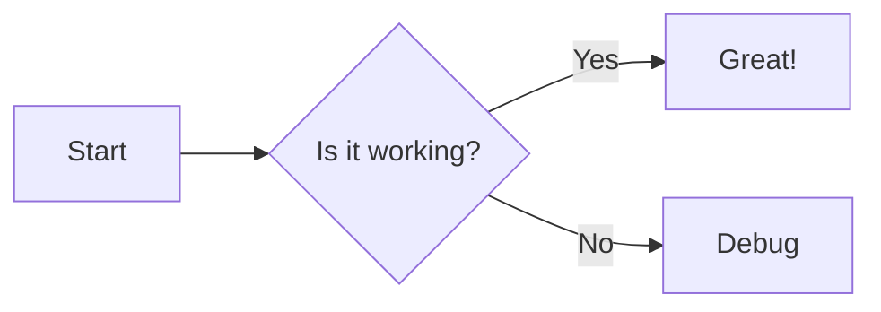

[English](./README.md) | [中文](./README.zh-TW.md)

# nuxt-mermaid-content

[![npm version][npm-version-src]][npm-version-href]
[![npm downloads][npm-downloads-src]][npm-downloads-href]
[![License][license-src]][license-href]
[![Nuxt][nuxt-src]][nuxt-href]
[](https://mermaid.js.org/)
[](https://content.nuxt.com/)

A Nuxt module designed for integrating Mermaid with `@nuxt/content`. It automatically converts `mermaid` code blocks in Markdown into responsive chart components, and supports lazy loading and dark/light theme switching.

## Features

- **Automatic conversion**: Parses Markdown code blocks and replaces them with a `<Mermaid>` rendering component.
- **Performance friendly**: Supports lazy loading — Mermaid core and related resources are only loaded when the component mounts.
- **Theme integration**: Integrates with `@nuxtjs/color-mode` to automatically switch between light and dark Mermaid themes.
- **Highly customizable**: Allows custom wrapper components, loading spinners, and custom CDN or local import sources.
- **Runtime config**: Settings can be overridden at deployment time through runtime config / environment variables.

## Quick Setup

### 1. Install the module

```bash
npx nuxi module add nuxt-mermaid-content
```

### 2. Configure `nuxt.config.ts`

Make sure the module is included in the `modules` array (if you used `nuxi module add`, this is added automatically):

```ts
export default defineNuxtConfig({
  modules: ["nuxt-mermaid-content", "@nuxt/content"],
});
```

### 3. Use Mermaid in Markdown

Add Mermaid code blocks inside `.md` files under the `content/` directory:

````markdown
# Flowchart example


````

The module will automatically transform the block into an SVG chart component.

## Configuration

You can configure the module globally through the `mermaidContent` option.

```ts
// nuxt.config.ts
export default defineNuxtConfig({
  mermaidContent: {
    enabled: true,
    followColorMode: true,
    lightTheme: "default",
    darkTheme: "dark",
    importSource:
      "https://cdn.jsdelivr.net/npm/mermaid@11/dist/mermaid.esm.min.mjs",
    init: {
      securityLevel: "strict",
      // additional options passed to mermaid.initialize()
    },
  },
});
```

### Options

| Option             | Type      | Default      | Description                                                              |
| :----------------- | :-------- | :----------- | :----------------------------------------------------------------------- |
| `enabled`          | `boolean` | `true`       | Whether the module and its conversion logic are enabled.                 |
| `importSource`     | `string`  | jsDelivr CDN | Source to load Mermaid ESM from (supports CDN or a local path).          |
| `followColorMode`  | `boolean` | `true`       | If `@nuxtjs/color-mode` is installed, automatically follow its theme.    |
| `lightTheme`       | `string`  | `'default'`  | Mermaid theme to use when color mode is light.                           |
| `darkTheme`        | `string`  | `'dark'`     | Mermaid theme to use when color mode is dark.                            |
| `mermaidComponent` | `string`  | `undefined`  | Optional: provide a custom Mermaid component name to override rendering. |
| `spinnerComponent` | `string`  | `undefined`  | Optional: global loading spinner component name.                         |
| `init`             | `object`  | `{}`         | Raw options object passed to `mermaid.initialize`.                       |

> **Note**: All options can be overridden at runtime via `runtimeConfig.public.mermaidContent`.

## Advanced Usage

### Theme & Color Mode

The module determines the active Mermaid theme with the following priority:

1. If `followColorMode: true` and the project has `@nuxtjs/color-mode` installed:
   - If color mode is `dark` → use `darkTheme`
   - If color mode is `light` → use `lightTheme`

2. If `followColorMode` is disabled, the module will use `init.theme` or Mermaid's own defaults.

### Custom Rendering Component

If you want full control over rendering (for example to add a border, zoom controls, or other UI), you can provide a custom component via `mermaidComponent`.

1. Specify the component name in `nuxt.config.ts`:

   ```ts
   mermaidContent: {
     mermaidComponent: "MyCustomMermaid",
   }
   ```

2. Implement the component in `components/MyCustomMermaid.vue`:

   ```vue
   <script setup lang="ts">
   // You can consume slot content or invoke useMermaid() logic here
   </script>

   <template>
     <div class="custom-wrapper border rounded p-4">
       <Mermaid>
         <slot />
       </Mermaid>
     </div>
   </template>
   ```

## Contribution

<details>
<summary>Local Development Commands</summary>

```bash
npm install
npm run dev:prepare
npm run dev       # Run playground
npm run test      # Run tests
```

</details>

## License

[MIT License](./LICENSE)

<!-- Badges -->

[npm-version-src]: https://img.shields.io/npm/v/nuxt-mermaid-content/latest.svg?style=flat&colorA=020420&colorB=00DC82
[npm-version-href]: https://npmjs.com/package/nuxt-mermaid-content
[npm-downloads-src]: https://img.shields.io/npm/dm/nuxt-mermaid-content.svg?style=flat&colorA=020420&colorB=00DC82
[npm-downloads-href]: https://npmjs.com/package/nuxt-mermaid-content
[license-src]: https://img.shields.io/npm/l/nuxt-mermaid-content.svg?style=flat&colorA=020420&colorB=00DC82
[license-href]: https://npmjs.com/package/nuxt-mermaid-content
[nuxt-src]: https://img.shields.io/badge/Nuxt-020420?logo=nuxt.js
[nuxt-href]: https://nuxt.com
