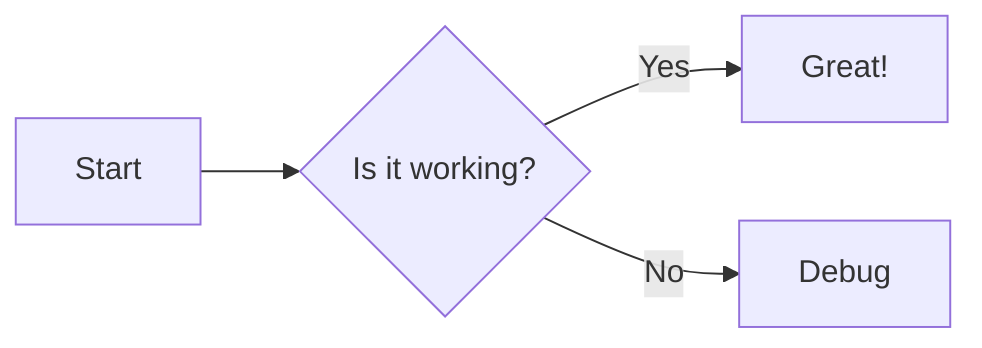
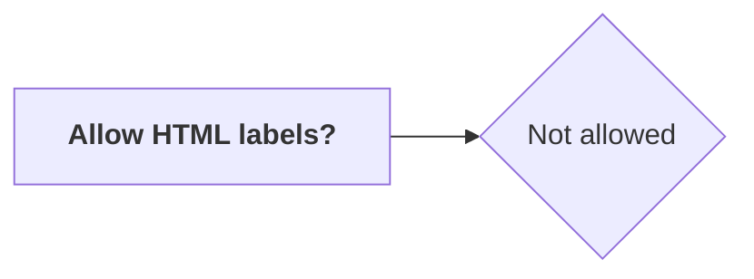
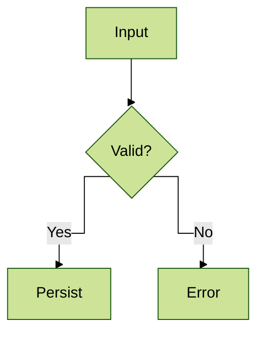
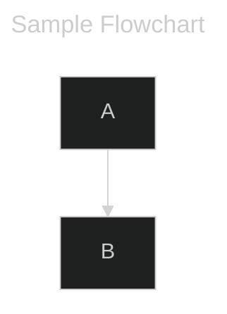
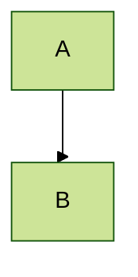

[English](./README.md) | [中文](./README.zh-TW.md)

[](https://www.npmjs.com/package/@barzhsieh/nuxt-content-mermaid)

# nuxt-content-mermaid

[![npm version][npm-version-src]][npm-version-href]
[![npm downloads][npm-downloads-src]][npm-downloads-href]
[![License][license-src]][license-href]
[![Nuxt][nuxt-src]][nuxt-href]
[](https://mermaid.js.org/)
[](https://content.nuxt.com/)

A Nuxt module designed for integrating [**Mermaid**](https://mermaid.js.org/) with [**Nuxt Content v3**](https://content.nuxt.com/docs/getting-started).
It automatically converts `mermaid` code blocks in Markdown into responsive chart components, and supports lazy loading and dark/light theme switching.

## Features

- **Automatic conversion**: Parses Markdown code blocks and replaces them with a `<Mermaid>` rendering component.
- **Performance friendly**: Supports lazy loading — Mermaid core and related resources are only loaded when the component mounts.
- **Theme integration**: Integrates with `@nuxtjs/color-mode` to automatically switch between light and dark Mermaid themes.
- **Highly customizable**: Allows custom wrapper components, loading spinners, error views, and custom CDN or local import sources.
- **Runtime config**: Settings can be overridden at deployment time through runtime config / environment variables.

## Requirements

- `nuxt@^3.20.1 || ^4.1.0`
- `@nuxt/content@>=3.5.0`

## Quick Setup

### 1. Install the module

**Auto-setup (adds to `modules` automatically):**

```bash
npx nuxi module add @barzhsieh/nuxt-content-mermaid
```

> Nuxt CLI installs third-party modules as regular `dependencies` by default. If you prefer `devDependencies`, move it after install or use the manual option below.

**Install as dev dependency (manual modules entry):**

```bash
# pnpm
pnpm add -D @barzhsieh/nuxt-content-mermaid

# npm
npm install -D @barzhsieh/nuxt-content-mermaid

# yarn
yarn add -D @barzhsieh/nuxt-content-mermaid
```

### 2. Configure `nuxt.config.ts`

Make sure the module is included in the `modules` array (skip if you used `nuxi module add`):

```ts
export default defineNuxtConfig({
  modules: ["@barzhsieh/nuxt-content-mermaid", "@nuxt/content"],
});
```

### 3. Use Mermaid in Markdown

Add Mermaid code blocks inside `.md` files under the `content/` directory:

````markdown
# Flowchart example


````

The module will automatically transform the block into an SVG chart component.

## Configuration

You can configure the module globally through the `contentMermaid` option.
(`mermaidContent` is still accepted for backward compatibility, but will be removed in a future release.)

```ts
// nuxt.config.ts
export default defineNuxtConfig({
  contentMermaid: {
    enabled: true,
    loader: {
      init: {
        securityLevel: "strict",
        // additional options passed to mermaid.initialize()
      },
      lazy: true,
    },
    theme: {
      light: "default",
      dark: "dark",
    },
    components: {
      renderer: undefined,
      spinner: undefined,
      error: undefined,
    },
    toolbar: {
      title: "mermaid",
      fontSize: "14px",
      fullscreenToolbarScale: 1.25,
      buttons: {
        copy: true,
        fullscreen: true,
        expand: true,
      },
    },
    expand: {
      enabled: true,
      margin: 0,
      invokeOpenOn: {
        diagramClick: true,
      },
      invokeCloseOn: {
        esc: true,
        wheel: true,
        swipe: true,
        overlayClick: true,
        closeButtonClick: true,
      },
    },
  },
});
```

### Options

**Top-level**

| Option    | Type      | Default | Description                                          |
| :-------- | :-------- | :------ | :--------------------------------------------------- |
| `enabled` | `boolean` | `true`  | Whether the module and its conversion logic are on.  |
| `debug`   | `boolean` | `false` | Enable verbose diagnostics; see Debug section below. |

**loader**

| Option            | Type                                  | Default                | Description                                                                      |
| :---------------- | :------------------------------------ | :--------------------- | :------------------------------------------------------------------------------- |
| `loader.init`     | `MermaidConfig`                       | `{ startOnLoad: false }` | Raw options object passed to `mermaid.initialize`.                               |
| `loader.lazy`     | `boolean \| { threshold?: number }` | `true`                 | Lazy load Mermaid when the component enters the viewport; set `false` to preload. |

**theme**

Color mode integration is automatic when `@nuxtjs/color-mode` is installed; manual themes set via `useMermaidTheme()` take precedence.

| Option            | Type   | Default     | Description                                                                                 |
| :---------------- | :----- | :---------- | :------------------------------------------------------------------------------------------ |
| `theme.light`     | string | `'default'` | Mermaid theme to use when color mode is light (and as fallback when color-mode is missing). |
| `theme.dark`      | string | `'dark'`    | Mermaid theme to use when color mode is dark (and as fallback when color-mode is missing).  |

**components**

| Option                    | Type     | Default     | Description                                                              |
| :------------------------ | :------- | :---------- | :----------------------------------------------------------------------- |
| `components.renderer`     | `string` | `undefined` | Optional: custom Mermaid renderer component name.                        |
| `components.spinner`      | `string` | `undefined` | Optional: global loading spinner component name.                         |
| `components.error`        | `string` | `undefined` | Optional: global error component name when Mermaid rendering fails.      |

**toolbar**

| Option                     | Type               | Default | Description                                 |
| :------------------------- | :----------------- | :------ | :------------------------------------------ |
| `toolbar.title`            | `string`           | `'mermaid'` | Default toolbar title for Mermaid blocks.   |
| `toolbar.fontSize`         | `string \| number` | `'14px'`    | Default toolbar font size.                  |
| `toolbar.fullscreenToolbarScale` | `number`     | `1.25`      | Scale factor for toolbar font/icon size in fullscreen. |
| `toolbar.buttons.copy`     | `boolean`          | `true`  | Show copy-source button in the toolbar.     |
| `toolbar.buttons.fullscreen` | `boolean`        | `true`  | Show fullscreen button in the toolbar.      |
| `toolbar.buttons.expand`     | `boolean`          | `true`  | Show expand button in the toolbar.            |

**expand**

Control SVG expand interactions. You can also set `expand: false` to disable it, or `expand: true` to use defaults.

| Option                     | Type      | Default | Description                                                                |
| :------------------------- | :-------- | :------ | :------------------------------------------------------------------------- |
| `expand.enabled`                    | `boolean` | `true` | Enable or disable expand features entirely.                   |
| `expand.margin`                     | `number`  | `0`    | Margin (px) around the expanded SVG within the viewport. |
| `expand.invokeOpenOn.diagramClick`  | `boolean` | `true` | Allow clicking the SVG to open expand overlay.                        |
| `expand.invokeCloseOn.esc`          | `boolean` | `true` | Allow Escape key to close.                                  |
| `expand.invokeCloseOn.wheel`        | `boolean` | `true` | Allow mouse wheel to close.                                 |
| `expand.invokeCloseOn.swipe`        | `boolean` | `true` | Allow swipe gesture to close.                               |
| `expand.invokeCloseOn.overlayClick` | `boolean` | `true` | Allow clicking the overlay background to close.             |
| `expand.invokeCloseOn.closeButtonClick`| `boolean`| `true` | Show the overlay close button.                              |

**Pan & Zoom (Expand Overlay / Fullscreen)**

When fullscreen or expand mode is active, users can pan and zoom the diagram:

| Interaction | Desktop | Mobile |
|:---|:---|:---|
| **Pan** | `Space` + Drag | 1-finger Drag |
| **Zoom** | `Ctrl/⌘` + Scroll | 2-finger Pinch |
| **Keyboard** | `+`/`-` to zoom, Arrow keys to pan, `0` to reset | — |

A zoom toolbar appears with +/−/Reset buttons and a percentage display.

Use `toolbar.fullscreenToolbarScale` to scale the fullscreen toolbar and zoom controls.


> **Note**: All options can be overridden at runtime via `runtimeConfig.public.contentMermaid` (`runtimeConfig.public.mermaidContent` remains supported but deprecated).

## Styling (CSS Variables)

This module ships global CSS variables (from `runtime/styles.css`) so the Mermaid wrapper and expand overlay share the same palette. You can override them in your app:

```css
:root {
  --ncm-code-bg: #f3f4f6;
  --ncm-code-bg-hover: #e5e7eb;
  --ncm-border: #e5e7eb;
  --ncm-text: #111827;
  --ncm-text-muted: #4b5563;
  --ncm-text-xmuted: #6b7280;
  --ncm-overlay-bg: rgba(255, 255, 255, 0.98);
}

html[data-theme="dark"],
.dark {
  --ncm-code-bg: #111827;
  --ncm-code-bg-hover: #1f2937;
  --ncm-border: #1f2937;
  --ncm-text: #f9fafb;
  --ncm-text-muted: #9ca3af;
  --ncm-text-xmuted: #6b7280;
  --ncm-overlay-bg: rgba(17, 24, 39, 0.98);
}
```

Variables:
- `--ncm-code-bg`: Mermaid block background.
- `--ncm-code-bg-hover`: Hover background for toolbar buttons.
- `--ncm-border-color`: Border color for the block and toolbar.
- `--ncm-border-width`: Border thickness.
- `--ncm-border-style`: Border style.
- `--ncm-border`: Composite shorthand (width, style, color) for borders.
- `--ncm-border-bottom`: Border style applied to the toolbar bottom.
- `--ncm-text`: Primary text color.
- `--ncm-text-muted`: Title and secondary text.
- `--ncm-text-xmuted`: Toolbar icon and subtle UI text.
- `--ncm-overlay-bg`: Expand overlay background (defaults to `--ncm-code-bg`).
- `--ncm-expand-target-bg`: Background color shown behind the expanded SVG when `expand.margin` leaves breathing room.
- `--ncm-overlay-opacity`: Overlay transparency (thinned when `expand.margin` creates breathing room).
- `--ncm-overlay-backdrop`: `backdrop-filter` applied to the overlay when it becomes visible.
- `--ncm-hint-bg`: Zoom hint toast background (default: `rgba(0,0,0,0.75)`).
- `--ncm-hint-text`: Zoom hint toast text color (default: `#fff`).
- `--ncm-hint-radius`: Zoom hint toast border radius (default: `8px`).

## Advanced Usage

### Debug mode

**`contentMermaid.debug`** (default `false`):
  - **Auto-config**: If you did **not** set `loader.init.logLevel` or `suppressErrorRendering`, debug defaults them to `logLevel: 1` and `suppressErrorRendering: false` (Mermaid shows errors in the DOM). If you set them explicitly, your values win.
  - **Runtime behavior**:
    - **Debug on**: `mermaid.run` uses `suppressErrors: false`, errors throw with full stack traces for debugging.
    - **Debug off**: `mermaid.run` uses `suppressErrors: true`, so one failing chart won't block others.
  - **Console output**: Adds queue diagnostics and render-time stats.

### Theme & Color Mode

The module determines the active Mermaid theme with the following priority:

1. Frontmatter `config.theme` (per-page override)
2. Manual mode via `useMermaidTheme()` (if set)
3. `@nuxtjs/color-mode` (auto-detected when installed):
  - `dark` → `theme.dark`
  - `light` → `theme.light`
4. `loader.init.theme` (if provided)
5. Fallback: `theme.light`, then Mermaid default `'default'`

For advanced manual control (e.g., forcing specific themes, custom toggle logic), please refer to the [Manual Theme Control Guide](./docs/en/MANUAL_THEME_CONTROL.md).

### Override Per-Page Settings with Frontmatter

Each Markdown file can override module settings by adding a `config` field in the frontmatter.

> **⚠️ To use frontmatter `config` overrides, you MUST declare the `config` field in your collection schema in `content.config.ts`.**
> Without this, Nuxt Content will not parse the `config` field as a JSON object, and your overrides will not work.

Add this to your `content.config.ts`:

```ts
import { defineContentConfig, defineCollection, z } from '@nuxt/content'

export default defineContentConfig({
  collections: {
    content: defineCollection({
      type: 'page',
      source: '**',
      schema: z.object({
        config: z.record(z.unknown()).optional(), // ← Declare config field
      }).passthrough(),
    }),
  },
})
```

Then use it in your Markdown frontmatter:

````markdown
---
title: Example of Overriding Mermaid Settings Per Page
config:
  theme: forest
  flowchart:
    htmlLabels: false
---

````

### Priority Order of `%%{init}%%` Syntax, Frontmatter, and Module Settings

Mermaid itself also supports overriding settings within diagrams using the `%%{init: ...}%%` syntax, for example:
````markdown

````

> For details, refer to the [official Mermaid documentation](https://mermaid.js.org/config/directives.html#declaring-directives)

The actual priority order when settings take effect is as follows:

1. **`%%{init: ...}%%` within the diagram** — Highest priority, processed directly by Mermaid.
2. **Frontmatter `config`** — merged on top of the module's `loader.init`.
3. **Module-level `contentMermaid.loader.init`** — Project default settings.

### Mermaid Inline Attributes & YAML Frontmatter

You can control Mermaid blocks in three ways: inline attrs, Mermaid YAML frontmatter, and `%%{init}%%` directives.

#### Inline attrs (fence info)

Use inline attrs on the `mermaid` fence to pass props to the wrapper component or set Mermaid YAML fields (including `toolbar` options like title/fontSize and `toolbar.buttons.*`).

````markdown
```mermaid {title="Diagram A" toolbar='{"title":"My Diagram","fontSize":"14px"}' config='{"theme":"dark"}'}
graph TD
  A --> B
```
````

#### Mermaid YAML frontmatter (inside the block)

Place Mermaid’s own YAML frontmatter at the top of the code block to affect SVG rendering (e.g. title, displayMode, config), and you can also provide `toolbar` values for the wrapper component (including `toolbar.buttons.copy: true`).

````markdown

````

#### `%%{init}%%` directive (inside the block)

Use Mermaid directives to set render options directly in the diagram definition.

````markdown

````

### Custom Rendering Component

If you want full control over rendering (for example to add a border, expand controls, or other UI), you can provide a custom component via `components.renderer`.

1. Specify the component name in `nuxt.config.ts`:

   ```ts
   contentMermaid: {
     components: {
       renderer: "MyCustomMermaid",
     },
   }
   ```

2. Implement the component in `components/MyCustomMermaid.vue`:

   ```vue
   <script setup lang="ts">
   // You can consume slot content or invoke useMermaid() logic here
   </script>

   <template>
     <div class="custom-wrapper border rounded p-4">
       <Mermaid>
         <slot />
       </Mermaid>
     </div>
   </template>
   ```

#### Loading Indicator

The module renders a built-in spinner before the first Mermaid render. If you set `components.spinner`, the named component will replace the default spinner and will be passed into your custom renderer as a `spinner` prop.

Minimal example that uses the provided spinner while waiting for your own loading logic:

```ts
// nuxt.config.ts
export default defineNuxtConfig({
  contentMermaid: {
    components: {
      renderer: 'MyCustomMermaid',
      spinner: 'MySpinner', // optional: globally replace the default spinner
    },
  },
})
```

```vue
<!-- components/MyCustomMermaid.vue -->
<script setup lang="ts">
import { ref, onMounted } from 'vue'
import type { Component } from 'vue'

const props = defineProps<{ spinner: Component | string }>()
const loading = ref(true)
onMounted(() => { loading.value = false })
</script>

<template>
  <div class="my-mermaid">
    <component v-if="loading" :is="props.spinner" />
    <Mermaid v-else>
      <slot />
    </Mermaid>
  </div>
</template>
```

### Wrapper Example

You can wrap `<Mermaid>` inside your own Vue component.
For example, you can bundle a title, loading state, and error/fallback UI, then drop it anywhere in templates:

```vue
<!-- WrapperMermaid.vue -->
<template>
  <section>
    <header v-if="title">{{ title }}</header>

    <Mermaid>
      <slot>
        <pre><code>{{ code }}</code></pre>
      </slot>

      <template #loading>
        <component :is="spinner" v-if="spinner" />
        <p v-else>Diagram loading…</p>
      </template>

      <template #error="{ error, source }">
        <p>Render failed: {{ error instanceof Error ? error.message : String(error) }}</p>
        <pre><code>{{ source }}</code></pre>
      </template>
    </Mermaid>
  </section>
</template>
```

```vue
<!-- usage -->
<WrapperMermaid
  title="Demo Diagram"
  spinner="MySpinner"
>
  <pre><code>graph TD; A-->B; B-->C; C-->A</code></pre>
</WrapperMermaid>
```

Copy or adapt this pattern to centralize the common slots you want to reuse.

### Error Handling

When Mermaid parsing/rendering fails, the component exposes an `error` slot and supports a global error component via `components.error`. Both receive the thrown error and the original Mermaid source for inspection.

```vue
<Mermaid>
  <pre><code>graph TD; A-->B; B-->C; C-->A</code></pre>

  <template #error="{ error, source }">
    <p>Render failed: {{ error instanceof Error ? error.message : String(error) }}</p>
    <details>
      <summary>Show definition</summary>
      <pre><code>{{ source }}</code></pre>
    </details>
  </template>
</Mermaid>
```

To reuse a global error view everywhere, register it once and reference it in config:

```ts
// nuxt.config.ts
export default defineNuxtConfig({
  contentMermaid: {
    components: {
      error: 'MermaidError', // globally registered component name
    },
  },
})
```
## Contribution

<details>
<summary>Local Development Commands</summary>

```bash
pnpm install
pnpm dev:prepare
pnpm dev       # Run playground
pnpm test      # Run tests
```

</details>

## License

[MIT License](./LICENSE)

<!-- Badges -->

[npm-version-src]: https://img.shields.io/npm/v/@barzhsieh/nuxt-content-mermaid/latest.svg?style=flat&colorA=020420&colorB=00DC82
[npm-version-href]: https://npmjs.com/package/@barzhsieh/nuxt-content-mermaid
[npm-downloads-src]: https://img.shields.io/npm/dm/@barzhsieh/nuxt-content-mermaid.svg?style=flat&colorA=020420&colorB=00DC82
[npm-downloads-href]: https://npmjs.com/package/@barzhsieh/nuxt-content-mermaid
[license-src]: https://img.shields.io/npm/l/@barzhsieh/nuxt-content-mermaid.svg?style=flat&colorA=020420&colorB=00DC82
[license-href]: https://npmjs.com/package/@barzhsieh/nuxt-content-mermaid
[nuxt-src]: https://img.shields.io/badge/Nuxt-020420?logo=nuxt.js
[nuxt-href]: https://nuxt.com
