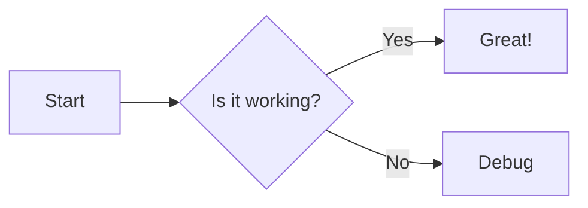
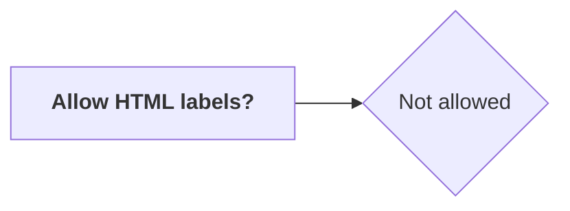
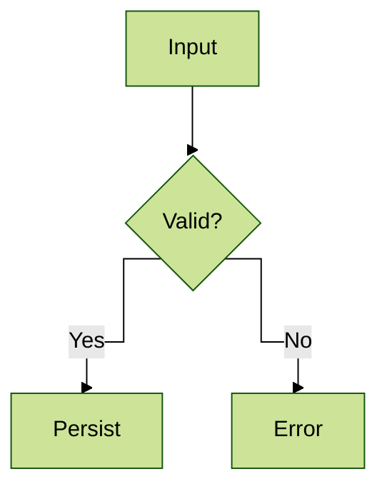

[English](./README.md) | [中文](./README.zh-TW.md)

# nuxt-content-mermaid

[![npm version][npm-version-src]][npm-version-href]
[![npm downloads][npm-downloads-src]][npm-downloads-href]
[![License][license-src]][license-href]
[![Nuxt][nuxt-src]][nuxt-href]
[](https://mermaid.js.org/)
[](https://content.nuxt.com/)

A Nuxt module designed for integrating [**Mermaid**](https://mermaid.js.org/) with [**Nuxt Content v3**](https://content.nuxt.com/docs/getting-started).
It automatically converts `mermaid` code blocks in Markdown into responsive chart components, and supports lazy loading and dark/light theme switching.

## Features

- **Automatic conversion**: Parses Markdown code blocks and replaces them with a `<Mermaid>` rendering component.
- **Performance friendly**: Supports lazy loading — Mermaid core and related resources are only loaded when the component mounts.
- **Theme integration**: Integrates with `@nuxtjs/color-mode` to automatically switch between light and dark Mermaid themes.
- **Highly customizable**: Allows custom wrapper components, loading spinners, error views, and custom CDN or local import sources.
- **Runtime config**: Settings can be overridden at deployment time through runtime config / environment variables.

## Requirements

- `nuxt@^3.20.1 || ^4.1.0`
- `@nuxt/content@>=3.5.0`

## Quick Setup

### 1. Install the module

**Auto-setup (adds to `modules` automatically):**

```bash
npx nuxi module add @barzhsieh/nuxt-content-mermaid
```

> Nuxt CLI installs third-party modules as regular `dependencies` by default. If you prefer `devDependencies`, move it after install or use the manual option below.

**Install as dev dependency (manual modules entry):**

```bash
# pnpm
pnpm add -D @barzhsieh/nuxt-content-mermaid

# npm
npm install -D @barzhsieh/nuxt-content-mermaid

# yarn
yarn add -D @barzhsieh/nuxt-content-mermaid
```

### 2. Configure `nuxt.config.ts`

Make sure the module is included in the `modules` array (skip if you used `nuxi module add`):

```ts
export default defineNuxtConfig({
  modules: ["@barzhsieh/nuxt-content-mermaid", "@nuxt/content"],
});
```

### 3. Use Mermaid in Markdown

Add Mermaid code blocks inside `.md` files under the `content/` directory:

````markdown
# Flowchart example


````

The module will automatically transform the block into an SVG chart component.

## Configuration

You can configure the module globally through the `mermaidContent` option.

```ts
// nuxt.config.ts
export default defineNuxtConfig({
  mermaidContent: {
    enabled: true,
    loader: {
      init: {
        securityLevel: "strict",
        // additional options passed to mermaid.initialize()
      },
      lazy: true,
    },
    theme: {
      useColorModeTheme: true,
      light: "default",
      dark: "dark",
    },
    components: {
      renderer: undefined,
      spinner: undefined,
      error: undefined,
    },
  },
});
```

### Options

**Top-level**

| Option    | Type      | Default | Description                                          |
| :-------- | :-------- | :------ | :--------------------------------------------------- |
| `enabled` | `boolean` | `true`  | Whether the module and its conversion logic are on.  |

**loader**

| Option            | Type                                  | Default                | Description                                                                      |
| :---------------- | :------------------------------------ | :--------------------- | :------------------------------------------------------------------------------- |
| `loader.init`     | `MermaidConfig`                       | `{ startOnLoad: false }` | Raw options object passed to `mermaid.initialize`.                               |
| `loader.lazy`     | `boolean \| { threshold?: number }` | `true`                 | Lazy load Mermaid when the component enters the viewport; set `false` to preload. |

**theme**

| Option                      | Type    | Default     | Description                                                                                               |
| :-------------------------- | :------ | :---------- | :-------------------------------------------------------------------------------------------------------- |
| `theme.useColorModeTheme`   | boolean | `true`      | If `@nuxtjs/color-mode` is installed, automatically follow its current theme.                             |
| `theme.light`               | string  | `'default'` | Mermaid theme to use when color mode is light (and as fallback when color-mode is off).                   |
| `theme.dark`                | string  | `'dark'`    | Mermaid theme to use when color mode is dark (and as fallback when color-mode is off).                    |

**components**

| Option                    | Type     | Default     | Description                                                              |
| :------------------------ | :------- | :---------- | :----------------------------------------------------------------------- |
| `components.renderer`     | `string` | `undefined` | Optional: custom Mermaid renderer component name.                        |
| `components.spinner`      | `string` | `undefined` | Optional: global loading spinner component name.                         |
| `components.error`        | `string` | `undefined` | Optional: global error component name when Mermaid rendering fails.      |

> **Note**: All options can be overridden at runtime via `runtimeConfig.public.mermaidContent`.

## Advanced Usage

### Theme & Color Mode

The module determines the active Mermaid theme with the following priority:

1. If `theme.useColorModeTheme: true` _and_ `@nuxtjs/color-mode` is available:  
   - `dark` → `theme.dark`  
   - `light` → `theme.light`
2. Otherwise (color-mode missing or `theme.useColorModeTheme` is `false`):  
   - Use `loader.init.theme` if provided.  
   - Else fall back to `theme.light`, then `theme.dark`.

### Override Per-Page Settings with Frontmatter

Each Markdown file can override module settings by adding a `config` field in the frontmatter.
````markdown
---
title: Example of Overriding Mermaid Settings Per Page
config:
  theme: forest
  flowchart:
    htmlLabels: false
---

````

> **Important: If you want to control settings via frontmatter, declare it in the collection schema in `content.config.ts`, for example:**
>
> ```ts
> import { defineContentConfig, defineCollection, z } from '@nuxt/content'
>
> export default defineContentConfig({
>   collections: {
>     content: defineCollection({
>       type: 'page',
>       source: '**',
>       schema: z.object({
>         config: z.record(z.unknown()).optional(), // Declare config field
>       }).passthrough(),
>     }),
>   },
> })
> ```

### Priority Order of `%%{init}%%` Syntax, Frontmatter, and Module Settings

Mermaid itself also supports overriding settings within diagrams using the `%%{init: ...}%%` syntax, for example:
````markdown

````

> For details, refer to the [official Mermaid documentation](https://mermaid.js.org/config/directives.html#declaring-directives)

The actual priority order when settings take effect is as follows:

1. **`%%{init: ...}%%` within the diagram** — Highest priority, processed directly by Mermaid.
2. **Frontmatter `config`** — merged on top of the module's `loader.init`.
3. **Module-level `mermaidContent.loader.init`** — Project default settings.

### Custom Rendering Component

If you want full control over rendering (for example to add a border, zoom controls, or other UI), you can provide a custom component via `components.renderer`.

1. Specify the component name in `nuxt.config.ts`:

   ```ts
   mermaidContent: {
     components: {
       renderer: "MyCustomMermaid",
     },
   }
   ```

2. Implement the component in `components/MyCustomMermaid.vue`:

   ```vue
   <script setup lang="ts">
   // You can consume slot content or invoke useMermaid() logic here
   </script>

   <template>
     <div class="custom-wrapper border rounded p-4">
       <Mermaid>
         <slot />
       </Mermaid>
     </div>
   </template>
   ```

#### Loading Indicator

The module renders a built-in spinner before the first Mermaid render. If you set `components.spinner`, the named component will replace the default spinner and will be passed into your custom renderer as a `spinner` prop.

Minimal example that uses the provided spinner while waiting for your own loading logic:

```ts
// nuxt.config.ts
export default defineNuxtConfig({
  mermaidContent: {
    components: {
      renderer: 'MyCustomMermaid',
      spinner: 'MySpinner', // optional: globally replace the default spinner
    },
  },
})
```

```vue
<!-- components/MyCustomMermaid.vue -->
<script setup lang="ts">
import { ref, onMounted } from 'vue'
import type { Component } from 'vue'

const props = defineProps<{ spinner: Component | string }>()
const loading = ref(true)
onMounted(() => { loading.value = false })
</script>

<template>
  <div class="my-mermaid">
    <component v-if="loading" :is="props.spinner" />
    <Mermaid v-else>
      <slot />
    </Mermaid>
  </div>
</template>
```

### Wrapper Example

You can wrap `<Mermaid>` inside your own Vue component.
For example, you can bundle a title, loading state, and error/fallback UI, then drop it anywhere in templates:

```vue
<!-- WrapperMermaid.vue -->
<template>
  <section>
    <header v-if="title">{{ title }}</header>

    <Mermaid>
      <slot>
        <pre><code>{{ code }}</code></pre>
      </slot>

      <template #loading>
        <component :is="spinner" v-if="spinner" />
        <p v-else>Diagram loading…</p>
      </template>

      <template #error="{ error, source }">
        <p>Render failed: {{ error instanceof Error ? error.message : String(error) }}</p>
        <pre><code>{{ source }}</code></pre>
      </template>
    </Mermaid>
  </section>
</template>
```

```vue
<!-- usage -->
<WrapperMermaid
  title="Demo Diagram"
  spinner="MySpinner"
>
  <pre><code>graph TD; A-->B; B-->C; C-->A</code></pre>
</WrapperMermaid>
```

Copy or adapt this pattern to centralize the common slots you want to reuse.

### Error Handling

When Mermaid parsing/rendering fails, the component exposes an `error` slot and supports a global error component via `components.error`. Both receive the thrown error and the original Mermaid source for inspection.

```vue
<Mermaid>
  <pre><code>graph TD; A-->B; B-->C; C-->A</code></pre>

  <template #error="{ error, source }">
    <p>Render failed: {{ error instanceof Error ? error.message : String(error) }}</p>
    <details>
      <summary>Show definition</summary>
      <pre><code>{{ source }}</code></pre>
    </details>
  </template>
</Mermaid>
```

To reuse a global error view everywhere, register it once and reference it in config:

```ts
// nuxt.config.ts
export default defineNuxtConfig({
  mermaidContent: {
    components: {
      error: 'MermaidError', // globally registered component name
    },
  },
})
```
## Contribution

<details>
<summary>Local Development Commands</summary>

```bash
pnpm install
pnpm dev:prepare
pnpm dev       # Run playground
pnpm test      # Run tests
```

</details>

## License

[MIT License](./LICENSE)

<!-- Badges -->

[npm-version-src]: https://img.shields.io/npm/v/@barzhsieh/nuxt-content-mermaid/latest.svg?style=flat&colorA=020420&colorB=00DC82
[npm-version-href]: https://npmjs.com/package/@barzhsieh/nuxt-content-mermaid
[npm-downloads-src]: https://img.shields.io/npm/dm/@barzhsieh/nuxt-content-mermaid.svg?style=flat&colorA=020420&colorB=00DC82
[npm-downloads-href]: https://npmjs.com/package/@barzhsieh/nuxt-content-mermaid
[license-src]: https://img.shields.io/npm/l/@barzhsieh/nuxt-content-mermaid.svg?style=flat&colorA=020420&colorB=00DC82
[license-href]: https://npmjs.com/package/@barzhsieh/nuxt-content-mermaid
[nuxt-src]: https://img.shields.io/badge/Nuxt-020420?logo=nuxt.js
[nuxt-href]: https://nuxt.com
