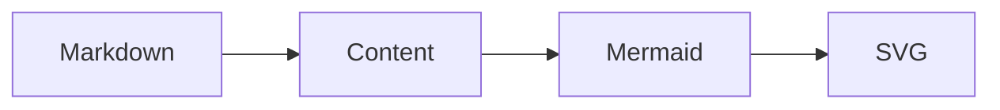

[English](./README.md) | [中文](./README.zh-TW.md)

[](https://nuxt-content-mermaid.barz.app)

# nuxt-content-mermaid

[![npm version][npm-version-src]][npm-version-href]
[![npm downloads][npm-downloads-src]][npm-downloads-href]
[![License][license-src]][license-href]
[![Nuxt][nuxt-src]][nuxt-href]
[](https://mermaid.js.org/)
[](https://content.nuxt.com/)

**@barzhsieh/nuxt-content-mermaid** turns `mermaid` code blocks in Nuxt
Content Markdown into responsive, interactive diagrams. It supports lazy
loading, light and dark themes, toolbar controls, and application-provided
rendering components.

The [documentation website](https://nuxt-content-mermaid.barz.app) is the
canonical package documentation. This README is a bounded distribution summary
for npm and GitHub.

## Package fit

Use this module when your Nuxt Content application needs to:

- author diagrams as Mermaid fences in Markdown;
- render diagrams in the browser with package-owned loading and error states;
- follow application light and dark modes;
- configure diagrams globally, per page, or per fence;
- opt into lazy rendering, toolbar controls, or custom rendering components.

The module owns its compatible Mermaid version. Applications own their Nuxt and
Nuxt Content peer dependencies and the Nuxt Content database connector.

## Compatibility

- Node.js `>=22.19.0`
- Nuxt `^4.1.0`
- Nuxt Content `>=3.5.0 <4.0.0`

For dependency ownership, the Nuxt Content v2 migration boundary, and rendering
guarantees, see the
[Dependency and Migration Contract](./docs/en/DEPENDENCY_AND_MIGRATION_CONTRACT.md).

## Quick start

Install the module and its Nuxt Content peer:

```bash
pnpm add @barzhsieh/nuxt-content-mermaid @nuxt/content
```

Register the module:

```ts
export default defineNuxtConfig({
  modules: ['@barzhsieh/nuxt-content-mermaid'],
})
```

Then add a Mermaid fence to a Content Markdown file:

````markdown

```mermaid
flowchart LR
  Markdown --> Content --> Mermaid --> SVG
```
````

Mermaid is included by the module and does not need to be installed separately.
For database connector choices and a complete first-project walkthrough, follow
[Getting Started](https://nuxt-content-mermaid.barz.app/getting-started).

## Canonical package documentation

- [Getting Started](https://nuxt-content-mermaid.barz.app/getting-started)
- [Writing Diagrams](https://nuxt-content-mermaid.barz.app/writing-diagrams)
- [Configuration](https://nuxt-content-mermaid.barz.app/configuration)
- [Troubleshooting](https://nuxt-content-mermaid.barz.app/troubleshooting)
- [Migration to v3](https://nuxt-content-mermaid.barz.app/migration/v3)

## Support and contribution

If the module is useful to you, you can
[support my open-source work on Ko-fi](https://ko-fi.com/barzhsieh).

Contributions are welcome. Open an
[issue](https://github.com/andy820621/nuxt-content-mermaid/issues) or submit a
pull request with a clear summary and test results. Maintainers should follow
the [stable release runbook](./docs/en/RELEASING.md).

## License

[MIT License](./LICENSE)

<!-- Badges -->

[npm-version-src]: https://img.shields.io/npm/v/@barzhsieh/nuxt-content-mermaid/latest.svg?style=flat&colorA=020420&colorB=00DC82
[npm-version-href]: https://npmjs.com/package/@barzhsieh/nuxt-content-mermaid
[npm-downloads-src]: https://img.shields.io/npm/dm/@barzhsieh/nuxt-content-mermaid.svg?style=flat&colorA=020420&colorB=00DC82
[npm-downloads-href]: https://npmjs.com/package/@barzhsieh/nuxt-content-mermaid
[license-src]: https://img.shields.io/npm/l/@barzhsieh/nuxt-content-mermaid.svg?style=flat&colorA=020420&colorB=00DC82
[license-href]: https://npmjs.com/package/@barzhsieh/nuxt-content-mermaid
[nuxt-src]: https://img.shields.io/badge/Nuxt-020420?logo=nuxt.js
[nuxt-href]: https://nuxt.com
