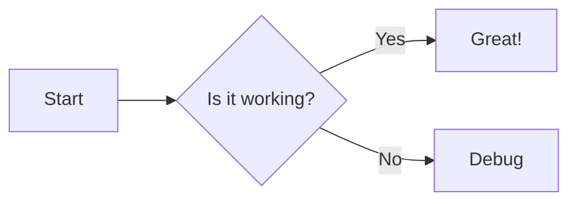
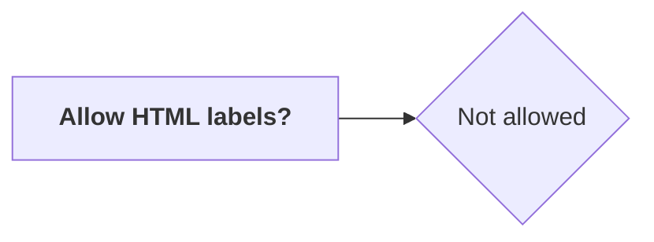
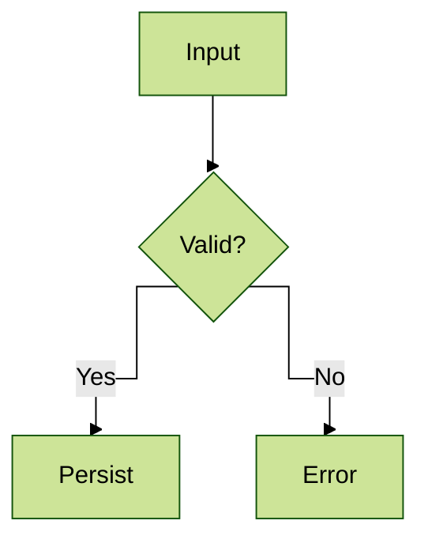
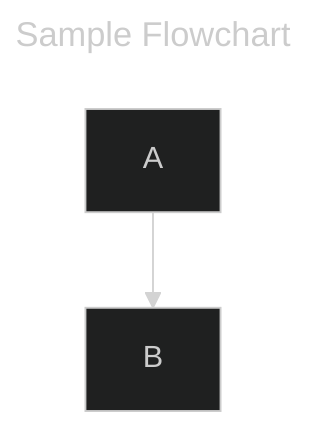
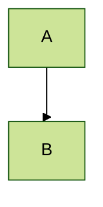

[English](./README.md) | [中文](./README.zh-TW.md)

[](https://www.npmjs.com/package/@barzhsieh/nuxt-content-mermaid)

# nuxt-content-mermaid

[![npm version][npm-version-src]][npm-version-href]
[![npm downloads][npm-downloads-src]][npm-downloads-href]
[![License][license-src]][license-href]
[![Nuxt][nuxt-src]][nuxt-href]
[](https://mermaid.js.org/)
[](https://content.nuxt.com/)

A Nuxt module designed for integrating [**Mermaid**](https://mermaid.js.org/) with [**Nuxt Content v3**](https://content.nuxt.com/docs/getting-started).
It automatically converts `mermaid` code blocks in Markdown into responsive chart components, and supports lazy loading and dark/light theme switching.

<details>
<summary>Table of Contents</summary>

- [Features](#features)
- [Requirements](#requirements)
- [Dependency and Migration Contract](./docs/en/DEPENDENCY_AND_MIGRATION_CONTRACT.md)
- [Quick Setup](#quick-setup)
- [Configuration](#configuration)
- [Migrating to v3](#migrating-to-v3)
- [Styling (CSS Variables)](#styling-css-variables)
- [Advanced Usage](#advanced-usage)
  - [Debug mode](#debug-mode)
  - [Theme & Color Mode](#theme--color-mode)
  - [Override Per-Page Settings with Frontmatter](#override-per-page-settings-with-frontmatter)
  - [Mermaid Inline Attributes & YAML Frontmatter](#mermaid-inline-attributes--yaml-frontmatter)
  - [Custom Rendering Component](#custom-rendering-component)
  - [Wrapper Example](#wrapper-example)
  - [Error Handling](#error-handling)
- [Support](#support)
- [Contribution](#contribution)
- [License](#license)

</details>

## Features

- **Automatic conversion**: Parses Markdown code blocks and replaces them with a `<Mermaid>` rendering component.
- **Performance friendly**: Supports lazy loading — Mermaid core and related resources are only loaded when the component mounts.
- **Theme integration**: Integrates with `@nuxtjs/color-mode` to automatically switch between light and dark Mermaid themes.
- **Highly customizable**: Supports custom renderers, loading spinners, error views, themes, and toolbar controls.
- **Deployment configuration**: Pure-data settings can be transported through public runtime config and are resolved once for each Nuxt application.

## Requirements

- Node.js `>=22.19.0`
- `nuxt@^4.1.0`
- `@nuxt/content@>=3.5.0 <4.0.0`

For the ownership model, 2.x migration path, rendering guarantees, and visual
snapshot limits, see the [Dependency and Migration Contract](./docs/en/DEPENDENCY_AND_MIGRATION_CONTRACT.md).

## Quick Setup

### 1. Install the packages

Package-manager installation and Nuxt module initialization are separate
steps. Your application owns the Nuxt and Nuxt Content peer dependencies, so it
must install, pin, and update them. Install this module together with the
supported Nuxt Content peer:

```bash
# pnpm
pnpm add @barzhsieh/nuxt-content-mermaid @nuxt/content

# npm
npm install @barzhsieh/nuxt-content-mermaid @nuxt/content

# yarn
yarn add @barzhsieh/nuxt-content-mermaid @nuxt/content
```

Mermaid is bundled as this module's Module-Owned Dependency, so you do not need
to install it separately for this module.

> [!NOTE]
> **Nuxt Content database connector** — On Node.js, Nuxt Content asks the
> application to choose a database connector. `better-sqlite3`, `sqlite3`, and
> native SQLite in supported Node.js versions are available choices; this
> module does not require or own a specific connector. Follow the
> [Nuxt Content installation guide](https://content.nuxt.com/docs/getting-started/installation)
> for the options supported by your installed version.
>
> **pnpm v10+** — If you choose `better-sqlite3` or `sqlite3`, pnpm v10 blocks
> their native build scripts by default. Run `pnpm approve-builds`, or allow
> only the connector you selected in `package.json`. The example below uses
> `better-sqlite3`; replace it with `sqlite3` when that is your connector:
>
> ```json
> {
>   "pnpm": {
>     "onlyBuiltDependencies": ["better-sqlite3"]
>   }
> }
> ```

### 2. Initialize the Nuxt module

List only this module in the standard `modules` configuration:

```ts
export default defineNuxtConfig({
  modules: ["@barzhsieh/nuxt-content-mermaid"],
});
```

The module declares the required Nuxt Content relationship and compatible
version through `moduleDependencies`, so Nuxt initializes the installed
`@nuxt/content` module in the required order. This does not install, pin, or
update Nuxt Content; those package-manager responsibilities remain with your
application.

If your application already lists `@nuxt/content` manually in `modules`, you
may keep that entry. Manual listing remains supported, but it is no longer the
standard configuration.

### 3. Use Mermaid in Markdown

Add Mermaid code blocks inside `.md` files under the `content/` directory:

````markdown
# Flowchart example


```mermaid
graph LR
  A[Start] --> B{Is it working?}
  B -- Yes --> C[Great!]
  B -- No --> D[Debug]
```
````

The module will automatically transform the block into an SVG chart component.

## Configuration

Configure the module globally through the canonical `contentMermaid` option. The former `mermaidContent` alias was removed in v3 and produces a migration error.

```ts
// nuxt.config.ts
export default defineNuxtConfig({
  contentMermaid: {
    enabled: true,
    loader: {
      init: {
        securityLevel: "strict",
        // additional options passed to mermaid.initialize()
      },
      lazy: true,
    },
    theme: {
      light: "default",
      dark: "dark",
    },
    toolbar: {
      title: "mermaid",
      fontSize: "14px",
      fullscreenToolbarScale: 1.25,
      buttons: {
        copy: true,
        fullscreen: true,
        expand: true,
      },
    },
    expand: {
      enabled: true,
      margin: 0,
      invokeOpenOn: {
        diagramClick: true,
      },
      invokeCloseOn: {
        esc: true,
        wheel: true,
        swipe: true,
        overlayClick: true,
        closeButtonClick: true,
      },
    },
  },
});
```

### Options

**Top-level**

| Option    | Type      | Default | Description                                          |
| :-------- | :-------- | :------ | :--------------------------------------------------- |
| `enabled` | `boolean` | `true`  | Whether the module and its conversion logic are on.  |
| `debug`   | `boolean` | `false` | Enable verbose diagnostics; see Debug section below. |

**loader**

| Option            | Type                                  | Default          | Description                                                                      |
| :---------------- | :------------------------------------ | :--------------- | :------------------------------------------------------------------------------- |
| `loader.init`     | `RuntimeMermaidConfig` (strict pure data) | package defaults | Pure-data Mermaid options transported to `mermaid.initialize`.                  |
| `loader.lazy`     | `boolean \| { threshold?: number }` | `true`           | Lazy load Mermaid when the component enters the viewport; set `false` to preload. |

The `loader.init` baseline is:

```ts
{
  startOnLoad: false,
  theme: 'default',
  fontFamily: 'Arial, sans-serif, 微軟正黑體',
  securityLevel: 'strict',
}
```

When omitted, debug-derived values resolve to `logLevel: 5` and
`suppressErrorRendering: true` with `debug: false`, or `logLevel: 1` and
`suppressErrorRendering: false` with `debug: true`. Explicit values always win.

**theme**

Color mode integration is automatic when `@nuxtjs/color-mode` is installed; manual themes set via `useMermaidTheme()` take precedence.

| Option            | Type   | Default     | Description                                                                  |
| :---------------- | :----- | :---------- | :--------------------------------------------------------------------------- |
| `theme.light`     | string | `'default'` | Used for light color mode and the manual `setMermaidTheme('light')` strategy. |
| `theme.dark`      | string | `'dark'`    | Used for dark color mode and the manual `setMermaidTheme('dark')` strategy.   |

**components**

| Option                    | Type     | Default | Description                                                              |
| :------------------------ | :------- | :------ | :----------------------------------------------------------------------- |
| `components.renderer`     | `string` | omitted | Optional: custom Mermaid renderer component name.                        |
| `components.spinner`      | `string` | omitted | Optional: global loading spinner component name.                         |
| `components.error`        | `string` | omitted | Optional: global error component name when Mermaid rendering fails.      |

**toolbar**

| Option                     | Type               | Default | Description                                 |
| :------------------------- | :----------------- | :------ | :------------------------------------------ |
| `toolbar.title`            | `string`           | `'mermaid'` | Default toolbar title for Mermaid blocks.   |
| `toolbar.fontSize`         | `string \| number` | `'14px'`    | Default toolbar font size.                  |
| `toolbar.fullscreenToolbarScale` | `number`     | `1.25`      | Scale factor for toolbar font/icon size in fullscreen. |
| `toolbar.buttons.copy`     | `boolean`          | `true`  | Show copy-source button in the toolbar.     |
| `toolbar.buttons.fullscreen` | `boolean`        | `true`  | Show fullscreen button in the toolbar.      |
| `toolbar.buttons.expand`     | `boolean`          | `true`  | Show expand button in the toolbar.            |

**expand**

Control SVG expand interactions. You can also set `expand: false` to disable it, or `expand: true` to use defaults.

| Option                     | Type      | Default | Description                                                                |
| :------------------------- | :-------- | :------ | :------------------------------------------------------------------------- |
| `expand.enabled`                    | `boolean` | `true` | Enable or disable expand features entirely.                   |
| `expand.margin`                     | `number`  | `0`    | Margin (px) around the expanded SVG within the viewport. |
| `expand.invokeOpenOn.diagramClick`  | `boolean` | `true` | Allow clicking the SVG to open expand overlay.                        |
| `expand.invokeCloseOn.esc`          | `boolean` | `true` | Allow Escape key to close.                                  |
| `expand.invokeCloseOn.wheel`        | `boolean` | `true` | Allow mouse wheel to close.                                 |
| `expand.invokeCloseOn.swipe`        | `boolean` | `true` | Allow swipe gesture to close.                               |
| `expand.invokeCloseOn.overlayClick` | `boolean` | `true` | Allow clicking the overlay background to close.             |
| `expand.invokeCloseOn.closeButtonClick`| `boolean`| `true` | Show the overlay close button.                              |

**Pan & Zoom (Expand Overlay / Fullscreen)**

When fullscreen or expand mode is active, users can pan and zoom the diagram:

| Interaction | Desktop | Mobile |
|:---|:---|:---|
| **Pan** | `Space` + Drag | 1-finger Drag |
| **Zoom** | `Ctrl/⌘` + Scroll | 2-finger Pinch |
| **Keyboard** | `+`/`-` to zoom, Arrow keys to pan, `0` to reset | — |

A zoom toolbar appears with +/−/Reset buttons and a percentage display.

Use `toolbar.fullscreenToolbarScale` to scale the fullscreen toolbar and zoom controls.


> **Note**: `contentMermaid.enabled` controls Module Activation during Nuxt setup. Setting it to `false` disables only the Mermaid Content/runtime integration; it does not disable Nuxt Content. It is never a public runtime setting. `runtimeConfig.public.contentMermaid` carries only strict pure data and is resolved once during each Nuxt application initialization; mutating it later does not update the established Runtime Mermaid Snapshot.

## Migrating to v3

The [v3 migration guide](./docs/en/MIGRATION_V3.md) covers the removed configuration alias, build-time activation, pure-data runtime transport, Page versus Direct Mermaid Config, Property-Presence Merge, expand reset semantics, and public diagnostic and rendering guarantees. A runnable companion is available at `/migration` in the playground.

## Styling (CSS Variables)

This module ships global CSS variables (from `runtime/styles.css`) so the Mermaid wrapper and expand overlay share the same palette. You can override them in your app:

```css
:root {
  --ncm-code-bg: #f3f4f6;
  --ncm-code-bg-hover: #e5e7eb;
  --ncm-border: #e5e7eb;
  --ncm-text: #111827;
  --ncm-text-muted: #4b5563;
  --ncm-text-xmuted: #6b7280;
  --ncm-overlay-bg: rgba(255, 255, 255, 0.98);
}

html[data-theme="dark"],
.dark {
  --ncm-code-bg: #111827;
  --ncm-code-bg-hover: #1f2937;
  --ncm-border: #1f2937;
  --ncm-text: #f9fafb;
  --ncm-text-muted: #9ca3af;
  --ncm-text-xmuted: #6b7280;
  --ncm-overlay-bg: rgba(17, 24, 39, 0.98);
}
```

Variables:
- `--ncm-code-bg`: Mermaid block background.
- `--ncm-code-bg-hover`: Hover background for toolbar buttons.
- `--ncm-border-color`: Border color for the block and toolbar.
- `--ncm-border-width`: Border thickness.
- `--ncm-border-style`: Border style.
- `--ncm-border`: Composite shorthand (width, style, color) for borders.
- `--ncm-border-bottom`: Border style applied to the toolbar bottom.
- `--ncm-text`: Primary text color.
- `--ncm-text-muted`: Title and secondary text.
- `--ncm-text-xmuted`: Toolbar icon and subtle UI text.
- `--ncm-overlay-bg`: Expand overlay background (defaults to `--ncm-code-bg`).
- `--ncm-expand-target-bg`: Background color shown behind the expanded SVG when `expand.margin` leaves breathing room.
- `--ncm-overlay-opacity`: Overlay transparency (thinned when `expand.margin` creates breathing room).
- `--ncm-overlay-backdrop`: `backdrop-filter` applied to the overlay when it becomes visible.
- `--ncm-hint-bg`: Zoom hint toast background (default: `rgba(0,0,0,0.75)`).
- `--ncm-hint-text`: Zoom hint toast text color (default: `#fff`).
- `--ncm-hint-radius`: Zoom hint toast border radius (default: `8px`).

## Advanced Usage

### Debug mode

**`contentMermaid.debug`** (default `false`):
  - **Auto-config**: If you did **not** set `loader.init.logLevel` or `suppressErrorRendering`, debug defaults them to `logLevel: 1` and `suppressErrorRendering: false` (Mermaid shows errors in the DOM). If you set them explicitly, your values win.
  - **Runtime behavior**:
    - **Debug on**: `mermaid.run` uses `suppressErrors: false`, errors throw with full stack traces for debugging.
    - **Debug off**: `mermaid.run` uses `suppressErrors: true`, so one failing chart won't block others.
  - **Console output**: Debug log wording and internal render scheduling are not public APIs. For configuration failures, recognize the documented public fingerprint instead of parsing private details.

### Theme & Color Mode

The module determines the active Mermaid theme with the following priority:

1. Frontmatter `config.theme` (per-page override)
2. Manual mode via `useMermaidTheme()` (if set)
3. `@nuxtjs/color-mode` (auto-detected when installed):
  - `dark` → `theme.dark`
  - `light` → `theme.light`
4. Resolved `loader.init.theme` (package default: `'default'`)

For advanced manual control (e.g., forcing specific themes, custom toggle logic), please refer to the [Manual Theme Control Guide](./docs/en/MANUAL_THEME_CONTROL.md).

### Override Per-Page Settings with Frontmatter

Each Markdown file can override module settings by adding a `config` field in the frontmatter.

> **⚠️ To use frontmatter `config` overrides, you MUST declare the `config` field in your collection schema in `content.config.ts`.**
> Without this, Nuxt Content will not parse the `config` field as a JSON object, and your overrides will not work.

Add this to your `content.config.ts`:

```ts
import { defineContentConfig, defineCollection, z } from '@nuxt/content'

export default defineContentConfig({
  collections: {
    content: defineCollection({
      type: 'page',
      source: '**',
      schema: z.object({
        config: z.record(z.unknown()).optional(), // ← Declare config field
      }).passthrough(),
    }),
  },
})
```

Then use it in your Markdown frontmatter:

````markdown
---
title: Example of Overriding Mermaid Settings Per Page
config:
  theme: forest
  flowchart:
    htmlLabels: false
---

```mermaid
flowchart LR
  A["<b>Allow HTML labels?</b>"] --> B{Not allowed}
```
````

### Priority Order of `%%{init}%%` Syntax, Frontmatter, and Module Settings

Mermaid itself also supports overriding settings within diagrams using the `%%{init: ...}%%` syntax, for example:
````markdown

```mermaid
%%{init: { 'theme': 'forest', 'flowchart': { 'curve': 'step' } }}%%
graph TD
  A[Input] --> B{Valid?}
  B -- Yes --> C[Persist]
  B -- No  --> D[Error]
```
````

> For details, refer to the [official Mermaid documentation](https://mermaid.js.org/config/directives.html#declaring-directives)

The actual priority order when settings take effect is as follows:

1. **`%%{init: ...}%%` within the diagram** — Highest priority, processed directly by Mermaid.
2. **Frontmatter `config`** — merged on top of the module's `loader.init`.
3. **Module-level `contentMermaid.loader.init`** — Project default settings.

### Mermaid Inline Attributes & YAML Frontmatter

You can control Mermaid blocks in three ways: inline attrs, Mermaid YAML frontmatter, and `%%{init}%%` directives.

#### Inline attrs (fence info)

Use inline attrs on the `mermaid` fence to pass props to the wrapper component or set Mermaid YAML fields (including `toolbar` options like title/fontSize and `toolbar.buttons.*`).

````markdown
```mermaid {title="Diagram A" toolbar='{"title":"My Diagram","fontSize":"14px"}' config='{"theme":"dark"}'}
graph TD
  A --> B
```
````

#### Mermaid YAML frontmatter (inside the block)

Place Mermaid’s own YAML frontmatter at the top of the code block to affect SVG rendering (e.g. title, displayMode, config), and you can also provide `toolbar` values for the wrapper component (including `toolbar.buttons.copy: true`).

````markdown

```mermaid
---
title: Sample Flowchart
displayMode: compact
config:
  theme: dark
toolbar:
  title: "Sample Diagram"
  buttons:
    copy: true
---
graph TD
  A --> B
```
````

#### `%%{init}%%` directive (inside the block)

Use Mermaid directives to set render options directly in the diagram definition.

````markdown

```mermaid
%%{init: { 'theme': 'forest', 'flowchart': { 'curve': 'step' } }}%%
graph TD
  A --> B
```
````

### Custom Rendering Component

If you want full control over rendering (for example to add a border, expand controls, or other UI), you can provide a custom component via `components.renderer`.

The configured name is a candidate until its component resolves. Built-in rendering remains paused during resolution. If the component cannot be found or loaded, the module falls back to the Built-in Renderer. Once resolution succeeds, the Custom Renderer completely owns rendering; its later mount or render failures do not trigger Built-in fallback.

1. Specify the component name in `nuxt.config.ts`:

   ```ts
   contentMermaid: {
     components: {
       renderer: "MyCustomMermaid",
       spinner: "MySpinner", // optional input for your component
     },
   }
   ```

2. Implement the component in `components/MyCustomMermaid.vue`:

   ```vue
   <script setup lang="ts">
   import { onMounted, ref, shallowRef, useId } from 'vue'
   import type { Component } from 'vue'

   const props = defineProps<{
     code?: string
     spinner: Component | string
   }>()

   const loading = ref(true)
   const error = shallowRef<unknown>()
   const svg = ref('')
   const renderId = `custom-mermaid-${useId().replaceAll(':', '')}`

   onMounted(async () => {
     try {
       const mermaid = await useNuxtApp().$mermaid()
       svg.value = (await mermaid.render(renderId, props.code ?? '')).svg
     }
     catch (cause) {
       error.value = cause
     }
     finally {
       loading.value = false
     }
   })
   </script>

   <template>
     <div class="custom-wrapper border rounded p-4">
       <component
         :is="props.spinner"
         v-if="loading"
       />
       <p
         v-else-if="error"
         role="alert"
       >
         Diagram failed: {{ error instanceof Error ? error.message : String(error) }}
       </p>
       <div
         v-else
         v-html="svg"
       />
     </div>
   </template>
   ```

The Custom Renderer receives the existing `code`, default slot, and `spinner` inputs. It does not receive Built-in configuration, theme, toolbar, loading, or error state. `components.error` handles only Built-in Mermaid render failures, so a Custom Renderer must own its error presentation as shown above.

Do not render `<Mermaid>` from the component currently configured as `components.renderer`: that nested component would select the same Custom Renderer again. Invoke `$mermaid`, another rendering library, or your own renderer directly instead.

### Wrapper Example

Independently of `components.renderer`, you can wrap `<Mermaid>` inside your own Vue component. Do not configure that wrapper itself as the Custom Renderer.
For example, you can bundle a title, loading state, and error/fallback UI, then drop it anywhere in templates:

```vue
<!-- WrapperMermaid.vue -->
<template>
  <section>
    <header v-if="title">{{ title }}</header>

    <Mermaid>
      <slot>
        <pre><code>{{ code }}</code></pre>
      </slot>

      <template #loading>
        <component :is="spinner" v-if="spinner" />
        <p v-else>Diagram loading…</p>
      </template>

      <template #error="{ error, source }">
        <p>Render failed: {{ error instanceof Error ? error.message : String(error) }}</p>
        <pre><code>{{ source }}</code></pre>
      </template>
    </Mermaid>
  </section>
</template>
```

```vue
<!-- usage -->
<WrapperMermaid
  title="Demo Diagram"
  spinner="MySpinner"
>
  <pre><code>graph TD; A-->B; B-->C; C-->A</code></pre>
</WrapperMermaid>
```

Copy or adapt this pattern to centralize the common slots you want to reuse.

### Error Handling

When Mermaid parsing/rendering fails, the component exposes an `error` slot and supports a global error component via `components.error`. Both receive the thrown error and the original Mermaid source for inspection.

```vue
<Mermaid>
  <pre><code>graph TD; A-->B; B-->C; C-->A</code></pre>

  <template #error="{ error, source }">
    <p>Render failed: {{ error instanceof Error ? error.message : String(error) }}</p>
    <details>
      <summary>Show definition</summary>
      <pre><code>{{ source }}</code></pre>
    </details>
  </template>
</Mermaid>
```

To reuse a global error view everywhere, register it once and reference it in config:

```ts
// nuxt.config.ts
export default defineNuxtConfig({
  contentMermaid: {
    components: {
      error: 'MermaidError', // globally registered component name
    },
  },
})
```

## Compatibility

The public peer contract supports Nuxt `^4.1.0` and Nuxt Content `>=3.5.0 <4.0.0`. Releases verify two fixed package artifact profiles: `v3-minimum` at the public floors and `v3-known-latest` at the deliberately pinned known-latest versions. Both profiles cover clean installation, public types, production build, and basic browser SVG rendering under their exact Node runtimes.

These profiles are evidence for the complete peer range, not a list of the only supported versions. If a profile fails, the resolution is to diagnose and fix the compatibility boundary—not to remove that profile or weaken its Package User assertions.

Run each profile under its exact Node runtime:

```bash
volta run --node 22.19.0 pnpm test:compatibility-profile --profile v3-minimum
volta run --node 24.19.0 pnpm test:package-artifact
```

## Support

If this module is useful to you, you can [support my open-source work on Ko-fi](https://ko-fi.com/barzhsieh). Your support helps fund maintenance, compatibility updates, testing, and documentation.

## Contribution

Contributions are welcome! Feel free to open an [issue](https://github.com/andy820621/nuxt-content-mermaid/issues) or submit a pull request.

Maintainers should follow the [blocking release procedure](./docs/en/RELEASING.md).

- Commit messages should follow [Conventional Commits](https://www.conventionalcommits.org/) (e.g. `feat: add spinner option`, `fix: handle dark mode toggle`).
- PRs should include a summary of changes and test results.

<details>
<summary>Local Development Commands</summary>

```bash
pnpm install        # Install dependencies
pnpm dev:prepare    # Build module stubs & prepare playground
pnpm dev            # Start playground
pnpm test           # Run tests
pnpm test:package-artifact # Verify the known-latest package artifact profile
pnpm lint           # Run ESLint
pnpm test:types     # Type checking
```

</details>

## License

[MIT License](./LICENSE)

<!-- Badges -->

[npm-version-src]: https://img.shields.io/npm/v/@barzhsieh/nuxt-content-mermaid/latest.svg?style=flat&colorA=020420&colorB=00DC82
[npm-version-href]: https://npmjs.com/package/@barzhsieh/nuxt-content-mermaid
[npm-downloads-src]: https://img.shields.io/npm/dm/@barzhsieh/nuxt-content-mermaid.svg?style=flat&colorA=020420&colorB=00DC82
[npm-downloads-href]: https://npmjs.com/package/@barzhsieh/nuxt-content-mermaid
[license-src]: https://img.shields.io/npm/l/@barzhsieh/nuxt-content-mermaid.svg?style=flat&colorA=020420&colorB=00DC82
[license-href]: https://npmjs.com/package/@barzhsieh/nuxt-content-mermaid
[nuxt-src]: https://img.shields.io/badge/Nuxt-020420?logo=nuxt.js
[nuxt-href]: https://nuxt.com
