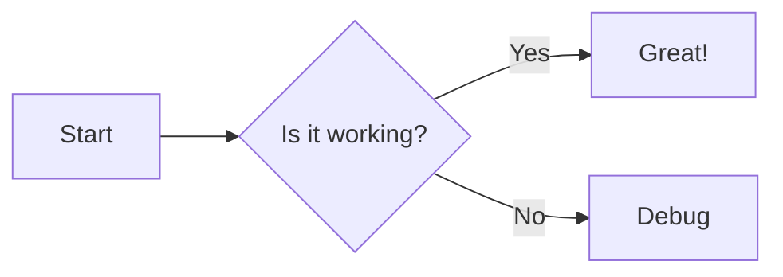
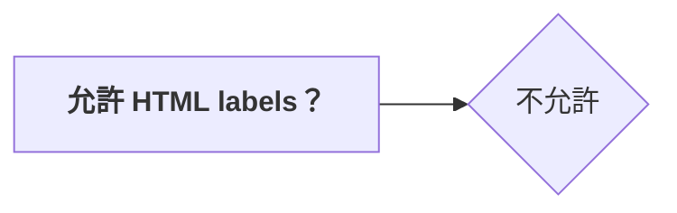
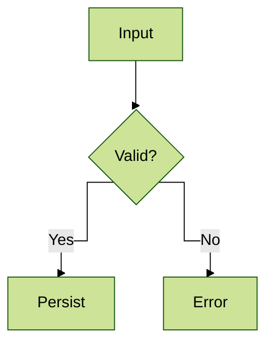
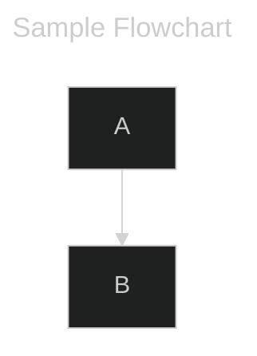
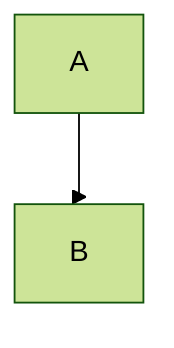

[中文](./README.zh-TW.md) | [English](./README.md) 

[](https://www.npmjs.com/package/@barzhsieh/nuxt-content-mermaid)

# nuxt-content-mermaid

[![npm version][npm-version-src]][npm-version-href]
[![npm downloads][npm-downloads-src]][npm-downloads-href]
[![License][license-src]][license-href]
[![Nuxt][nuxt-src]][nuxt-href]
[](https://mermaid.js.org/)
[](https://content.nuxt.com/)

專為 [**Nuxt Content v3**](https://content.nuxt.com/docs/getting-started) 整合 [**Mermaid**](https://mermaid.js.org/) 的模組。
能自動將 Markdown 中的 \`\`\`mermaid 區塊轉換為響應式的圖表元件，並支援 Lazy Loading 與深色模式切換。

## Features

- **自動轉換**：解析 Markdown 代碼區塊並替換為 `<Mermaid>` 渲染元件。
- **效能優化**：支援 Lazy Loading，僅在元件掛載時載入 Mermaid 核心與資源。
- **主題整合**：無縫整合 `@nuxtjs/color-mode`，自動切換 Light/Dark 對應主題。
- **高度客製**：支援自訂渲染元件（Wrapper）、Loading Spinner、錯誤畫面以及 CDN 來源。
- **Runtime Config**：支援透過環境變數動態覆寫設定。

## 使用前提

- `nuxt@^3.20.1 || ^4.1.0`
- `@nuxt/content@>=3.5.0`

## Quick Setup

### 1. 安裝模組

**自動設定（自動寫入 `modules`）：**

```bash
npx nuxi module add @barzhsieh/nuxt-content-mermaid
```

> Nuxt CLI 對第三方模組預設會裝到 `dependencies`。若你偏好放在 `devDependencies`，請安裝完後移動或改用下方的方式手動安裝。

**裝到 `devDependencies`（需手動加入 `modules`）：**

```bash
# pnpm
pnpm add -D @barzhsieh/nuxt-content-mermaid

# npm
npm install -D @barzhsieh/nuxt-content-mermaid

# yarn
yarn add -D @barzhsieh/nuxt-content-mermaid
```

### 2. 配置 `nuxt.config.ts`

確保模組已加入 `modules` 清單（若使用 `nuxi module add` 則可略過）：

```ts
export default defineNuxtConfig({
  modules: ["@barzhsieh/nuxt-content-mermaid", "@nuxt/content"],
});
```

### 3. 在 Markdown 中使用

在 `content/` 目錄下的 `.md` 檔案中直接撰寫 Mermaid 語法：

````markdown
# 流程圖範例


````

模組會自動將其轉換為 SVG 圖表。

## Configuration

你可以透過 `contentMermaid` 選項進行全域設定。  
（`mermaidContent` 仍會被接受以維持相容，但已棄用，未來版本會移除。）

```ts
// nuxt.config.ts
export default defineNuxtConfig({
  contentMermaid: {
    enabled: true,
    loader: {
      init: {
        securityLevel: "strict",
        // 其他傳遞給 mermaid.initialize() 的參數
      },
      lazy: true,
    },
    theme: {
      light: "default",
      dark: "dark",
    },
    components: {
      renderer: undefined,
      spinner: undefined,
      error: undefined,
    },
    toolbar: {
      title: "mermaid",
      fontSize: "14px",
      fullscreenToolbarScale: 1.25,
      buttons: {
        copy: true,
        fullscreen: true,
        expand: true,
      },
    },
    expand: {
      enabled: true,
      margin: 0,
      invokeOpenOn: {
        diagramClick: true,
      },
      invokeCloseOn: {
        esc: true,
        wheel: true,
        swipe: true,
        overlayClick: true,
        closeButtonClick: true,
      },
    },
  },
});
```

### 參數說明

**Top-level**

| 參數      | 類型      | 預設值 | 說明                           |
| :-------- | :-------- | :----- | :----------------------------- |
| `enabled` | `boolean` | `true` | 是否啟用模組與轉換邏輯。       |
| `debug`   | `boolean` | `false` | 啟用除錯模式；見下方 Debug 說明。 |

**loader**

| 參數             | 類型                                   | 預設值                   | 說明                                                                  |
| :--------------- | :------------------------------------- | :----------------------- | :---------------------------------------------------------------------- |
| `loader.init`    | `MermaidConfig`                        | `{ startOnLoad: false }` | 直接傳遞給 `mermaid.initialize` 的原始設定。                            |
| `loader.lazy`    | `boolean \| { threshold?: number }` | `true`                  | 元件進入 viewport 時才載入 Mermaid；設為 `false` 會在前一刻就載入。 |

**theme**

若專案安裝了 `@nuxtjs/color-mode` 會自動偵測並跟隨；透過 `useMermaidTheme()` 設定的手動主題會優先。

| 參數          | 類型   | 預設值      | 說明                                                                              |
| :------------ | :----- | :---------- | :-------------------------------------------------------------------------------- |
| `theme.light` | string | `'default'` | 當 color-mode 為 light 時的主題，若 color-mode 不存在也會回退使用。               |
| `theme.dark`  | string | `'dark'`    | 當 color-mode 為 dark 時的主題，若 color-mode 不存在也會回退使用。                |

**components**

| 參數                     | 類型     | 預設值     | 說明                                                   |
| :----------------------- | :------- | :--------- | :----------------------------------------------------- |
| `components.renderer`    | `string` | `undefined` | 指定自訂的 Mermaid 實作元件名稱（見進階用法）。        |
| `components.spinner`     | `string` | `undefined` | 指定全域的 Loading 元件名稱。                          |
| `components.error`       | `string` | `undefined` | 指定全域的錯誤顯示元件名稱，渲染失敗時會使用。         |

**toolbar**

| 參數                    | 類型               | 預設值 | 說明                                   |
| :---------------------- | :----------------- | :----- | :------------------------------------- |
| `toolbar.title`         | `string`           | `'mermaid'` | Mermaid 工具列預設標題。               |
| `toolbar.fontSize`      | `string \| number` | `'14px'`    | Mermaid 工具列預設字體大小。           |
| `toolbar.fullscreenToolbarScale` | `number`    | `1.25`      | fullscreen 時工具列字體/圖示的放大倍率。 |
| `toolbar.buttons.copy`  | `boolean`          | `true`  | 顯示工具列複製原始 Mermaid 的按鈕。    |
| `toolbar.buttons.fullscreen` | `boolean`     | `true`  | 顯示工具列全螢幕按鈕。                 |
| `toolbar.buttons.expand`  | `boolean`          | `true`  | 顯示工具列放大按鈕。                   |

**expand**

控制 SVG 放大互動行為，也可直接設為 `expand: false` 來停用，或 `expand: true` 使用預設值。

| 參數                      | 類型      | 預設值 | 說明                                                     |
| :------------------------ | :-------- | :----- | :------------------------------------------------------- |
| `expand.enabled`                      | `boolean` | `true` | 是否啟用放大功能。                                        |
| `expand.margin`                       | `number`  | `0`    | 放大後 SVG 在視窗內保留的邊距（px）。                          |
| `expand.invokeOpenOn.diagramClick`    | `boolean` | `true` | 允許直接點擊 SVG 開啟放大。                                   |
| `expand.invokeCloseOn.esc`            | `boolean` | `true` | 允許按 ESC 關閉。                                         |
| `expand.invokeCloseOn.wheel`          | `boolean` | `true` | 允許滑鼠滾輪關閉。                                        |
| `expand.invokeCloseOn.swipe`          | `boolean` | `true` | 允許滑動手勢關閉。                                        |
| `expand.invokeCloseOn.overlayClick`   | `boolean` | `true` | 允許點擊 overlay 背景關閉。                              |
| `expand.invokeCloseOn.closeButtonClick`| `boolean` | `true` | 顯示 overlay 關閉按鈕。                                   |

**平移與縮放 (Expand Overlay)**

當放大 overlay 開啟時，使用者可平移與縮放圖表：

| 操作 | 桌機 | 行動裝置 |
|:---|:---|:---|
| **平移 (Pan)** | `Space` + 拖曳 | 單指拖曳 |
| **縮放 (Zoom)** | `Ctrl/⌘` + 滾輪 | 雙指捏合 |
| **鍵盤** | `+`/`-` 縮放、方向鍵平移、`0` 重置 | — |

放大介面會顯示縮放工具列，包含 +/−/Reset 按鈕與百分比顯示。

若未按 `Ctrl/⌘` 直接滾動，會顯示提示訊息「Use Ctrl/⌘ + Scroll to zoom」（每次放大僅顯示一次）。


> **Note**: 所有設定皆可透過 `runtimeConfig.public.contentMermaid` 在部署時進行覆寫（`runtimeConfig.public.mermaidContent` 仍支援但已棄用）。

## 樣式自訂（CSS 變數）

模組會提供全域 CSS 變數（來源為 `runtime/styles.css`），讓 Mermaid 區塊與放大 overlay 使用同一套配色。你可以在專案中覆寫：

```css
:root {
  --ncm-code-bg: #f3f4f6;
  --ncm-code-bg-hover: #e5e7eb;
  --ncm-border: #e5e7eb;
  --ncm-text: #111827;
  --ncm-text-muted: #4b5563;
  --ncm-text-xmuted: #6b7280;
  --ncm-overlay-bg: rgba(255, 255, 255, 0.98);
}

html[data-theme="dark"],
.dark {
  --ncm-code-bg: #111827;
  --ncm-code-bg-hover: #1f2937;
  --ncm-border: #1f2937;
  --ncm-text: #f9fafb;
  --ncm-text-muted: #9ca3af;
  --ncm-text-xmuted: #6b7280;
  --ncm-overlay-bg: rgba(17, 24, 39, 0.98);
}
```

可覆寫的變數：
可覆寫的變數：
- `--ncm-code-bg`：Mermaid 區塊背景色
- `--ncm-code-bg-hover`：工具列按鈕 hover 背景
- `--ncm-border-color`：區塊與工具列的邊框顏色
- `--ncm-border-width`：邊框厚度
- `--ncm-border-style`：邊框樣式
- `--ncm-border`：邊框 shorthand（寬度、樣式、顏色）
- `--ncm-border-bottom`：工具列底部的邊框
- `--ncm-text`：主要文字顏色
- `--ncm-text-muted`：標題與次要文字
- `--ncm-text-xmuted`：工具列 icon 與更淡的文字
- `--ncm-overlay-bg`：放大 overlay 背景（預設跟 `--ncm-code-bg` 一致）
- `--ncm-expand-target-bg`：當 `expand.margin > 0` 時，放大後留白的 SVG 外框背景，可以與 overlay 做出區隔
- `--ncm-overlay-opacity`：overlay 的透明度（搭配 margin 留白時可微調濃淡）
- `--ncm-overlay-backdrop`：顯示 overlay 時加上的 `backdrop-filter`，可自訂 blur/效果
- `--ncm-hint-bg`：縮放提示訊息背景色（預設 `rgba(0,0,0,0.75)`）
- `--ncm-hint-text`：縮放提示訊息文字顏色（預設 `#fff`）
- `--ncm-hint-radius`：縮放提示訊息圓角（預設 `8px`）

## Advanced Usage

### Debug 模式

**`contentMermaid.debug`**（預設 `false`）：
  - **自動配置**：若未手動設定 `loader.init.logLevel` 或 `suppressErrorRendering`，開啟 debug 模式會自動將 `logLevel` 設為 `1` (Info)，並將 `suppressErrorRendering` 設為 `false`（允許 Mermaid 在 DOM 中顯示錯誤訊息）。
  - **執行行為**：
    - **Debug 開啟**：`mermaid.run` 使用 `suppressErrors: false`，發生錯誤時會拋出完整堆疊以便除錯。
    - **Debug 關閉**：`mermaid.run` 使用 `suppressErrors: true`，避免單一圖表錯誤中斷其他圖表的渲染。
  - **主控台輸出**：模組會額外輸出渲染佇列的診斷資訊與執行時間統計。

### 主題與顏色模式 (Theme & Color Mode)

模組會依據以下優先順序決定主題：

1. Frontmatter `config.theme`（單篇覆寫）
2. `useMermaidTheme()` 設定的手動模式（若有）
3. `@nuxtjs/color-mode`（安裝時自動偵測）：
  - `dark` → 使用 `theme.dark`
  - `light` → 使用 `theme.light`
4. `loader.init.theme`（若有設定）
5. 回退：`theme.light`，若無則 Mermaid 預設 `'default'`

更多進階手動控制（如：強制指定特定主題、自訂切換邏輯），請參閱 [手動主題控制指南](./docs/ch/MANUAL_THEME_CONTROL.md)。

### 以 frontmatter 覆寫單頁設定

每篇 Markdown 都可以透過於 frontmatter 中加入 `config` 欄位來覆寫模組設定。

> **⚠️ 若要使用 frontmatter `config` 覆寫，務必在 `content.config.ts` 的 collection schema 中宣告 `config` 欄位。**  
> 若未宣告，Nuxt Content 不會將 `config` 解析為 JSON 物件，覆寫將無法生效。

在 `content.config.ts` 加上：

```ts
import { defineContentConfig, defineCollection, z } from '@nuxt/content'

export default defineContentConfig({
  collections: {
    content: defineCollection({
      type: 'page',
      source: '**',
      schema: z.object({
        config: z.record(z.unknown()).optional(), // 宣告 config 欄位
      }).passthrough(),
    }),
  },
})
```

接著在 Markdown frontmatter 使用：

````markdown
---
title: 單篇覆寫 Mermaid 設定範例
config:
  theme: forest
  flowchart:
    htmlLabels: false
---


````

### `%%{init}%%` 語法、frontmatter 與模組設定的優先順序

Mermaid 本身也支援在圖表內透過 `%%{init: ...}%%` 語法覆寫設定，例如：

````markdown

````

> 細節可參考 [Mermaid 官方文件](https://mermaid.js.org/config/directives.html#declaring-directives)

實際生效時的優先順序如下：

1. **圖表內的 `%%{init: ...}%%`** —— 最優先，直接由 Mermaid 處理。  
2. **frontmatter `config`** —— 深度合併在模組的 `loader.init` 之上。  
3. **模組層級的 `contentMermaid.loader.init`** —— 專案的全域預設。  

### Mermaid Inline attrs 與 YAML Frontmatter

支援三種方式控制 Mermaid Svg 的渲染：inline attrs、Mermaid YAML frontmatter、`%%{init}%%` 指令。

#### Inline attrs（fence info）

在 `mermaid` fence 上使用 inline attrs，傳遞 wrapper props 或設定 Mermaid 的 YAML 欄位（包含 `toolbar` 的 title/fontSize 與 `toolbar.buttons.*`）。

````markdown
```mermaid {title="Diagram A" toolbar='{"title":"My Diagram","fontSize":"14px"}' config='{"theme":"dark"}'}
graph TD
  A --> B
```
````

#### Mermaid YAML frontmatter（block 內）

把 Mermaid 的 YAML frontmatter 放在 code block 最前面，用來影響 SVG 輸出（例如 title、displayMode、config），也可以提供 `toolbar` 給 wrapper 元件（包含 `toolbar.buttons.copy: true`）。

````markdown

````

#### `%%{init}%%` 指令（block 內）

使用 Mermaid directive，直接在圖表定義內設定渲染選項。

````markdown

````

### 自訂渲染元件 (Custom Component)

若需完全接管 Mermaid 的渲染行為（例如：加入外框、Expand/Collapse 功能），可指定 `components.renderer`。

1. 在 `nuxt.config.ts` 中指定元件名稱：

   ```ts
   contentMermaid: {
     components: {
       renderer: "MyCustomMermaid",
     }
   }
   ```

2. 在 `components/MyCustomMermaid.vue` 中實作：

   ```vue
   <script setup lang="ts">
   // 你可以在此使用 slot 內容或自行呼叫 useMermaid() 等邏輯
   </script>

   <template>
     <div class="custom-wrapper border rounded p-4">
       <Mermaid>
         <slot />
       </Mermaid>
     </div>
   </template>
   ```

#### 載入中指示

模組在首次渲染前會使用內建的 spinner，如需替換可在 `components.spinner` 指定元件名稱；該元件也會以 `spinner` prop 傳入你的自訂渲染元件，方便直接渲染。

以下是極簡的設定與元件示例：

```ts
// nuxt.config.ts
export default defineNuxtConfig({
  contentMermaid: {
    components: {
      renderer: 'MyCustomMermaid',
      spinner: 'MySpinner', // 選填：改用自己的全域 Loading 元件
    }
  }
})
```

```vue
<!-- components/MyCustomMermaid.vue -->
<script setup lang="ts">
import { ref, onMounted } from 'vue'
import type { Component } from 'vue'

const props = defineProps<{ spinner: Component | string }>()
const loading = ref(true)
onMounted(() => { loading.value = false })
</script>

<template>
  <div class="my-mermaid">
    <component v-if="loading" :is="props.spinner" />
    <Mermaid v-else>
      <slot />
    </Mermaid>
  </div>
</template>
```

### 元件使用方式

可以用 `<Mermaid>` 自己包一個的 Vue 元件 。
例如，你可以同時放入標題、Loading 與錯誤顯示，之後就能在任意模板重複使用：
```vue
<!-- WrapperMermaid.vue -->
<template>
  <section>
    <header v-if="title">{{ title }}</header>

    <Mermaid>
      <slot>
        <pre><code>{{ code }}</code></pre>
      </slot>

      <template #loading>
        <component :is="spinner" v-if="spinner" />
        <p v-else>Diagram loading…</p>
      </template>

      <template #error="{ error, source }">
        <p>渲染失敗：{{ error instanceof Error ? error.message : String(error) }}</p>
        <pre><code>{{ source }}</code></pre>
      </template>
    </Mermaid>
  </section>
</template>
```

```vue
<!-- 使用範例 -->
<WrapperMermaid
  title="Demo Diagram"
  spinner="MySpinner"
>
  <pre><code>graph TD; A-->B; B-->C; C-->A</code></pre>
</WrapperMermaid>
```

可依需求調整此模式，把常用的 slot 寫在一個可重用的包裝元件中。

### 錯誤處理

當 Mermaid 解析或渲染失敗時，`<Mermaid>` 會觸發 `error` slot，並可透過 `components.error` 指定全域錯誤元件。兩者都會拿到錯誤內容與原始 Mermaid 定義，方便除錯。

```vue
<Mermaid>
  <pre><code>graph TD; A-->B; B-->C; C-->A</code></pre>

  <template #error="{ error, source }">
    <p>渲染失敗：{{ error instanceof Error ? error.message : String(error) }}</p>
    <details>
      <summary>查看原始定義</summary>
      <pre><code>{{ source }}</code></pre>
    </details>
  </template>
</Mermaid>
```

若想一次註冊、全域套用自訂錯誤畫面，可在設定中指定元件名稱：

```ts
// nuxt.config.ts
export default defineNuxtConfig({
  contentMermaid: {
    components: {
      error: 'MermaidError', // 全域註冊的元件名稱
    },
  },
})
```

## Contribution

<details>
<summary>Local Development Commands</summary>

```bash
pnpm install
pnpm dev:prepare
pnpm dev       # Run playground
pnpm test      # Run tests
```

</details>

## License

[MIT License](./LICENSE)

<!-- Badges -->

[npm-version-src]: https://img.shields.io/npm/v/@barzhsieh/nuxt-content-mermaid/latest.svg?style=flat&colorA=020420&colorB=00DC82
[npm-version-href]: https://npmjs.com/package/@barzhsieh/nuxt-content-mermaid
[npm-downloads-src]: https://img.shields.io/npm/dm/@barzhsieh/nuxt-content-mermaid.svg?style=flat&colorA=020420&colorB=00DC82
[npm-downloads-href]: https://npmjs.com/package/@barzhsieh/nuxt-content-mermaid
[license-src]: https://img.shields.io/npm/l/@barzhsieh/nuxt-content-mermaid.svg?style=flat&colorA=020420&colorB=00DC82
[license-href]: https://npmjs.com/package/@barzhsieh/nuxt-content-mermaid
[nuxt-src]: https://img.shields.io/badge/Nuxt-020420?logo=nuxt.js
[nuxt-href]: https://nuxt.com
