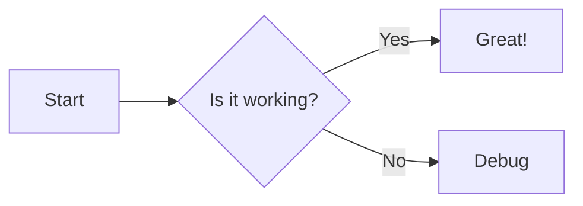

[English](./README.md) | [中文](./README.zh-TW.md)

# nuxt-mermaid-content

[![npm version][npm-version-src]][npm-version-href]
[![npm downloads][npm-downloads-src]][npm-downloads-href]
[![License][license-src]][license-href]
[![Nuxt][nuxt-src]][nuxt-href]
[](https://mermaid.js.org/)
[](https://content.nuxt.com/)

專為 Nuxt + `@nuxt/content` 設計的 Mermaid 整合模組。能自動將 Markdown 中的 ```mermaid 區塊轉換為響應式的圖表元件，並支援 Lazy Loading 與深色模式切換。

## Features

- **自動轉換**：解析 Markdown 代碼區塊並替換為 `<Mermaid>` 渲染元件。
- **效能優化**：支援 Lazy Loading，僅在元件掛載時載入 Mermaid 核心與資源。
- **主題整合**：無縫整合 `@nuxtjs/color-mode`，自動切換 Light/Dark 對應主題。
- **高度客製**：支援自訂渲染元件（Wrapper）、Loading Spinner 及 CDN 來源。
- **Runtime Config**：支援透過環境變數動態覆寫設定。

## Quick Setup

### 1. 安裝模組

```bash
npx nuxi module add nuxt-mermaid-content
```

### 2. 配置 `nuxt.config.ts`

確保模組已加入 `modules` 清單（若使用 `nuxi module add` 則會自動加入）：

```ts
export default defineNuxtConfig({
  modules: ["nuxt-mermaid-content", "@nuxt/content"],
});
```

### 3. 在 Markdown 中使用

在 `content/` 目錄下的 `.md` 檔案中直接撰寫 Mermaid 語法：

````markdown
# 流程圖範例


````

模組會自動將其轉換為 SVG 圖表。

## Configuration

你可以透過 `mermaidContent` 選項進行全域設定。

```ts
// nuxt.config.ts
export default defineNuxtConfig({
  mermaidContent: {
    enabled: true,
    followColorMode: true,
    lightTheme: "default",
    darkTheme: "dark",
    importSource:
      "https://cdn.jsdelivr.net/npm/mermaid@11/dist/mermaid.esm.min.mjs",
    init: {
      securityLevel: "strict",
      // 其他傳遞給 mermaid.initialize() 的參數
    },
  },
});
```

### 參數說明

| 參數               | 類型      | 預設值         | 說明                                                 |
| :----------------- | :-------- | :------------- | :--------------------------------------------------- |
| `enabled`          | `boolean` | `true`         | 是否啟用模組與轉換邏輯。                             |
| `importSource`     | `string`  | `jsdelivr CDN` | 指定 Mermaid ESM 的載入來源（支援 CDN 或本地路徑）。 |
| `followColorMode`  | `boolean` | `true`         | 若安裝了 `@nuxtjs/color-mode`，是否自動切換主題。    |
| `lightTheme`       | `string`  | `'default'`    | 當 `colorMode` 為 light 時的主題。                   |
| `darkTheme`        | `string`  | `'dark'`       | 當 `colorMode` 為 dark 時的主題。                    |
| `mermaidComponent` | `string`  | `undefined`    | 指定自訂的 Mermaid 實作元件名稱（見進階用法）。      |
| `spinnerComponent` | `string`  | `undefined`    | 指定全域的 Loading 元件名稱。                        |
| `init`             | `object`  | `{}`           | 直接傳遞給 `mermaid.initialize` 的原始設定。         |

> **Note**: 所有設定皆可透過 `runtimeConfig.public.mermaidContent` 在部署時進行覆寫。

## Advanced Usage

### 主題與顏色模式 (Color Mode)

模組會依據以下優先順序決定主題：

1. 若 `followColorMode: true` 且專案有安裝 `@nuxtjs/color-mode`：
   - 偵測為 `dark` → 使用 `darkTheme`
   - 偵測為 `light` → 使用 `lightTheme`
2. 若未啟用 `followColorMode`，則使用 `init.theme` 或 Mermaid 預設值。

### 自訂渲染元件 (Custom Component)

若需完全接管 Mermaid 的渲染行為（例如：加入外框、ZoomIn/Out 功能），可指定 `mermaidComponent`。

1. 在 `nuxt.config.ts` 中指定元件名稱：

   ```ts
   mermaidContent: {
     mermaidComponent: "MyCustomMermaid";
   }
   ```

2. 在 `components/MyCustomMermaid.vue` 中實作：

   ```vue
   <script setup lang="ts">
   // 你可以在此使用 slot 內容或自行呼叫 useMermaid() 等邏輯
   </script>

   <template>
     <div class="custom-wrapper border rounded p-4">
       <Mermaid>
         <slot />
       </Mermaid>
     </div>
   </template>
   ```

## Contribution

<details>
<summary>Local Development Commands</summary>

```bash
npm install
npm run dev:prepare
npm run dev       # Run playground
npm run test      # Run tests
```

</details>

## License

[MIT License](./LICENSE)

<!-- Badges -->

[npm-version-src]: https://img.shields.io/npm/v/nuxt-mermaid-content/latest.svg?style=flat&colorA=020420&colorB=00DC82
[npm-version-href]: https://npmjs.com/package/nuxt-mermaid-content
[npm-downloads-src]: https://img.shields.io/npm/dm/nuxt-mermaid-content.svg?style=flat&colorA=020420&colorB=00DC82
[npm-downloads-href]: https://npmjs.com/package/nuxt-mermaid-content
[license-src]: https://img.shields.io/npm/l/nuxt-mermaid-content.svg?style=flat&colorA=020420&colorB=00DC82
[license-href]: https://npmjs.com/package/nuxt-mermaid-content
[nuxt-src]: https://img.shields.io/badge/Nuxt-020420?logo=nuxt.js
[nuxt-href]: https://nuxt.com
