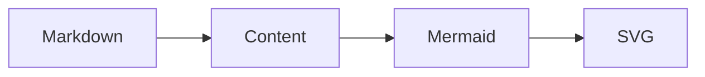

[中文](./README.zh-TW.md) | [English](./README.md)

[](https://nuxt-content-mermaid.barz.app/zh)

# nuxt-content-mermaid

[![npm version][npm-version-src]][npm-version-href]
[![npm downloads][npm-downloads-src]][npm-downloads-href]
[![License][license-src]][license-href]
[![Nuxt][nuxt-src]][nuxt-href]
[](https://mermaid.js.org/)
[](https://content.nuxt.com/)

**@barzhsieh/nuxt-content-mermaid** 會將 Nuxt Content Markdown 中的
`mermaid` 程式碼圍欄 (fence) 轉換為響應式、可互動的圖表，並支援延遲載入、深淺色
主題、工具列控制，以及由應用程式提供的渲染元件。

[英文正式文件](https://nuxt-content-mermaid.barz.app) 是 canonical package
documentation。本 README 是 npm 與 GitHub 的精簡發佈摘要；
[繁體中文網站](https://nuxt-content-mermaid.barz.app/zh) 為 best-effort
translation，可能比英文內容稍晚同步。若兩者有差異，請以英文文件為準。

## 適用情境

當 Nuxt Content 應用程式需要下列能力時，可使用本模組：

- 在 Markdown 中以 Mermaid 程式碼圍欄 (fence) 撰寫圖表；
- 在瀏覽器中渲染圖表，並使用套件提供的載入與錯誤狀態；
- 跟隨應用程式的深色與淺色模式；
- 在全域、單一頁面或單一圍欄 (fence) 設定圖表；
- 選用延遲渲染、工具列控制或自訂渲染元件。

本模組管理相容的 Mermaid 版本；應用程式負責 Nuxt、Nuxt Content peer
dependencies，以及 Nuxt Content database connector。

## 相容性

- Node.js `>=22.19.0`
- Nuxt `^4.1.0`
- Nuxt Content `>=3.5.0 <4.0.0`

相依擁有權、Nuxt Content v2 遷移邊界與渲染保證，請參閱
[相依與遷移契約](./docs/ch/DEPENDENCY_AND_MIGRATION_CONTRACT.md)。

## 快速開始

安裝本模組與 Nuxt Content peer：

```bash
pnpm add @barzhsieh/nuxt-content-mermaid @nuxt/content
```

註冊模組：

```ts
export default defineNuxtConfig({
  modules: ['@barzhsieh/nuxt-content-mermaid'],
})
```

接著在 Content Markdown 檔案中加入 Mermaid 圍欄：

````markdown

```mermaid
flowchart LR
  Markdown --> Content --> Mermaid --> SVG
```
````

Mermaid 已包含在本模組中，不需要另外安裝。資料庫 connector 選擇與完整的
第一個專案步驟，請參閱[開始使用](https://nuxt-content-mermaid.barz.app/zh/getting-started)。

## 繁體中文文件

- [開始使用](https://nuxt-content-mermaid.barz.app/zh/getting-started)
- [撰寫圖表](https://nuxt-content-mermaid.barz.app/zh/writing-diagrams)
- [設定](https://nuxt-content-mermaid.barz.app/zh/configuration)
- [疑難排解](https://nuxt-content-mermaid.barz.app/zh/troubleshooting)
- [升級至 v3](https://nuxt-content-mermaid.barz.app/zh/migration/v3)

## 支持與貢獻

如果本模組對你有幫助，歡迎透過
[Ko-fi 支持我的開源工作](https://ko-fi.com/barzhsieh)。

歡迎建立 [Issue](https://github.com/andy820621/nuxt-content-mermaid/issues)
或提交附有清楚摘要與測試結果的 Pull Request。維護者請遵循
[stable release runbook](./docs/en/RELEASING.md)。

## 授權

[MIT License](./LICENSE)

<!-- Badges -->

[npm-version-src]: https://img.shields.io/npm/v/@barzhsieh/nuxt-content-mermaid/latest.svg?style=flat&colorA=020420&colorB=00DC82
[npm-version-href]: https://npmjs.com/package/@barzhsieh/nuxt-content-mermaid
[npm-downloads-src]: https://img.shields.io/npm/dm/@barzhsieh/nuxt-content-mermaid.svg?style=flat&colorA=020420&colorB=00DC82
[npm-downloads-href]: https://npmjs.com/package/@barzhsieh/nuxt-content-mermaid
[license-src]: https://img.shields.io/npm/l/@barzhsieh/nuxt-content-mermaid.svg?style=flat&colorA=020420&colorB=00DC82
[license-href]: https://npmjs.com/package/@barzhsieh/nuxt-content-mermaid
[nuxt-src]: https://img.shields.io/badge/Nuxt-020420?logo=nuxt.js
[nuxt-href]: https://nuxt.com
