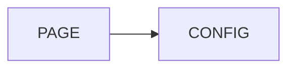

# 遷移至 v3

v3 明確劃分設定邊界。請先更新 Nuxt 設定，然後為每張圖選擇一種設定來源。[Playground 遷移頁](../../playground/pages/migration.vue)可操作地展示支援的路徑。

## 1. 重新命名模組設定鍵

`contentMermaid` 是唯一支援的 Nuxt 設定鍵。`mermaidContent` 不會回退到新鍵；Nuxt setup 會以公開的設定錯誤 fingerprint 停止，避免不完整的遷移看似正常運作。

```ts
// v2 — 已移除
export default defineNuxtConfig({
  mermaidContent: { debug: true },
})

// v3
export default defineNuxtConfig({
  contentMermaid: { debug: true },
})
```

## 2. 將 Module Activation 留在建置期

`contentMermaid.enabled` 是 Module Activation。在 Nuxt 啟動時，它決定模組是否安裝 Markdown transform 與 runtime integration。請只放在 Nuxt 設定中；不要放進 `runtimeConfig.public.contentMermaid`、由環境變數驅動的 public runtime 設定，或應用程式啟動後才變動的程式碼。

```ts
// v3：有效的建置期 activation
export default defineNuxtConfig({
  contentMermaid: { enabled: false },
})

// v3：無效的 public runtime transport
export default defineNuxtConfig({
  runtimeConfig: {
    public: {
      contentMermaid: { enabled: false },
    },
  },
})
```

public runtime transport 會在每個 Nuxt 應用程式（與每個 SSR render context）讀取一次，產生由套件擁有且 frozen 的 Runtime Mermaid Snapshot。之後的變更不是重新渲染、重新初始化或 activation API。

## 3. Runtime 僅傳遞純資料

`runtimeConfig.public.contentMermaid` 接受遞迴的純資料：字串、布林值、`null`、有限數字、plain object 與陣列。它拒絕函式、class instance、accessor、symbol、`undefined`、cycle、非有限數字與 negative zero。

```ts
// v3：有效的 runtime transport
runtimeConfig: {
  public: {
    contentMermaid: {
      loader: { init: { flowchart: { curve: 'basis' } } },
    },
  },
}

// v3：將這個 client-only capability 移到 Direct Mermaid Config
runtimeConfig: {
  public: {
    contentMermaid: {
      loader: { init: { sequence: { actorFont: () => ({ fontSize: 14 }) } } },
    },
  },
}
```

請改為直接傳給元件：

```vue
<Mermaid
  :code="diagram"
  :config="{ sequence: { actorFont: () => ({ fontSize: 14 }) } }"
/>
```

## 4. 選擇 Page 或 Direct Mermaid Config

由 Content 撰寫的 Markdown 使用 Page Mermaid Config。請將純資料放在頁面的 frontmatter `config` 欄位（並在 Nuxt Content collection schema 宣告該欄位）；Markdown Diagram Protocol 會將它提供為 `pageConfig`。

````md
---
config:
  theme: forest
---


````

應用程式程式碼則透過 `config` prop 使用 Direct Mermaid Config，也能使用上述支援的 client-only capabilities。`pageConfig` 與 `config` 是 discriminator，不是覆寫 layer：同時提供兩者會得到 component configuration error。移除其中一個來源即可恢復，元件只會渲染最新的合法狀態。

## 5. 理解 Property-Presence Merge

套件擁有的設定 layers 使用 Property-Presence Merge。只有屬性缺席時才會回退；屬性存在時會取代低優先層，唯一例外是兩者都是 plain object 時才遞迴合併。陣列、`null`、`false`、`0`、空字串與空陣列都是明確的取代值。

```ts
// 低優先層
{ tags: ['default'], label: 'Mermaid', limit: 3, theme: 'dark' }

// 高優先層
{ tags: [], label: '', limit: 0, theme: null }

// 結果
{ tags: [], label: '', limit: 0, theme: null }
```

請勿依賴 `defu` 式的 backfill 來處理這些值。

## 6. 將 `expand` 布林值視為完整重設

`expand: true` 與 `expand: false` 都會重設完整的 expand preset，捨棄低優先層的客製值；object 才是 Property-Presence patch。

```ts
// 低優先層
{ expand: false }

// 不會重新啟用 expand
{ expand: { margin: 32 } }

// 明確重新啟用 expand
{ expand: { enabled: true, margin: 32 } }
```

## 7. 僅辨識公開診斷與渲染保證

設定失敗只暴露 Minimal Public Diagnostic Fingerprint：

| 邊界 | `name` | `code` |
| --- | --- | --- |
| 模組／runtime 設定 | `ContentMermaidConfigurationError` | `CONTENT_MERMAID_CONFIGURATION_ERROR` |
| 元件來源衝突 | `MermaidComponentConfigurationError` | `CONTENT_MERMAID_COMPONENT_CONFIGURATION_ERROR` |

請勿依賴私有 issue schema、queue 狀態、staging ID 或精確的 debug log 文字。渲染是 transactional：當後續渲染失敗、過時，或被來源衝突阻擋時，最新成功 commit 的圖仍會保持可見。

## 遷移檢查表

- 將所有 live `mermaidContent` 設定鍵改為 `contentMermaid`。
- 只在 module configuration 使用 `enabled`。
- public runtime transport 僅保留純資料；將 client-only capability 移至 Direct Mermaid Config。
- Markdown 用 Page Mermaid Config，應用程式程式碼用 Direct Mermaid Config；單一元件不可同時使用兩者。
- 在 Property-Presence Merge 下檢查刻意的空值、falsy 值、`null` 與陣列覆寫。
- 檢查 `expand` 布林值的 reset 行為；若高層 object 必須重啟，加入 `enabled: true`。
- 以公開的 `name` 與 `code` 辨識錯誤，不要依賴內部實作。
