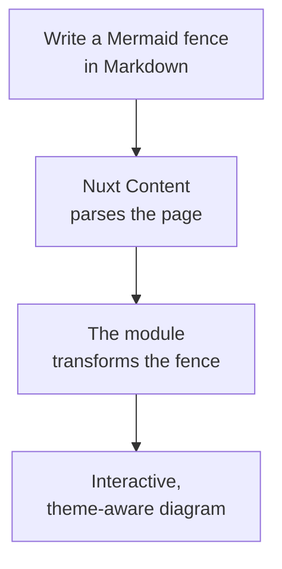

# Documentation Website

## 狀態

本規格是文件網站唯一的產品與架構契約。

- 2026-08-15：完成第一階段簡化，網站收斂為一個 Nuxt Content collection、通用文件 route/layout 與六篇手寫 Markdown。
- 2026-08-15：完成第二階段 landing 優化，以薄 Vue shell 排版首頁，並讓 Mermaid demo 保持內容驅動。
- 2026-08-15：完成第三階段品牌資源整合，以正式 wordmark、favicon 與靜態社群 metadata 建立網站識別。
- 2026-08-15：完成第四階段 wordmark 簡化，以單一 SVG 配合 CSS `currentColor` 支援 light/dark theme。
- 2026-08-15：完成第五階段 responsive navigation 優化，以單一手機文件選單與高辨識 active state 改善導覽。
- 2026-08-15：完成第六階段 code readability 優化，以正確的 Shiki dark tokens、高對比暗色 palette 與一致的 inline／fenced code 排版改善閱讀體驗。

`docs/research/` 內的比較與網站研究是非規範性背景；若研究紀錄與本規格衝突，以本規格為準。

## 決策摘要

網站維持小型、內容驅動的 Nuxt Content 3 架構，但把首頁與文件閱讀介面分成兩個清楚的 seam：

```text
全站 app shell
├── queryCollectionNavigation('docs') → 手機全畫面文件選單
├── / → pages/index.vue → landing shell
│   └── queryCollection('docs').path('/').first()
│       └── ContentRenderer → 首頁 Markdown Mermaid fence
└── 其他內容路徑 → pages/[...slug].vue → layouts/docs.vue
    ├── queryCollection('docs') → ContentRenderer
    ├── queryCollectionNavigation('docs') → 左側 sidebar
    └── page.body.toc.links → 右側 TOC
```

首頁是獨立、薄的 Vue 排版 shell；它不是另一套內容系統。首頁 Mermaid demo 必須走真正的 Markdown → Nuxt Content → 套件 transform → `ContentRenderer` → Mermaid rendering 流程。

網站仍完全退出 root、CI、artifact 與 release 的品質和交付流程。

## 第一原理

網站只有兩種使用情境：

1. 首次造訪者需要在一個畫面內理解套件用途、看到真實 diagram，並前往 Getting Started。
2. 文件讀者需要在多個主題間導覽、閱讀當前內容，並跳到頁內 heading。

Landing 與 docs layout 解決的是不同問題，因此不應讓 docs layout 特判首頁，也不應把 landing presentation 塞進 content schema。兩者只共享全站 header、theme 與 GitHub 入口。

## 目標

- 讓首頁以最少內容直接說明產品價值。
- 讓首頁 Mermaid demo 經過套件使用者真正採用的 Markdown 流程。
- 保留目前容易理解的文件 collection、catch-all route、sidebar 與 TOC。
- 讓一人維護者主要透過 Markdown 維護公開文件。
- 保留全站 light/dark theme toggle 與 GitHub repository 入口。
- 讓手機導覽收斂為單一 hamburger 入口，並讓目前頁面在所有 theme 下清楚可辨。
- 讓 fenced 與 inline code 在 light／dark theme、desktop／mobile 下保持清楚、可辨且容易閱讀。
- 以正式 wordmark、favicon 與靜態社群圖片建立一致的網站識別。
- 不因首頁視覺優化重建 records、demo contract、生成器或驗證系統。
- 讓網站繼續完全退出套件品質與交付流程。

## 非目標

以下能力不屬於本網站：

- Nuxt UI Pro 或其他文件站框架。
- Nuxt Studio。
- 搜尋 API 或全文搜尋索引。
- Plausible、analytics 或動態 OG Image 生成；網站只使用一張既有靜態社群圖片。
- 多段式行銷首頁、testimonial、blog feed 或 release feed。
- Nuxt ESLint 的 Packages／Guide／Legacy 多層分類。
- Landing collection、data collection、自訂 landing schema 或 landing frontmatter model。
- `index.yml`、landing YAML、MDC 專屬 landing 元件或 demo asset。
- Contract Demo、artifact identity、lazy proof 或 runtime evidence；首頁核准的 Markdown／Rendered UI 雙檢視除外。
- Reference records，或以 JSON、YAML、TypeScript、frontmatter、資料 collection 等形式建立的替代 records。
- 網站專用 verifier、parity、freshness、schema、artifact 或 release 驗證。
- 認證、個人化、request-time API、server-side content service 或發佈策略。

## Nuxt Content 3 邊界

### Collection

網站繼續只有一個 `docs` page collection：

```ts
import { defineCollection, defineContentConfig } from '@nuxt/content'

export default defineContentConfig({
  collections: {
    docs: defineCollection({
      type: 'page',
      source: '**',
    }),
  },
})
```

不得新增 landing collection、data collection、Zod schema 或 `pageId`。首頁與文件頁都使用同一 collection 的內建 `path`、`title`、`description`、`navigation` 與 `body` 欄位。

### 公開 API

網站只使用 Nuxt Content 3 的公開 API：

- `defineCollection()` 與 `defineContentConfig()`。
- `queryCollection()`。
- `queryCollectionNavigation()`。
- `ContentRenderer`。
- page document 的 `body.toc.links`。
- 未來必要時可使用標準 `.navigation.yml`，但本次不新增。

不得使用 `queryContent()`、`fetchContentNavigation()`、`useContent()`、`index.yml` 或 document-driven mode。

## 全站 app shell

`website/app.vue` 從只渲染 `NuxtPage`，提升為全站共用 shell。它只負責：

- Skip-to-content link。
- 品牌名稱，連到 `/`。
- `Documentation`，連到 `/getting-started`。
- `Troubleshooting`，連到 `/troubleshooting`。
- Light/dark theme toggle。
- GitHub repository link，連到 `https://github.com/andy820621/nuxt-content-mermaid`。
- 由 `queryCollectionNavigation('docs')` 取得的手機文件選單。
- `NuxtPage`。

Header 在 landing 與所有文件頁都顯示。Landing 不強制 dark mode；theme toggle 在所有頁面都可用。

Theme 使用套件既有的 `useMermaidTheme()` 作為網站與 diagram 的共同狀態，並由全站 root 的 theme attribute 套用 CSS variables。不得為網站另外建立 theme store、theme record 或加入只為 toggle 服務的 UI framework。Theme preference 的跨 reload 持久化不是本次契約。

### Responsive navigation

Desktop header 繼續直接顯示 `Documentation` 與 `Troubleshooting`，desktop 文件頁也繼續顯示 sticky sidebar。

在既有 `48rem` breakpoint 以下：

- Header 收斂成單列，只直接顯示品牌、theme toggle、GitHub link 與 hamburger。
- 原本的 `Documentation`／`Troubleshooting` 文字列隱藏，不得換行到第二列。
- Hamburger 開啟 Header 下方的全畫面文件選單；選單在 landing 與所有文件 route 都使用相同內容。
- 選單標題為 `Documentation`，直接列出 `queryCollectionNavigation('docs')` 產生的 Getting Started、Writing Diagrams、Configuration、Troubleshooting 與 Migration to v3。
- 首頁因 `navigation: false` 不進入文件樹；使用者仍可透過 Header 品牌返回 `/`。
- 選單固定在 Header 下方、覆蓋主內容並自行捲動；它不是 modal dialog，不加入 backdrop、搜尋、分類或 drawer framework。
- 開啟時 hamburger 切換為關閉圖示，背景內容不可互動且不可捲動；Header 的 theme、GitHub 與關閉按鈕仍可操作。
- 點擊文件連結、按下 Escape 或 route 改變時關閉選單；Escape 關閉後將焦點還給 hamburger。

`app.vue` 使用 `mobileMenuOpen` 作為唯一 navigation UI state，不建立 store、composable、component 或另一套 navigation model。Hamburger 必須提供 `aria-expanded`、`aria-controls` 與動態 Open／Close accessible label；選單使用 `<nav aria-label="Documentation">`，active link 保留 `aria-current="page"`。

`app.vue` 使用獨立的 `mobile-docs-navigation` `useAsyncData` key，避免與 `pages/[...slug].vue` 的 `docs-navigation` inline handler 產生 Nuxt incompatible-options warning。兩個查詢都直接呼叫 `queryCollectionNavigation('docs')`；以目前五個靜態 links 的規模，允許這個小幅重複來維持既有 catch-all route／layout props data flow 與四檔案實作範圍。兩個呈現端只各自把 Content navigation tree flatten 成連結清單，不抽出網站 utility。查詢失敗沿用 Nuxt 的既有頁面／generate 錯誤處理，不新增 fallback UI、schema 或 validator。

Desktop sidebar 與 mobile menu 的 active state 使用同一視覺語言：左側 `2px` accent 指示線、`var(--accent)` 文字、較高字重與 `var(--accent-soft)` 背景。Hover 只使用 `var(--surface)`，focus-visible 使用 accent outline，避免 active state 只靠低對比背景或單一色彩表達。

## 品牌資源

### 資源角色

`src/assets/` 是網站品牌資源的單一來源。網站不得把相同檔案複製到 `website/public/`，也不得建立品牌 manifest、asset generator 或同步 script。

正式資源分工如下：

| 資源 | 用途 |
| --- | --- |
| `nuxt-content-mermaid-icon.svg` | Header 的獨立圖示。 |
| `nuxt-content-mermaid-wordmark.svg` | Header 唯一 wordmark；Nuxt／Mermaid 路徑使用 `currentColor`，Content 路徑固定為綠色。 |
| `nuxt-content-mermaid-logo.svg` | 完整 icon + wordmark 品牌原稿；本階段不直接渲染。 |
| `nuxt-content-mermaid.png` | Open Graph 與 Twitter 共用的靜態社群圖片。 |
| `nuxt-content-mermaid.webp`、`nuxt-content-mermaid_wide.png` | 既有替代輸出；本階段不作為 metadata 圖片。 |
| `favicon/*` | Browser favicon、PNG icons、Apple touch icon 與未啟用的 manifest 原稿。 |

既有未追蹤的 `facicon/` 目錄在納入 Git 前更名為語意正確的 `favicon/`。`site.webmanifest` 與 Android icons 可以保留為品牌來源，但網站不連結 manifest；本階段不建立 PWA、service worker 或安裝體驗。

### Header wordmark

Header 首頁連結由以下視覺組成：

1. `nuxt-content-mermaid-icon.svg`。
2. 一個 inline `<svg>` wrapper，透過三個 same-origin external `<use>` 引用 `nuxt-content-mermaid-wordmark.svg` 的 `#nuxt`、`#content` 與 `#mermaid` paths。

Wordmark SVG 根層 `color` 使用 `currentColor`；Header CSS 以既有 `--text` token 設定 wrapper 的 `color`，因此 Nuxt／Mermaid paths 隨網站 theme 切換，`#content` path 的 `#00DC82` 保持不變。Vue 不計算 theme-specific asset URL，也不建立第二個 theme state。Icon 是裝飾圖，wordmark wrapper 以 `<title>` 提供 `Nuxt Content Mermaid` 的 accessible name；整組仍是一個可存取的首頁連結。小螢幕可縮小 wordmark 並讓文字導覽換列，但不得退回純文字品牌或隱藏首頁入口。

### Public asset mapping

`website/nuxt.config.ts` 透過 Nitro `publicAssets` 將 repository 的 `src/assets/` 唯讀映射到網站固定的 `/assets/` 路徑。這是網站 build-time 的靜態資源輸入，不是 package artifact 或 release contract。

此方式的約束是：

- 不複製檔案到 `website/public/`。
- 不使用帶 hash 的 Vite asset URL 作為社群 metadata。
- 不新增 runtime environment variable、asset manifest 或部署檢查。
- Root lint、test、typecheck、build、artifact 與 release 繼續完全忽略網站。

### Favicon 與社群 metadata

全站 head 使用 `/assets/favicon/` 下的既有 favicon 與 Apple touch icon。Manifest 不加入 head。

網站正式 origin 固定為：

```text
https://nuxt-content-mermaid.barz.app
```

全站共用以下靜態 metadata：

- `og:site_name = Nuxt Content Mermaid`。
- `og:type = website`。
- `og:image = https://nuxt-content-mermaid.barz.app/assets/nuxt-content-mermaid.png`。
- `twitter:card = summary_large_image`。
- `twitter:image` 使用同一張絕對網址圖片。

Landing 與文件 route 各自以目前 page 的 `title`、`description` 補齊 Open Graph title／description；全站 shell 以當前 route path 和固定 origin 產生 `og:url`。這只是靜態 head metadata，不新增 Nuxt SEO module、OG renderer、canonical generator 或發布驗證。

## Landing page

### Route seam

新增 `website/pages/index.vue` 作為 `/` 的唯一 route。它與 `pages/[...slug].vue` 並存：

- `pages/index.vue` 只處理 `/`。
- `pages/[...slug].vue` 繼續處理 Getting Started、Writing Diagrams、Configuration、Troubleshooting 與 Migration to v3。
- 不在 catch-all route 內加入 `route.path === '/'` 的 presentation 分支。
- 不建立 landing layout；單一 `pages/index.vue` 就是薄 landing shell。

### Content query

Landing shell 必須使用：

```ts
queryCollection('docs').path('/').first()
```

找不到 page 時回傳 404。SEO title 與 description 直接使用 page 的內建欄位。

Hero 右側必須以 `ContentRenderer` 渲染 page，並只覆寫 transform 產生的 transport node：

```vue
<ContentRenderer
  class="landing-demo-content"
  :value="page"
  :data="{ config: null }"
  :components="{ ContentMermaidTransport: LandingMermaidDemo }"
/>
```

`LandingMermaidDemo` 只接收套件 transform 已產生的 encoded `code`、`pageConfig` 與 `toolbar` props。Markdown tab 解碼同一份 `code` 並補回 fence markers；Rendered UI tab 把相同 props 交回真正的全域 `ContentMermaidTransport`。不得解析 page body AST、複製 fence 或建立第二份 diagram constant。`ContentRenderer` 仍是 page render path，真正的 transport／Mermaid component 仍是唯一 diagram render path。

不得以 `rawbody` 實作 source tab；套件的 file transform 早於 collection 欄位定稿，因此該欄位會得到 transformed MDC 而不是原始 Mermaid fence。Collection 保持 schema-free。

### `content/1.index.md`

首頁 Markdown 只允許以下內容：

````md
---
title: Mermaid diagrams, native to Nuxt Content
description: Turn Mermaid code blocks into interactive diagrams without leaving your Markdown workflow.
navigation: false
---


````

約束：

- Frontmatter 只有 `title`、`description` 與 `navigation: false`。
- Body 只有一個 Mermaid fence。
- 不包含 H1、CTA、cards、HTML wrappers、MDC component、artifact version 或 demo metadata。
- `navigation: false` 必須讓首頁不出現在 docs sidebar。
- Diagram source 是普通 Markdown 內容，不搬到 Vue、asset、JSON、YAML 或 TypeScript constant。

### Vue presentation

`pages/index.vue` 只負責：

- 以 page `title` 與 `description` 排版 hero。
- 顯示 `Get started` primary CTA，連到 `/getting-started`。
- 在 hero 右側放置 page `ContentRenderer`，並以 `LandingMermaidDemo` 提供 Markdown／Rendered UI tabs。
- 顯示三張固定功能卡片。

三張卡片的 title 固定為：

1. `Write diagrams in Markdown`
2. `Render interactive diagrams`
3. `Keep the source readable`

卡片 description 應以使用者結果描述，避免 `authoring surface`、`module transform`、`fallback contract` 等內部術語。初始文案為：

| Title | Description |
| --- | --- |
| Write diagrams in Markdown | Use familiar `mermaid` fences in Nuxt Content. |
| Render interactive diagrams | Get theme-aware diagrams with built-in controls. |
| Keep the source readable | Preserve readable Markdown when JavaScript is unavailable. |

Cards 是 landing presentation，不進入 frontmatter、collection schema 或另一份資料檔。三筆固定內容可以直接留在 `pages/index.vue`，避免為單一 caller 建立淺薄資料 module。

### Visual direction

可從舊首頁取回以下視覺語言：

- 綠色 accent 與柔和 radial gradient。
- 大型、直接的 hero typography。
- Headline 保留原文，以約 `-0.038em` 字距、較寬的 copy column 與自然換行降低壓迫感。
- Desktop 採較寬文字欄與較窄 TD diagram 欄；mobile 改為上下堆疊。
- 右側使用有邊框的 Markdown／Rendered UI tab frame，預設顯示真實 rendered UI。
- 三張簡短 cards；desktop 三欄、mobile 單欄。
- 清楚的 primary CTA。

不得取回：

- Stable artifact badge。
- Live／evidence badge。
- 第二份 diagram source 或 AST parser。
- 第二個 lazy diagram。
- Lazy proof section。
- 重複的 final CTA。
- Contract 或 verifier 語言。

## 文件 routes 與 layout

### Catch-all route

`website/pages/[...slug].vue` 保持現有責任：

- `queryCollection('docs').path(route.path).first()` 讀取文件。
- `queryCollectionNavigation('docs')` 讀取 navigation tree。
- 找不到文件時回傳 404。
- 使用 page `title` 與 `description` 設定 metadata。
- 將 page 與 navigation 傳入 `layouts/docs.vue`。
- 以 `ContentRenderer` 渲染中央內容。

它不處理首頁 presentation，也不需要 landing props 或 conditional layout。

### Docs layout

`website/layouts/docs.vue` 繼續負責：

- Desktop 左側 sidebar：來自 `queryCollectionNavigation('docs')`。
- 中央文件 slot。
- 右側 TOC：來自 `page.body.toc.links`。
- Responsive 文件閱讀排版。

因為 header、skip link 與 mobile navigation 都由 `app.vue` 擁有，docs layout 不再重複擁有 header，也不建立第二個 mobile menu。`48rem` 以下完全隱藏 `.docs-sidebar`，中央內容直接使用單欄；右側 TOC 維持既有 responsive 行為。Layout 不增加搜尋、footer community links、surround navigation 或 mobile drawer framework。

### Troubleshooting

- Route 保留 `/troubleshooting`。
- Top navigation label 使用 `Troubleshooting`，不改名為 FAQ。
- 文件仍出現在 sidebar。
- 內容可以把症狀 heading 寫成使用者自然搜尋的問題，但仍是普通 Markdown。
- 不新增 FAQ collection、accordion、disclosure component 或問題資料模型。

## 程式碼閱讀體驗

### 問題與原則

Nuxt Content 3.15.2 已經為 fenced code 產生 `github-light` 與 `github-dark` Shiki tokens，但它產生的 dark selector 以 `.dark` class 為契約；本網站以 `html[data-theme='dark']` 表示目前 theme，因此 dark mode 仍顯示 light tokens。最差的 fenced-code token 與 `var(--surface)` 只有約 `1.15:1` 對比，不能依賴微調背景解決。

本階段採用 Nuxt 官方文件的核心機制：在 build time 同時產生 light／dark Shiki tokens，並在目前 theme selector 下切換 token 的 `color`、`background-color`、`font-style`、`font-weight` 與 `text-decoration`。不直接複製 Nuxt 的 Material palette，因為它是為 Nuxt 的藍灰 surface 設計；本站保留 `github-light`，dark theme 改用 `github-dark-high-contrast`，使範例程式碼在既有綠色 surface 上保持高對比。

這是內容 presentation，不建立 code component、Prose component、MDC component、client-side highlighter 或另一套 theme state。Shiki 仍由 Nuxt Content 在內容 build 時處理，沒有額外 browser JavaScript。

### Shiki theme 與 selector

`website/nuxt.config.ts` 只透過既有 MDC highlight options 明確指定：

```ts
mdc: {
  highlight: {
    theme: {
      default: 'github-light',
      dark: 'github-dark-high-contrast',
    },
  },
},
```

不得新增 Shiki dependency；Nuxt Content／MDC 既有 highlighter 負責載入 themes。Light theme 保留目前 palette，避免無關的亮色視覺變動。

`website/assets/css/main.css` 以本站既有 theme contract 套用 dark variables：

```css
html[data-theme='dark'] .shiki span {
  color: var(--shiki-dark) !important;
  background-color: var(--shiki-dark-bg) !important;
  font-style: var(--shiki-dark-font-style) !important;
  font-weight: var(--shiki-dark-font-weight) !important;
  text-decoration: var(--shiki-dark-text-decoration) !important;
}
```

這個 selector 不把 root theme 改成 `.dark`，也不修改 `useMermaidTheme()`；網站與 Mermaid 繼續共享目前的 `data-theme` 狀態。

### Fenced code

所有 `.docs-content pre` 保留目前的 `var(--surface)`、`var(--border)`、圓角與 `overflow: auto` fallback，並採用：

- `0.875rem` 字級與約 `1.7` line-height，接近 Nuxt 官方的 `14px / 24px` 閱讀密度。
- `white-space: pre-wrap` 與 `overflow-wrap: break-word`，讓長 package commands 與 URLs 優先在容器內換行。
- 標準的 thin scrollbar color 作為仍需 overflow 時的低干擾 fallback，不建立自訂 scrollbar component 或大量 vendor-specific styling。

換行只改變畫面 presentation，不改動 Markdown source、Shiki token、複製內容或程式碼 whitespace semantics。

### Inline code

`.docs-content :not(pre) > code` 使用與 fenced code 相同的 monospaced font，並加上：

- `var(--surface)` 輕量底色。
- 小幅 horizontal／vertical padding。
- 小圓角。
- 相對於周圍文字略小的字級。

Inline code 不使用 syntax highlighting、不改成 link、不增加 copy button，也不建立專屬 Vue component。表格、清單與段落中的 inline code 使用同一規則。

### 不受影響的內容

- Mermaid diagram 的正常 browser renderer、toolbar、theme 與互動行為不變。
- Mermaid source fallback 不改成 Shiki code block；首頁 source tab 只是同一 transport source 的 presentation，不改變 fallback protocol。
- Landing Mermaid demo、文件內容、navigation、routes、TOC、SEO 與品牌資源不變。
- Code blocks 不增加 title bar、language label、copy button、line numbers、highlighted lines 或 tabs。

## 最終內容樹

```text
website/content/
├── 1.index.md                       # /                    — Landing demo content, navigation: false
├── 2.getting-started.md             # /getting-started     — Getting Started
├── 3.writing-diagrams.md            # /writing-diagrams    — Writing Diagrams
├── 4.configuration.md               # /configuration       — Configuration
├── 5.troubleshooting.md             # /troubleshooting     — Troubleshooting
└── 6.migration/
    └── 1.v3.md                       # /migration/v3         — Migration to v3
```

仍然只有六篇手寫 Markdown。首頁雖不顯示在 sidebar，仍屬於同一個 `docs` page collection。

## 最終網站程式檔案

```text
website/
├── app.vue
├── assets/css/main.css
├── components/
│   └── LandingMermaidDemo.vue
├── content.config.ts
├── layouts/docs.vue
├── nuxt.config.ts
├── package.json
├── pages/
│   ├── index.vue
│   └── [...slug].vue
├── test/
│   └── landingHero.e2e.test.ts
└── tsconfig.json
```

網站只新增一個 page-local transport wrapper 與一個 browser behavior test；仍不需要 `utils/`、`reference/`、`server/` 或網站專用資料／產物 scripts。

## 第二階段檔案變更範圍（已完成）

| 檔案 | 動作 | 設計責任 |
| --- | --- | --- |
| `website/pages/index.vue` | 新增 | 查詢首頁 page、404/SEO、hero、CTA、`ContentRenderer` 與三張 cards。 |
| `website/app.vue` | 修改 | 成為全站 shell，提供 header、theme toggle、GitHub 與 skip link。 |
| `website/layouts/docs.vue` | 修改 | 移除重複 header／skip link，只保留 docs sidebar、content 與 TOC。 |
| `website/content/1.index.md` | 修改 | 只留下核准的內建 frontmatter 與一個 Mermaid fence。 |
| `website/assets/css/main.css` | 修改 | 加入全站 header、light/dark tokens、landing hero/cards 與 responsive styles；保留 docs styles。 |

本次不修改：

- `website/content.config.ts`：仍是唯一 `docs` collection，沒有 schema。
- `website/pages/[...slug].vue`：既有文件查詢與 render path 保持不變。
- 其餘五篇文件 Markdown：內容與 routes 保持不變。
- `website/nuxt.config.ts`、`website/package.json`、`pnpm-lock.yaml`：不新增 landing 或 theme dependency。
- Root scripts、CI、artifact 與 release files：網站仍完全退出這些流程。

本次不新增或恢復任何其他檔案。

## 第三階段檔案變更範圍

| 檔案 | 動作 | 設計責任 |
| --- | --- | --- |
| `src/assets/nuxt-content-mermaid-icon.svg` | 納入 Git | Header icon 品牌原稿。 |
| `src/assets/nuxt-content-mermaid-logo.svg` | 納入 Git | 保留完整品牌原稿，本階段不直接渲染。 |
| `src/assets/nuxt-content-mermaid-wordmark.svg` | 納入 Git | Dark mode Header wordmark。 |
| `src/assets/nuxt-content-mermaid-wordmark-dark.svg` | 新增 | Light mode 的黑色文字 wordmark。 |
| `src/assets/facicon/` → `src/assets/favicon/` | 更名並納入 Git | Browser icon 資源；manifest 不啟用。 |
| `website/nuxt.config.ts` | 修改 | 以 Nitro `publicAssets` 將 `src/assets/` 映射到 `/assets/`。 |
| `website/app.vue` | 修改 | 顯示 theme-aware icon／wordmark，設定 favicon 與全站社群 metadata。 |
| `website/assets/css/main.css` | 修改 | Header 品牌圖片與 responsive 尺寸；移除舊 CSS 品牌圖形。 |
| `website/pages/index.vue` | 修改 | 以首頁 page title／description 補齊 Open Graph metadata。 |
| `website/pages/[...slug].vue` | 修改 | 以文件 page title／description 補齊 Open Graph metadata。 |

第三階段不修改：

- `website/content/**`、`website/content.config.ts` 與 `website/layouts/docs.vue`。
- Landing hero、CTA、功能 cards 與真實 Mermaid `ContentRenderer` demo。
- `website/package.json`、workspace 設定與 lockfile。
- Root scripts、CI、artifact 與 release files。

第三階段不新增 dependency、Vue component、content model、schema、generator、manifest pipeline、test 或永久網站驗證。

## 第四階段檔案變更範圍

| 檔案 | 動作 | 設計責任 |
| --- | --- | --- |
| `src/assets/nuxt-content-mermaid-wordmark.svg` | 修改 | 根層 `color` 改為 `currentColor`，paths 與品牌綠色不變。 |
| `src/assets/nuxt-content-mermaid-wordmark-dark.svg` | 刪除 | 移除重複的 theme-specific asset。 |
| `website/app.vue` | 修改 | 以單一 `<svg>` wrapper 和三個 external `<use>` 取代 theme-specific `` 與 computed URL。 |
| `website/assets/css/main.css` | 修改 | 以 `var(--text)` 控制 wordmark 的 `currentColor`。 |

第四階段不修改 favicon、社群 metadata、內容、routes、layout、navigation、Mermaid demo 或品質與交付邊界，也不新增 component、loader、dependency、generator 或驗證。

## 第五階段檔案變更範圍

| 檔案 | 動作 | 設計責任 |
| --- | --- | --- |
| `website/app.vue` | 修改 | 使用獨立的 `mobile-docs-navigation` query、手機 hamburger、全畫面文件選單、關閉與焦點行為。 |
| `website/layouts/docs.vue` | 修改 | 保留 desktop sticky sidebar，手機完全隱藏 sidebar。 |
| `website/assets/css/main.css` | 修改 | 單列手機 Header、全畫面選單、背景鎖定，以及 light/dark 都清楚的 active／hover／focus styles。 |
| `docs/specs/documentation-website.md` | 修改 | 固定第五階段 responsive navigation 契約與驗收條件。 |

第五階段不修改 Content、routes、collection、favicon、社群 metadata、dependencies、root scripts、CI、artifact 或 release，也不新增 component、composable、store、utility、UI framework、永久測試或網站 verifier。

## 第六階段檔案變更範圍（設計已核准）

| 檔案 | 動作 | 設計責任 |
| --- | --- | --- |
| `website/nuxt.config.ts` | 修改 | 明確指定 `github-light` 與 `github-dark-high-contrast` Shiki themes。 |
| `website/assets/css/main.css` | 修改 | 讓 `data-theme='dark'` 套用 dark tokens，並改善 fenced／inline code 的字級、換行、surface 與 overflow presentation。 |
| `docs/specs/documentation-website.md` | 修改 | 固定第六階段 code readability 契約與驗收條件。 |

第六階段不修改 Markdown、Vue components、routes、layout、navigation、Mermaid runtime、品牌資源、dependencies、workspace、root scripts、CI、artifact 或 release；也不新增 Prose／MDC component、client-side highlighter、copy control、永久測試或網站 verifier。

## 第七階段檔案變更範圍（首頁 source／preview）

| 檔案 | 動作 | 設計責任 |
| --- | --- | --- |
| `website/components/LandingMermaidDemo.vue` | 新增 | 將同一 transport `code` 投影為 Markdown tab，並把 props 交回真正的 `ContentMermaidTransport` 產生 Rendered UI tab。 |
| `website/pages/index.vue` | 修改 | 以 `ContentRenderer.components` 只覆寫首頁的 `ContentMermaidTransport` node。 |
| `website/content/1.index.md` | 修改 | 保持單一 fence，改成四階段 TD 流程。 |
| `website/assets/css/main.css` | 修改 | 放鬆 hero 字距、重新分配欄寬，加入 tab frame、outline glyph、underline active state 與 narrow viewport containment。 |
| `website/test/landingHero.e2e.test.ts` | 新增 | 驗證真實 renderer、同源 Markdown、鍵盤 tabs、明暗 theme 與 320px overflow。 |
| `website/package.json`、`pnpm-lock.yaml` | 修改 | 加入 website-local browser test script 與 workspace 已有的測試工具。 |

第七階段不修改 package transform、renderer、toolbar、theme、lazy loading、root scripts、CI、artifact 或 release pipeline，也不新增 Nuxt UI、collection schema、`rawbody` 或第二份 diagram source。

## 品質與交付邊界

以下 root commands 不得讀取、解析或驗證 `website/**`：

- `pnpm lint`
- `pnpm test`
- `pnpm test:types`
- `pnpm prepack`
- `pnpm verify:source`

CI 不執行網站 lint、test、typecheck、build、generate、browser check 或 content check。Package artifact 與 release scripts 不讀取 website source、manifest、output 或內容。

網站保留本機 `dev`、`generate` 與 `test`。維護者或 AI agent 可以在單次工作中執行 browser behavior tests、generate 和人工檢查 routes／畫面，但不得把結果升格為 package verifier、snapshot、manifest 或 release contract。

## 禁止重新發明 records 或 demo contract

最終架構必須持續符合：

- 只有一個 `docs` page collection。
- 沒有 landing collection、data collection 或自訂 schema。
- 沒有 `index.yml`、landing YAML 或 option inventory。
- Landing page 直接查詢 page document；唯一 adapter 是把 transform 既有 transport props 投影成首頁雙檢視的 `LandingMermaidDemo`。
- Landing Mermaid fence 是 Markdown body，不是 asset 或 TypeScript constant。
- Sidebar 直接來自 `queryCollectionNavigation()`。
- TOC 直接來自 Markdown headings。
- 沒有 Reference records、record components、virtual module 或 generated Markdown。
- 沒有 Contract Demo、artifact identity、lazy proof 或 evidence taxonomy；首頁核准的 source tab 不形成第二份 source record。
- 沒有 parity、freshness、artifact 或 release verifier。
- AI agent 的臨時檢查結果不得提交為網站資料模型或交付契約。

## 驗收條件

設計實作完成時應滿足：

1. `/` 只由 `pages/index.vue` 處理，不使用 docs layout。
2. Landing 使用 `queryCollection('docs').path('/').first()` 取得首頁 page。
3. Hero 的 title／description 來自 page 內建欄位，CTA 連到 `/getting-started`。
4. Hero 右側使用 `ContentRenderer`，且只將 `ContentMermaidTransport` 映射到 `LandingMermaidDemo`。
5. `content/1.index.md` 只有三個核准 frontmatter fields 與一個 Mermaid fence。
6. 首頁 Mermaid diagram 成功經過 Markdown → Content → package transform → browser render。
7. `Rendered UI` 預設啟用；`Markdown` 顯示與首頁 fence 完全相同的 source，兩者共用 transform 的同一份 encoded `code`。兩個 trigger 使用 outline icon；active 同時由 accent 文字、較高字重與 3px underline 表達，dark theme 的低強度 glow 不取代 focus outline。
8. 三張 cards 使用核准的 titles，且不由 schema 或資料檔生成。
9. Desktop Header 在 landing 與文件頁直接顯示 Documentation、Troubleshooting、theme toggle 與 GitHub link；手機 Header 只直接顯示品牌、theme toggle、GitHub 與 hamburger。
10. Theme toggle 同步網站外觀與 Mermaid theme，landing 不強制 dark mode。
11. `pages/[...slug].vue` 繼續處理五個文件 routes；`layouts/docs.vue` 在 desktop 提供 sidebar 與 TOC，在手機完全隱藏 sidebar。
12. `/` 不出現在 sidebar；Troubleshooting 保留 route、名稱與 sidebar entry。
13. Desktop landing 是 hero 雙欄與三欄 cards；mobile 改為單欄，Header 保持單列且不再讓文字導覽換行。
14. Repo 中沒有 landing collection/schema、index.yml、authored MDC landing component、demo asset 或替代 records。
15. Contract Demo、artifact identity、lazy proof、verifier 與其他網站驗證系統仍不存在。
16. Root、CI、artifact 與 release 繼續不讀取或驗證網站；browser test 只由 website-local script 執行。
17. 一次性 `pnpm --dir website generate` 成功產生既有 routes，但不形成永久 gate。
18. 手機 hamburger 在 landing 與文件頁都顯示相同的五個文件 links，並能以 link click、Escape 與 route change 關閉。
19. Mobile menu 開啟時主內容不可互動或捲動，Header actions 仍可操作；Escape 關閉後焦點返回 hamburger。
20. Desktop sidebar 與 mobile menu 的 active link 都具有 accent 指示線、accent 文字、soft background 與 `aria-current="page"`，在 light／dark theme 下清楚可辨。
21. 畫面檢查涵蓋 desktop/mobile × light/dark、hamburger open/close、active state、keyboard focus 與無水平溢位；首頁 browser test 固定 source／preview 的核心互動與 320px containment。
22. Dark theme 的 fenced code 實際使用 `github-dark-high-contrast` 產生的 `--shiki-dark` tokens，不再顯示 light tokens。
23. Light theme 繼續使用 `github-light`，既有文件與 landing 外觀沒有無關的 palette 改變。
24. 所有文件頁的 fenced code 使用一致的 `0.875rem` 字級、易讀 line-height、長行換行與 overflow fallback；一般 desktop／mobile viewport 不因長 install command 產生頁面水平溢位。
25. 段落、清單與表格中的 inline code 具有可辨識的 surface、padding 與圓角，且在 light／dark theme 下保持清楚。
26. Mermaid renderer、fallback semantics、內容、routes、navigation、TOC 與 theme state 不因 code presentation 優化而改變。
27. 一次性 `pnpm --dir website generate` 與 desktop/mobile × light/dark 畫面檢查涵蓋 Getting Started、Writing Diagrams、Configuration、Troubleshooting 與 Migration to v3，但不新增文件頁永久驗證。

## 官方與研究依據

- [Nuxt Content：Getting Started responsive navigation](https://content.nuxt.com/docs/getting-started)
- [Nuxt ESLint：ESLint Module responsive navigation](https://eslint.nuxt.com/packages/module)
- [Nuxt Content：Collection Types](https://content.nuxt.com/docs/collections/types)
- [Nuxt Content：queryCollection](https://content.nuxt.com/docs/utils/query-collection)
- [Nuxt Content：queryCollectionNavigation](https://content.nuxt.com/guide/displaying/navigation)
- [Nuxt Content：ContentRenderer](https://content.nuxt.com/docs/components/content-renderer)
- [Nuxt ESLint landing page](https://eslint.nuxt.com/)
- [Nuxt ESLint module documentation](https://eslint.nuxt.com/packages/module)
- [Nuxt ESLint FAQ](https://eslint.nuxt.com/guide/faq)
- [Nuxt core docs repository：網站由 nuxt.com 提供](https://github.com/nuxt/nuxt/blob/main/docs/README.md)
- [Nuxt.com MDC parser：light／dark Shiki themes](https://github.com/nuxt/nuxt.com/blob/main/helpers/mdc-parser.mjs)
- [Nuxt.com CSS：dark Shiki token selector](https://github.com/nuxt/nuxt.com/blob/main/app/assets/css/main.css)
- `docs/research/documentation-site-architecture-comparison.md`
- `docs/research/nuxt-eslint-site-experience.md`
