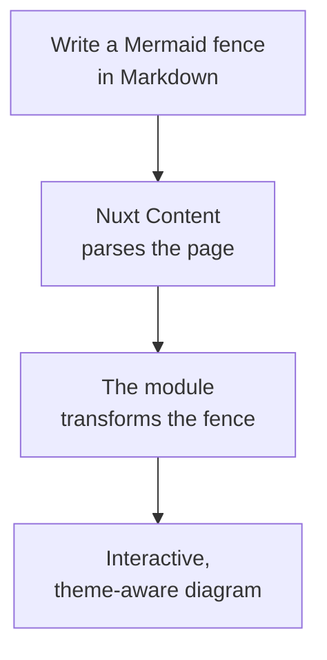

# Homepage hero source/preview design

**Date:** 2026-08-16  
**Status:** Approved design  
**Scope:** Documentation website homepage

## Summary

The homepage hero keeps the existing headline, `Mermaid diagrams, native to Nuxt Content`, while reducing its visual density through a less aggressive negative letter spacing and a wider copy column.

The demo becomes one artifact with two views:

- `Markdown` shows the exact Mermaid fence authored in `content/1.index.md`.
- `Rendered UI` shows that same fence rendered through the real Nuxt Content and nuxt-content-mermaid pipeline.

`Rendered UI` is selected by default. The diagram changes from a wide left-to-right list into a narrow, top-to-bottom explanation of the transformation pipeline.

## Mental model

The hero should answer two questions in order:

1. What does the product produce? The default rendered view proves the outcome.
2. How is it authored? The Markdown view proves that the outcome starts as an ordinary Mermaid fence.

Both views must be projections of one source. They must not contain duplicated diagram definitions that can drift apart.

## Goals

- Preserve the existing headline and description.
- Give the headline more breathing room without weakening its visual weight.
- Make the demo explain the product rather than merely name four technologies.
- Show real Markdown source and real rendered UI in a familiar tabbed frame.
- Preserve the homepage's real `ContentRenderer` path.
- Keep the experience usable with keyboards, screen readers, narrow viewports, light mode, and dark mode.

## Non-goals

- Add source/preview tabs to every Mermaid diagram in the module.
- Add Nuxt UI as a website dependency.
- Reproduce Nuxt UI's visual design or component implementation.
- Change the module's Markdown transform, renderer selection, toolbar, theme, expand, or fullscreen behavior.
- Introduce a second copy of the Mermaid definition in Vue, frontmatter, JSON, YAML, or another Markdown fence.

## Content design

The frontmatter remains:

```yaml
title: Mermaid diagrams, native to Nuxt Content
description: Turn Mermaid code blocks into interactive diagrams without leaving your Markdown workflow.
navigation: false
```

The body remains one ordinary Mermaid fence. Its flow becomes top-to-bottom and distinguishes the roles in the pipeline:



The four nodes represent, respectively, author input, content processing, module responsibility, and reader output. This is more precise than treating `Mermaid` as an ambiguous middle-stage label.

## Data flow

`content/1.index.md` remains the single source of truth. The module's existing Markdown transform encodes the Mermaid fence once and emits `ContentMermaidTransport`. The homepage changes only the component used for that transport node:

```text
One Mermaid fence
  └── module transform → encoded transport `code`
        ├── decode + fence markers → Markdown tab
        └── ContentMermaidTransport → Mermaid → Rendered UI tab
```

The homepage passes the queried page through the existing `ContentRenderer`, with a page-local component map that replaces only `ContentMermaidTransport` with `LandingMermaidDemo`. The wrapper receives the transform's existing `code`, `pageConfig`, and `toolbar` props. It reconstructs the display-only fence from `code` and forwards those same props to the real globally registered transport component.

This avoids the rejected `rawbody` approach: Nuxt Content's file transform runs before collection fields are finalized, so `rawbody` would contain transformed MDC rather than the authored Mermaid fence. The `docs` collection therefore stays schema-free.

No code parses the page AST or maintains a landing-page-specific diagram constant.

## Component boundary

A small `LandingMermaidDemo` transport wrapper owns the two-view interface.

Its public contract mirrors the existing Markdown transport props:

- encoded `code`;
- optional `pageConfig`;
- optional `toolbar`.

It owns:

- active-tab state;
- tab semantics and keyboard behavior;
- reconstructing the Markdown `<pre><code>` presentation from the encoded transport source;
- forwarding the same props to the real `ContentMermaidTransport` in the rendered panel.

It does not parse the Content AST or render Mermaid itself. The homepage remains responsible for querying the page and passing it through `ContentRenderer`; the package transport and `Mermaid` component remain responsible for rendering.

## Interaction and accessibility

- `Rendered UI` is active by default.
- The controls use the tabs pattern: `tablist`, `tab`, and `tabpanel` relationships with stable IDs.
- Left Arrow and Right Arrow move between tabs; Home and End select the first and last tab.
- Only the active tab is in the sequential keyboard focus order.
- Selection and focus remain visibly distinguishable in both themes.
- Inactive content is not exposed as active content to assistive technology.
- The Markdown source can scroll horizontally without widening the page.
- The existing Mermaid toolbar stays inside the rendered panel and retains its current copy, expand, and fullscreen behavior.
- Reduced-motion preferences disable non-essential tab-indicator animation.

## Visual design

The tab frame borrows only the structural idea seen in Nuxt UI's homepage code group: a bordered header with compact tab triggers above a shared content panel. It uses this website's existing color tokens, borders, radius, typography, and shadows.

The hero headline keeps its wording and weight. Its letter spacing moves from the current highly compressed `-0.065em` toward approximately `-0.038em`; the exact value may be adjusted during visual verification. The left column becomes wider because the TD diagram requires less horizontal space than the previous LR diagram.

The intended hierarchy is:

1. eyebrow;
2. headline;
3. description;
4. primary CTA;
5. source/preview proof.

The heading must not rely on forced `<br>` elements. Its wrapping should emerge from the grid width, maximum line length, font size, and letter spacing so it remains resilient across fonts and viewport sizes.

## Responsive behavior

- Wide layouts use two columns, with more space allocated to the copy than before.
- Intermediate layouts keep two columns only while both the headline and demo remain readable.
- Narrow layouts stack the copy above the demo.
- The tab triggers remain visible without truncating their meaning.
- Markdown may scroll inside its own panel; the page itself must not gain horizontal overflow.
- The rendered TD diagram must fit a 320 px viewport without requiring page-level horizontal scrolling.
- Switching tabs must not cause a large avoidable layout shift; both panels should have compatible minimum heights at each breakpoint.

## Loading and failure behavior

- Before Mermaid renders, existing server-rendered fallback semantics remain owned by the module.
- Lazy loading starts when the rendered panel becomes observable. The tab implementation must allow rendering to begin correctly when the preview is selected by default and after later tab switches.
- Existing spinner and render-error behavior remains visible inside the rendered panel.
- A Mermaid render failure does not affect access to the Markdown tab.
- If the encoded transport source is absent, the source panel shows an empty fence instead of fabricating a second definition; browser verification catches this protocol failure.

## Verification

Implementation verification must cover:

- the `docs` collection remains schema-free;
- the homepage still resolves SEO fields and 404 behavior from the queried page;
- the Markdown tab displays the exact body from `content/1.index.md`;
- the rendered tab still uses `ContentRenderer` and produces the built-in Mermaid UI;
- the rendered tab is active by default;
- mouse and keyboard tab switching work;
- tab ARIA relationships are valid;
- focus indicators are visible in light and dark mode;
- no horizontal page overflow occurs at 320 px;
- the diagram renders after tab switching and theme switching;
- lint, unit tests, type tests, and website generation pass.

Visual verification should compare representative desktop, tablet, and 320 px mobile widths in both themes. It should specifically inspect headline spacing, natural line breaks, tab-panel height, nested toolbar density, and diagram legibility.

## Existing specification changes

This design supersedes only the homepage-demo constraints in `docs/specs/documentation-website.md` that prohibit source disclosure and a page-local transport adapter. The following original constraints remain:

- the title and description come from page frontmatter;
- the diagram is authored in `content/1.index.md`;
- the page body contains one Mermaid fence;
- `ContentRenderer` remains the page render path, and the real `ContentMermaidTransport` remains the diagram render path;
- the source is not copied into Vue, assets, frontmatter, or another content block.

The implementation should update the canonical documentation website specification so these contracts do not contradict each other.
