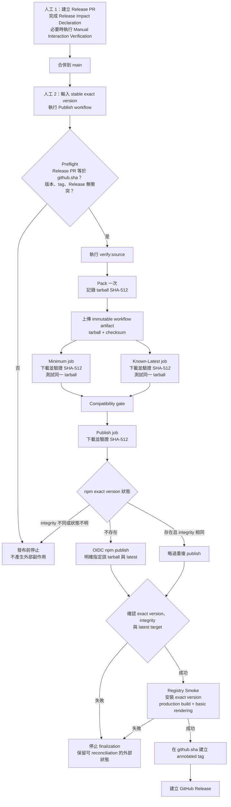

# Release Verification

## 範圍

本規格定義 3.x stable release 的 Release PR gate、發布身分、package artifact
驗證、npm publication、Registry Smoke、Git tag 與 GitHub Release 契約。

每次正常發布只有兩項維護者操作：

1. 建立並合併 Release PR。
2. 在 GitHub Actions 輸入 stable exact version，執行 Publish workflow。

驗證、封裝、consumer smoke test、npm 發布、Registry Smoke、tag 與 GitHub
Release 皆由該流程完成，不要求額外的發布確認或長期 npm token。

## 發布身分

Git commit 指出 tarball 的來源；tarball 是 npm 使用者實際安裝的產品；
SHA-512 是該 tarball bytes 的身分。

```ts
interface ReleaseIdentity {
  sourceCommit: string
  packageName: '@barzhsieh/nuxt-content-mermaid'
  targetVersion: string
  tarballFilename: string
  integritySha512: `sha512-${string}`
}
```

`integritySha512` 使用 npm `dist.integrity` 相同的 Subresource Integrity 格式。
GitHub Actions workflow artifact 負責在 jobs 之間運送 tarball；SHA-512
負責證明下載、測試、發布與 registry 記錄指向相同 bytes。

發布身分存在於 workflow job outputs、checksum 檔與 workflow log。每個下載
artifact 的 job 都必須重新計算 SHA-512，並與 `verify-and-pack` job 的輸出
比較後才能繼續。

## 維護者流程

### 1. Release PR

Release PR 是專用的 release metadata PR，包含：

1. `package.json` 的 stable exact version。
2. 對應的 lockfile 變更（若有）。
3. CHANGELOG 的 target version release notes。
4. Release Impact Declaration，以及必要時的 Manual Interaction Verification 結果。

它不建立 tag、不發布 npm，也不提交 `dist` 或 tarball。它必須通過一般 branch
protection、CI 與本節定義的人工驗證後才能合併。

### Release Impact Declaration 與 Manual Interaction Verification

每個 Release PR 都必須包含 Release Impact Declaration。它以目前 npm `latest`
對應的 release baseline 到 PR head 的完整差異為範圍，分別將下列面向標記為
「受影響」、「不受影響」或「不確定」，並附上簡短依據：

1. package contents。
2. runtime behavior。
3. interaction，包括 fullscreen、zoom、pan、drag、clipboard 與 controls。
4. styling，包括 layout、responsive presentation 與可見 diagram state。
5. browser APIs，包括權限、事件、觀察器與相容性行為。
6. runtime dependencies。

只有 interaction、styling 或 browser APIs 被標記為「受影響」或「不確定」時，
Release PR 才必須完成 Manual Interaction Verification。驗證範圍由 declaration
指出的風險決定，並在 PR 描述記錄測試 commit、環境、情境與結果。

package contents、runtime behavior 與 runtime dependencies 由自動 release gates
處理；這三個維度被標記為「受影響」或「不確定」不會單獨增加人工操作。
runtime code 或 dependency 發生變更，也只有在同時影響 interaction、styling、
browser APIs，或對這三個維度的影響仍不確定時，才觸發 Manual Interaction
Verification。

Release Impact Declaration 與 Manual Interaction Verification 都屬於 Release PR
validation，不是 package artifact identity evidence。Release PR 合併即代表所需
驗證完成；Publish workflow 不再提示、等待或新增人工輸入。

### Release PR 與 `github.sha` 邊界

Publish workflow 只發布 Release PR 的合併結果，不搜尋較舊 commit，也不把後續
`main` 變更加入同一 release：

1. Release PR 的 merge result 必須是 dispatch 當下的 `main` HEAD，並等於 `github.sha`。
2. `github.sha` 必須能對應到一個已合併、base 為 `main` 的 Release PR。
3. 該 commit 的 tree 必須包含 target version 與對應 CHANGELOG release notes；PR 必須包含 Release Impact Declaration 與所需驗證。
4. pack、annotated tag 與 GitHub Release target 都使用同一個 `github.sha`。

若 Release PR 合併後又有其他 commit 進入 `main`，preflight 必須停止。那些變更
只有在新的 Release PR 重新納入 release baseline 並通過 validation 後才能發布。

只要 npm exact target version 尚不存在，替代的 Release PR 可以沿用同一個 target
version，不需 bump，也不必再次修改已正確設定的 `package.json#version`。新的 PR
必須重新涵蓋 intervening diff、更新或確認 CHANGELOG release notes、重做 Release
Impact Declaration，並完成 declaration 所要求的自動與人工驗證。新的 merge
result 取代舊 commit，成為唯一可發布的 `github.sha`。若 npm exact target version
已存在，新的 Release PR 不得以同一版本納入額外 source changes。

### 2. Publish workflow

維護者從 `main` 執行 Publish workflow，只輸入 stable exact version。正常成功
路徑不要求其他輸入或確認。

npm Trusted Publisher 是一次性 repository 設定。它必須綁定實際 publish
workflow 的精確檔名，並允許 `npm publish`。

## Stable version 契約

Publish workflow 只處理 canonical `x.y.z` stable SemVer：不得包含 `v` prefix、
prerelease identifier 或 build metadata。

發布新版本時，target version 必須嚴格高於 npm `dist-tags.latest` 指向的版本。
target 等於目前 `latest` 不授權再次 publish；只允許作為相同 release 的冪等重跑，
且後續必須證明 npm exact version integrity 與 tarball SHA-512 相同。target 低於
`latest`、`latest` 缺失、版本無效或 registry 狀態無法判定時一律停止。

發布後必須同時確認：

1. npm exact version 存在。
2. exact version 的 `dist.integrity` 等於 tarball SHA-512。
3. npm `dist-tags.latest` 精確指向 target version。

## 發布流程



## Workflow 架構與權限

Workflow 僅接受 `workflow_dispatch`，並以固定 repository release concurrency
group 限制同時間只有一個 active release。進行中的 release 不得被較新的執行
取消。

Workflow root 不授予廣泛權限；每個 job 明確宣告最小權限。

| Job | Job-level 權限 | 責任 |
| --- | --- | --- |
| `verify-and-pack` | `contents: read`, `pull-requests: read` | 驗證 Release PR、main、版本、npm baseline 與既有 refs；執行 source gate；pack 一次並上傳 artifact |
| `smoke` matrix | `contents: read` | Minimum 與 Known-Latest 各自下載同一 artifact、驗證 SHA-512 並執行 profile |
| `publish` | `contents: read`, `id-token: write` | 驗證 artifact、reconcile npm、以 OIDC 發布明確 tarball、確認 exact integrity 與 `latest` |
| `registry-smoke` | `contents: read` | 從 public registry 安裝 exact version，驗證 production build 與 basic rendering |
| `finalize` | `contents: write` | Registry Smoke 成功後建立 annotated tag 與 GitHub Release |

## Preflight

`verify-and-pack` 在安裝依賴或 pack 前必須 fail closed：

1. 確認事件為手動 dispatch、`github.ref` 為 `refs/heads/main`，並驗證 Release PR 與 `github.sha` 邊界。
2. 驗證 input 是 stable `x.y.z`、等於 `package.json#version`，並符合 npm `latest` 版本順序。
3. 查詢 npm exact version、remote annotated tag `v<targetVersion>` 與同 tag 的 GitHub Release。
4. 任一 GitHub、Git 或 npm 查詢失敗或結果無法判定時停止。

fresh release 的 npm exact version、remote tag 與 GitHub Release 都必須不存在。
冪等重跑時，existing tag 只能 peeled 到同一個 `github.sha`；existing GitHub
Release 只能綁定該 tag。Release without tag、tag target 不同、Release tag 不同，
或 npm exact version 不存在但 tag／Release 已存在，都是 publish 前衝突。

若 npm exact version 已存在，preflight 只能把執行標記為 reconciliation candidate；
直到 pack 完成並比對 `dist.integrity` 前，不得視為可安全繼續的 release。

## Source gate、pack 與 artifact

Preflight 通過後，`verify-and-pack` 必須依序完成：

1. 使用 lockfile 安裝依賴並執行 `pnpm verify:source`。
2. 只執行一次 `pnpm pack`，檢查 tarball 的 package name、version 與 packlist。
3. 計算 npm SRI SHA-512，產生唯一 `.tgz` 與 checksum。
4. 將 tarball 與 checksum 上傳為同一個 immutable workflow artifact。

後續 jobs 不得執行 `pack`、`prepack`、`prepare`，或任何會重新產生發布
tarball 的路徑。

## Compatibility Profiles

Minimum 與 Known-Latest 使用 `v3-minimum` 與 `v3-known-latest` fixed profile。
兩個 matrix jobs 各自下載 `verify-and-pack` 上傳的 artifact，先比對重新計算的
SHA-512，再把該 `.tgz` 以 retained tarball 模式交給 Clean Package User
Consumer。

每個 profile 驗證 package contents、exports、public types、production build、
runtime startup 與非空 Mermaid SVG。任何一個 profile 失敗都阻止 npm、tag 與
GitHub Release 副作用。

## npm reconciliation 與 publish

`publish` job 在兩個 profiles 成功後執行，使用支援 Trusted Publishing 的明確
Node 與 npm CLI 版本，且不持有長效 npm token。它下載 workflow artifact 後
必須重新計算並驗證 SHA-512。

發布前以 package name 與 exact version 查詢 registry：

1. exact version 不存在：允許進入 publish。
2. exact version 存在且 `dist.integrity` 等於 tarball SHA-512：視為相同 release，略過 publish。
3. exact version 存在但 integrity 不同：停止。
4. 網路、權限或 registry 回應無法判定：停止，不把未知狀態視為不存在。

真正發布時必須把下載後驗證過的 `.tgz` 明確路徑直接傳給 `npm publish`，指定
public access 與 `latest` dist-tag，並停用 lifecycle scripts。禁止呼叫不帶
tarball 的 `npm publish`。

發布後以有界 retry 查詢 npm，直到 exact version、`dist.integrity` 與 `latest`
都符合 Stable version 契約；逾時或不一致都停止 finalization。

## Registry Smoke

Registry Smoke 在 npm exact version、integrity 與 `latest` 全部確認後執行，且
必須早於 tag 與 GitHub Release。

它在乾淨的 Package User consumer 中使用 fixed `v3-known-latest` profile，並只
允許從 public npm registry 安裝
`@barzhsieh/nuxt-content-mermaid@<targetVersion>`。workspace、workflow tarball、
source path 與 dist-tag fallback 都不是有效輸入。

Registry Smoke 只執行輕量的 registry-facing gate：

1. 確認實際安裝 manifest 的 name 與 version 精確相符。
2. 完成 production build。
3. 啟動 production consumer，確認基本 rendering 產生可見且非空的 Mermaid SVG。

它不重跑 archive、exports、public types 或兩個 compatibility profiles。

Registry Smoke 失敗時不得建立 tag 或 GitHub Release。因 npm publication 已可能
完成，重跑時必須先走相同 exact version、integrity 與 `latest` reconciliation，
再重試 Registry Smoke。若 clean consumer 證實為 package defect，維護者應
deprecate 該 exact version 並發布新的修正版，不自動 unpublish。

## Annotated tag 與 GitHub Release

只有 Registry Smoke 成功後，`finalize` job 才能執行。annotated tag 名稱為
`v<targetVersion>`，target 必須是 `sourceCommit`，亦即 Release PR merge result
與 workflow 的 `github.sha`。

Finalization 每次都從 GitHub 與 Git refs reconciliation：

1. remote tag 不存在：建立 annotated tag 並 push。
2. remote tag 已存在且 peeled target 相同：繼續；target 不同則停止。
3. GitHub Release 不存在：以該 tag 與 CHANGELOG 對應段落建立。
4. GitHub Release 已存在且 tag 相同：視為完成；不一致則停止。

npm package 可能比 Git tag 與 GitHub Release 早數分鐘出現；npm 與 GitHub 不構成
單一原子交易，workflow 以 reconciliation 安全完成剩餘步驟。

## 失敗與重跑語意

Workflow 的冪等性來自即時外部狀態、`github.sha` 與 tarball integrity。

| 失敗位置 | 外部狀態 | 正確處理 |
| --- | --- | --- |
| npm publish 前 | npm、tag、Release 都未改變 | 修正 Release PR 或問題後重新執行 |
| npm publish 回應不明 | npm 可能已存在 | 由 post-check 或 failed-job rerun 重新 reconciliation |
| Registry Smoke 失敗 | npm 可能已發布；tag、Release 未建立 | 保留 exact version，調查後 rerun failed jobs；確認 package defect 時 deprecate 並發布修正版 |
| finalization 失敗 | npm 與 Registry Smoke 已成功；tag 或 Release 未完成 | rerun failed job，依既有 refs reconciliation |
| integrity、`latest`、tag 或 Release 衝突 | 外部狀態與 Release Identity 不一致 | 硬停止，不覆蓋、不重新 pack、不建立誤導 release |

優先使用 GitHub 的 **Re-run failed jobs**，以保留原 workflow run 的
`sourceCommit` 與 artifact。全新 dispatch 仍必須通過 Release PR 與
`github.sha` 邊界，不得從更新後的 `main` 靜默重建同一版本。

## 驗證邊界

實作與自動測試必須證明：

1. 非 main、非 stable version、版本不遞增、Release PR／`github.sha` 不符、既有 ref 衝突與 indeterminate response 都 fail closed。
2. 每個 release attempt 只 pack 一次，兩個 profiles 與 publish 使用同一 artifact 並驗證 SHA-512。
3. npm reconciliation 的不存在、相同 integrity、不同 integrity 三條路徑正確，且發布後確認 exact version、integrity 與 `latest`。
4. Registry Smoke 只安裝 registry exact version，並在 tag 前驗證 production build 與 basic rendering。
5. Release Impact Declaration 涵蓋六個 canonical 維度；只有 interaction、styling 或 browser APIs 受影響或不確定時觸發 Manual Interaction Verification，其他維度由自動 gate 處理。

測試應注入 Git、GitHub PR／Release、npm registry 與 artifact effects；自動測試
不得發布、deprecate 或 unpublish 真實 package。Workflow YAML 應接受語法與
action 版本檢查。

## 官方規則依據

- [npm Trusted Publishing](https://docs.npmjs.com/trusted-publishers/)：GitHub Actions OIDC、精確 workflow 檔名、`id-token: write`、支援的 Node/npm CLI 與自動 provenance 規則。
- [GitHub Actions workflow permissions](https://docs.github.com/en/actions/reference/workflows-and-actions/workflow-syntax)：job-level `permissions` 與最小權限語意。
- [GitHub Actions concurrency](https://docs.github.com/en/actions/how-tos/write-workflows/choose-when-workflows-run/control-workflow-concurrency)：concurrency group 與 `cancel-in-progress` 語意。
- [actions/upload-artifact](https://github.com/actions/upload-artifact)：workflow artifact immutability 與 digest 行為。
