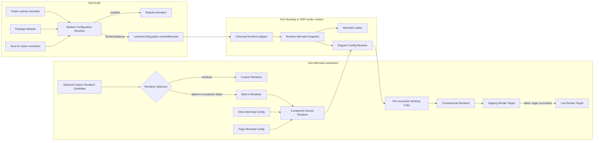
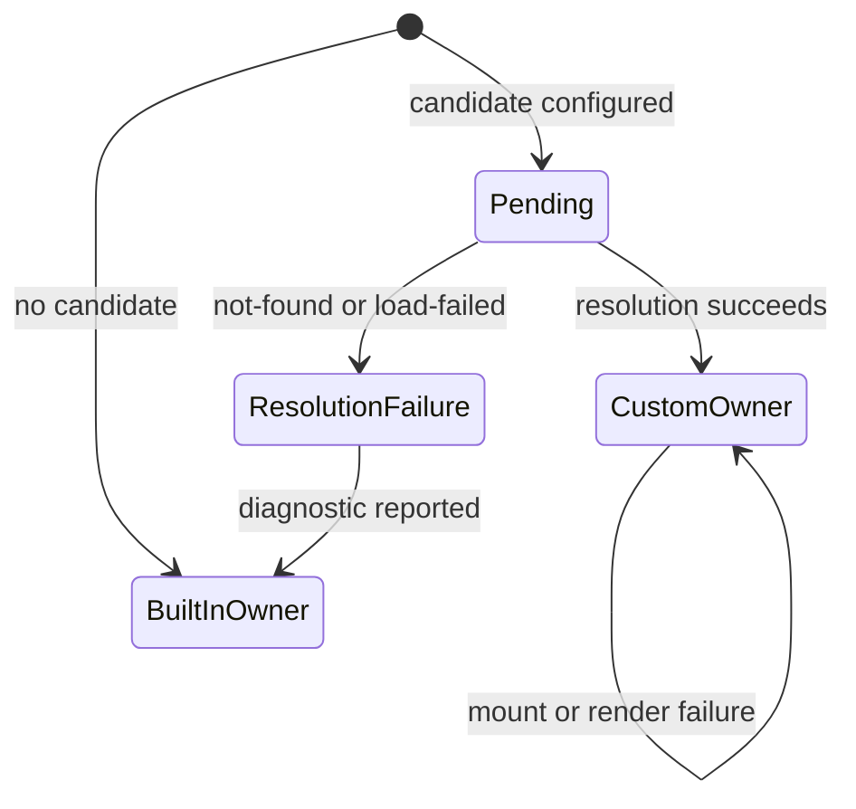

# V3 Configuration Architecture

## Status

Accepted for the 3.x release line. This specification is the source of truth for integrated seam ownership, public release boundaries, and verification scope.

## Release Boundary

Version 3.0 supports Nuxt `^4.1.0` with Nuxt Content `>=3.5.0 <4.0.0`. It preserves the public `$mermaid: () => Promise<Mermaid>` injection, current Custom Renderer interface, styling hooks, manual theme control, and Mermaid configuration capability available through direct application code.

Version 3.0 deliberately breaks the legacy aliases and configuration behaviors listed under [Public Interface and Breaking Changes](#public-interface-and-breaking-changes).

## Architecture

### 1. Nuxt Option Resolution

Nuxt Kit remains the upstream owner of inline-module-option versus `contentMermaid` config-key resolution. The package receives Nuxt-Resolved Module Options after Nuxt's `defu` processing and does not claim Property-Presence Merge semantics before that seam.

Complete package defaults are absent from `defineNuxtModule.defaults`, so Nuxt cannot backfill arrays, `null`, or explicit falsy values before the package sees its canonical input.

### 2. Module Configuration Resolver

The Module Configuration Resolver is the package-owned build seam. It validates observable raw inputs and resolves a fixed low-to-high sequence:

1. package defaults;
2. Nuxt-Resolved Module Options;
3. `runtimeConfig.public.contentMermaid` build-time overrides.

It observes application-owned inputs through property descriptors, so validation never invokes getters, setters, or serialization hooks. Package defaults remain internal and valid strict pure data; callers cannot replace or reorder them.

It returns Module Activation separately from runtime options. `enabled` is resolved exclusively from package defaults and Nuxt-Resolved Module Options; the presence of an own `enabled` property in public runtime overrides is an error regardless of value. The final runtime payload is a wholly package-owned clone, remains mutable for Nuxt's build-time transport, and is validated before being written to public runtime config.

Module setup performs a descriptor-safe preflight for the removed top-level `mermaidContent` key. An own property triggers the migration error even when its value is `undefined` or provided by an accessor, and the accessor is never invoked. The package never reads, mirrors, removes, or falls back to `runtimeConfig.public.mermaidContent`.

All configuration preflight and resolution completes before setup changes Nuxt Content hooks, component registration, runtime config, or runtime files. When Module Activation is false, setup returns without installing the Markdown transform or runtime integration and without writing a runtime payload.

### 3. Configuration Core

All named override resolvers share Property-Presence Merge, which:

- consumes an explicit sequence from low to high and is never regrouped;
- falls back only when a property is absent;
- recursively merges only when both values are plain objects;
- replaces arrays and every other present value, including `null`, `false`, zero, empty strings, and empty arrays;
- never mutates an input;
- rejects prototype-pollution keys.

The structural merger handles only normalized data. Each named resolver owns shorthand interpretation, domain validation, accepted `null` behavior, precedence, and final-result validation.

### 4. Validation and Diagnostics

Transport validation uses property descriptors and never calls getters, setters, `toJSON`, or serialization hooks. Strict pure data accepts strings, booleans, `null`, finite numbers other than negative zero, plain objects, and arrays. It rejects accessors, symbols, `undefined` values, functions, bigint, non-plain instances, cycles, non-finite numbers, and negative zero.

Validation stops at the first failing Configuration Validation Phase but aggregates safely observable issues within that phase. It stops an unsafe branch while continuing safe siblings, traverses shared non-cyclic references once per reachable path, stops after collecting the fiftieth issue with truncation recorded, and orders issues by structured path segments followed by stable code.

Package-owned objects use closed schemas. Mermaid- or Markdown-owned payloads use open schemas whose unknown pure-data keys survive validation, cloning, merging, snapshots, and working-copy materialization. Explicitly package-owned islands remain closed inside open payloads.

Global configuration failures expose the Minimal Public Diagnostic Fingerprint:

- name: `ContentMermaidConfigurationError`
- code: `CONTENT_MERMAID_CONFIGURATION_ERROR`

Component invocation failures expose a separate fingerprint:

- name: `MermaidComponentConfigurationError`
- code: `CONTENT_MERMAID_COMPONENT_CONFIGURATION_ERROR`

Neither error class nor its internal issue types are exported from the package entry.

### 5. Runtime Transport and Universal Runtime Adapter

`runtimeConfig.public.contentMermaid` carries only Runtime Options; it never carries `enabled`. Runtime Mermaid Config is a recursively pure-data, open-key projection of Mermaid Config that removes function, `any`, and other non-transport leaves at every depth.

The Universal Runtime Adapter runs once per Nuxt application instance, including each SSR render context. It starts from the actual public payload, removes framework reactivity without retaining proxies, validates the raw phase, applies runtime defaults and domain shorthands, validates the final phase, creates a wholly package-owned tree, and always deep-freezes it.

The adapter publishes one app-scoped Runtime Mermaid Snapshot through a private internal seam. The snapshot is initialization state, not a live control plane. Loader and component code consume only this snapshot; later mutation of public runtime config is outside the 3.0 contract.

### 6. Component Configuration Sources

One shared Component Source Resolver owns source presence, mutual exclusion, source discrimination, and source-specific validation for every Mermaid component invocation.

The component accepts exactly one optional configuration source:

- `pageConfig`: open-key strict pure data received through Nuxt Content;
- `config`: Direct Mermaid Config with the supported Mermaid capability surface.

The props are a TypeScript discriminated union. A source is provided when its value is not `undefined`; providing both is a component configuration error before either value is inspected, merged, materialized, or selected. With neither source, diagram configuration comes from the Runtime Mermaid Snapshot alone.

The Markdown Diagram Transform emits the Page Mermaid Config protocol. Page and direct configs are source discriminators rather than competing override layers, so no precedence exists between them.

The Diagram Config Resolver combines runtime configuration with the selected source using its source-specific validation and materialization policy. Theme Resolution Policy remains separate from structural merge.

### 7. Direct Config Working Copies

Every Direct Mermaid Config passed to Mermaid initialization or rendering receives a fresh working copy:

- plain objects and arrays are recursively copied and share no structural references with the input or another invocation;
- non-cyclic shared references are preserved within one working copy;
- RegExp values at supported paths are recreated from their source, flags, and last index, while custom properties are rejected;
- provider-owned opaque capabilities retain identity only at an exact, versioned allowlist of upstream-supported paths;
- all other non-plain instances are rejected.

Opaque capability functions and objects are not frozen, wrapped, cloned, or traversed. Their closures and attached state remain provider-owned.

### 8. Expand, Toolbar, Metadata, and Theme

Expand boolean values reset the whole preset. `true` replaces the accumulator with fresh enabled package defaults; `false` replaces it with fresh disabled package defaults; an object is a Property-Presence patch. A lower `false` followed by a higher `{ margin: 32 }` therefore remains disabled unless the higher object explicitly sets `enabled: true`.

Toolbar input, Mermaid YAML frontmatter, fence inline attributes, and Diagram Mermaid Config use separate named resolvers. Inline-attribute syntax and toolbar objects are closed; YAML frontmatter and Mermaid config are open with closed islands. Recognized invalid Markdown metadata follows Selective Fallback instead of producing partially transformed output.

Theme selection remains a semantic policy: selected diagram-source theme, manual Mermaid theme mode, detected color mode, then configured fallback. It is not implemented through structural merge.

### 9. Component Conflict Lifecycle

Initial setup validates the mutually exclusive source invariant synchronously before creating downstream watchers, resolving themes, or rendering. An initial conflict throws and creates no recovery watcher.

Later source updates are resolved after Vue completes the current update batch. One uninterrupted period with both props supplied is one Component Configuration Conflict: it reports once, blocks new Render Requests, and logically invalidates queued and executing Render Generations.

If the component survives Vue error handling and later becomes legal, exactly one request is made for the then-current resolved source and configuration. Intermediate states are not replayed. A later legal interval creates a new episode boundary, so a future distinct conflict can report once again.

Conflict orchestration consumes Component Source Resolver outcomes and Direct Config materialization results. It does not repeat source validation, source discrimination, or working-copy logic.

### 10. Renderer Selection and Rendering Ownership

Setting `components.renderer` creates a Custom Renderer Candidate, not a Rendering Owner. Renderer Selection resolves that candidate before assigning ownership and maintains the following internal state machine:

While resolution is pending, the component has no Rendering Owner. Renderer Selection retains the established outer styling seam and neutral source fallback from the slot or `code`, but it does not instantiate Built-in Renderer UI, lazy loading, error handling, or render lifecycle. Exact pending DOM structure beyond existing styling hooks is not a public contract.

Successful resolution atomically assigns ownership to the Custom Renderer. It receives only the established `code`, default slot, and `spinner` inputs and completely owns configuration, theme, toolbar, loading, error presentation, and rendering. A later Custom Renderer mount or render failure never transfers ownership to the Built-in Renderer.

Each pending selection attempt owns a one-shot failure commit. After an asynchronous result settles, orchestration first rejects superseded attempts. A current `not-found` or `load-failed` result synchronously reports one Custom Renderer Resolution Diagnostic and only then commits Built-in ownership. The diagnostic is an internal invariant and test seam, not a public structured-diagnostics interface. Independently of `debug`, Package Users receive a console diagnostic containing the package prefix, candidate, and understandable failure reason; exact wording is not guaranteed. `components.error` remains exclusive to Built-in Mermaid render failures.

`src/runtime/components/Mermaid.vue` remains the public orchestration entry and `.mermaid-outer-wrapper` remains its sole root. The internal Built-in Renderer owns the existing `.mermaid-block` root, Mermaid lifecycle, lazy loading, toolbar, fullscreen, loading and error presentation, and related styles without adding a wrapper. The public entry forwards `loading` and scoped `error` slots unchanged. Existing element hierarchy, class hooks, fallback source markup, and Custom Renderer inputs remain stable; compiler-generated scoped-style attributes are not public CSS contracts.

This preserves the existing availability-oriented fallback. Fail-closed selection is deferred unless a concrete safety or compliance requirement makes a Custom Renderer mandatory. A future need to preserve package UI and lifecycle while replacing only diagram generation must use a separately named low-level render adapter rather than changing `components.renderer`.

### 11. Transactional Rendering

Every Render Request belongs to a component-local Render Generation. Only the latest legal generation can commit live package-managed DOM or presentation state. A stale queued request may be skipped; work already executing may finish but its result is discarded. No public contract promises physical interruption, `AbortSignal`, or a particular queue implementation.

Each attempt renders in a Staging Render Target isolated from the live target. Commit uses one synchronous live-target replacement only after rendering succeeds and generation and configuration eligibility are rechecked. Failed, stale, or conflict-invalidated attempts leave the latest Committed Diagram unchanged.

Browser verification against Mermaid 11.12.3 established that a truly disconnected flowchart target fails while querying layout geometry. Both strict SVG and sandbox iframe output succeed when staging is temporarily connected to a package-owned offscreen measurement host and can be moved into the live target. Staging isolation therefore means outside the live render subtree, not necessarily disconnected from the document; the measurement host is always removed after the attempt.

## Public Interface and Breaking Changes

| Area | 3.0 contract | Migration impact |
| --- | --- | --- |
| Nuxt config key | Only `contentMermaid` is supported | `mermaidContent` throws a migration error |
| Module activation | `contentMermaid.enabled` is build-only | Remove `enabled` from public runtime config |
| Runtime transport | Runtime options permit only strict pure data | Move function and non-plain values to Direct Mermaid Config |
| Runtime mutation | Public runtime config is read at NuxtApp initialization | Post-start mutation has no rerender or reinitialization guarantee |
| Component props | `pageConfig` and `config` are mutually exclusive | Content-generated calls use Page Mermaid Config; direct calls retain `config` |
| Markdown output | The transform emits the Page Mermaid Config binding | Update tests or integrations that match generated markup |
| Merge behavior | Property presence, array replacement, explicit falsy replacement | Migrate config relying on `defu` array or null behavior |
| Expand boolean | A boolean resets the whole preset | Re-enable above lower `false` with an explicit `enabled: true` patch |
| Invalid configuration | Fail fast without fallback and expose diagnostic fingerprints | Invalid transport or config props stop their owning phase |
| Rendering | Only the latest legal successful generation commits | Stale or failing renders no longer clear the Committed Diagram |

Other preserved public contracts include the `$mermaid` injection, Direct Mermaid Config capability, Custom Renderer inputs, CSS hooks, lazy-loading behavior, and manual theme composable.

## Derived Behavior

- A stale Render Outcome cannot update loading, error, first-render, overlay, fullscreen, or live diagram state; generation checks guard presentation state as well as DOM.
- A Component Configuration Conflict is never routed into per-diagram render-error presentation.
- `null` counts as a supplied source prop and then fails that source's object contract; only `undefined` means absent.
- Recognized invalid Markdown metadata uses Selective Fallback; unexpected transform defects still fail the Content build.
- Explicit Mermaid initialization log-level and error-rendering values win; otherwise their values derive from the module debug policy.
- Transactional success requires an error-propagating Mermaid render call. A result that may have swallowed a render failure cannot be committed as success.
- The existing Custom Renderer interface is preserved. The wrapper enforces source mutual exclusion without inventing new Custom Renderer config props.
- A configured Custom Renderer Candidate pauses Built-in creation until resolution assigns exactly one Rendering Owner.
- Failure after successful Custom Renderer resolution never falls back to the Built-in Renderer.
- A Staging Render Target may be document-connected only in a package-owned offscreen measurement host; isolation from the live target is the invariant.

## Implementation Defaults

These choices are internal, reversible, and not public contracts:

- retain the existing serialized global Mermaid execution queue initially, with generation checks before expensive work and before commit;
- use transaction-unique staging IDs;
- store each Runtime Mermaid Snapshot behind a private app-scoped seam;
- unwrap framework proxies at the adapter edge, then validate descriptors and build an owned tree;
- traverse string keys in code-unit order and numeric array indexes numerically before applying the issue cap;
- duplicate shared references when materializing transport data, preserving them only where the Direct Config Working Copy requires it;
- begin with the narrow capability and RegExp path allowlist represented by supported Mermaid and DOMPurify types;
- use a fresh offscreen measurement host for each active attempt and remove it unconditionally;
- keep `theme.useColorModeTheme` as its existing deprecated no-op in 3.0;
- choose the console method, internal function names, diagnostic object representation, component-loading mechanism, and test helper without expanding their public contract;
- preserve current lazy-loading and Custom Renderer behavior except where the accepted conflict and recovery invariant requires one latest recovery request.

## Out of Scope

- physical cancellation, `AbortSignal`, queue coalescing, queue replacement, and other wasted-work optimizations;
- Nuxt 4.3 native `contentMermaid: false` while the minimum supported Nuxt version remains 4.1;
- reactive runtime configuration with specified Mermaid reinitialization and rerender behavior;
- a new client-only extension seam for capabilities not carried by Direct Mermaid Config;
- a versioned public structured-diagnostics interface;
- additional non-plain-instance adapters or capability paths without a current typed Package User;
- a redesign of the Custom Renderer interface;
- a low-level render adapter that preserves Built-in Renderer UI and lifecycle while replacing only diagram generation;
- removal of the deprecated `theme.useColorModeTheme` no-op.

## Verification Boundary

Implementation is complete only when tests cover:

- public type regressions for recursive pure data, removed aliases, and mutually exclusive props;
- every validation category, phase-local aggregation, issue cap, sorting, path formatting, descriptor safety, cycles, and shared references;
- Property-Presence Merge and the complete expand transformation matrix;
- build resolver priority, separated activation, Nuxt 4.1-compatible disable behavior, alias migration failure, and final runtime transport;
- per-NuxtApp snapshot ownership, proxy detachment, deep freeze, fail-fast behavior, and non-live runtime mutation;
- Page and Direct source validation, capability materialization, open-key preservation, and per-invocation isolation;
- Markdown metadata ownership, Selective Fallback, and the Page Mermaid Config protocol;
- no-owner pending behavior, neutral source fallback, atomic Custom Renderer ownership, and absence of Built-in creation after successful resolution;
- exactly-once `not-found` and `load-failed` diagnostics before Built-in fallback with `debug` both enabled and disabled, without routing through `components.error`;
- Custom Renderer mount and render failures remaining under Custom Renderer ownership without Built-in fallback;
- logical invalidation, stale work, staging cleanup, strict and sandbox commit, Committed Diagram preservation, one-error-per-conflict, and latest-only recovery;
- lint, unit tests, type tests, package build, and relevant Nuxt browser fixtures.

Playground production build is outside this architecture's mandatory
verification boundary. Its risk-based release-readiness policy is owned by
[`release-verification.md`](./release-verification.md).
