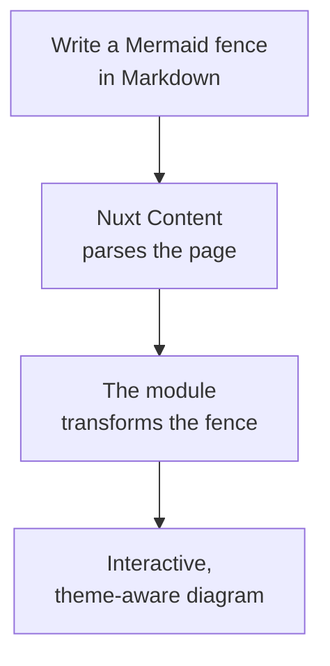

# Homepage Hero Source/Preview Implementation Plan

> **For agentic workers:** REQUIRED SUB-SKILL: Use superpowers:subagent-driven-development (recommended) or superpowers:executing-plans to implement this plan task-by-task. Steps use checkbox (`- [ ]`) syntax for tracking.

**Goal:** Preserve the homepage headline while presenting one Mermaid fence as an accessible Markdown/Rendered UI demo with a narrower TD diagram and more relaxed hero typography.

**Architecture:** `website/content/1.index.md` remains the only Mermaid source. Nuxt Content exposes that body as `rawbody` for a small `LandingDemoTabs` presentation component, while the parsed page continues through `ContentRenderer` and the package's real renderer in the preview slot.

**Tech Stack:** Nuxt 4.5.2, Nuxt Content 3.15.2, Vue 3, TypeScript, Mermaid 11.16.1, Vitest 4.1.10, `@nuxt/test-utils` 4.1.0, Playwright 1.62.1, CSS.

## Global Constraints

- Keep the exact title `Mermaid diagrams, native to Nuxt Content`.
- Keep the exact description `Turn Mermaid code blocks into interactive diagrams without leaving your Markdown workflow.`
- Keep one `docs` page collection and one Mermaid fence in `website/content/1.index.md`.
- `ContentRenderer` remains the only diagram render path.
- Do not copy the diagram definition into Vue, frontmatter, JSON, YAML, assets, or a second fence.
- `Rendered UI` is the default tab.
- Do not add Nuxt UI or reproduce its component implementation.
- Preserve the built-in Mermaid toolbar, theme, loading, error, expand, and fullscreen behavior.
- Preserve 320 px page-level horizontal-overflow support.
- Keep the website outside the root release/artifact pipeline; website tests run through website-local scripts.

---

## File Structure

- Create `website/components/LandingDemoTabs.vue`: own the accessible two-tab presentation and display the supplied source string.
- Create `website/test/landingHero.e2e.test.ts`: exercise the public homepage behavior in Chromium.
- Modify `website/content.config.ts`: declare Nuxt Content's built-in `rawbody` field on the existing collection.
- Modify `website/content/1.index.md`: replace the LR list with the approved four-stage TD pipeline.
- Modify `website/pages/index.vue`: pass `page.rawbody` to the tab component and keep `ContentRenderer` in its default slot.
- Modify `website/assets/css/main.css`: style the tab frame, panels, typography, grid, and responsive behavior.
- Modify `website/package.json` and `pnpm-lock.yaml`: add website-local test/typecheck scripts and existing catalog test tools.
- Modify `test/documentationContract.test.ts`: protect the single-source content and collection contract.
- Modify `docs/specs/documentation-website.md`: reconcile the canonical website contract with the approved design.

### Task 1: Establish the single-source content contract

**Files:**
- Modify: `test/documentationContract.test.ts`
- Modify: `website/content.config.ts`
- Modify: `website/content/1.index.md`
- Modify: `docs/specs/documentation-website.md:58-107`
- Modify: `docs/specs/documentation-website.md:217-305`

**Interfaces:**
- Consumes: Nuxt Content's `z`, `defineCollection()`, and `defineContentConfig()` exports.
- Produces: `DocsCollectionItem.rawbody: string`; one TD Mermaid body consumed by Task 2.

- [ ] **Step 1: Add a failing source-contract test**

Extend `test/documentationContract.test.ts` with these file reads and test:

```ts
const homepageFiles = {
  contentConfig: readDocument('../website/content.config.ts'),
  content: readDocument('../website/content/1.index.md'),
}

describe('documentation website homepage source contract', () => {
  it('exposes one top-to-bottom Mermaid fence as rawbody', () => {
    expect(homepageFiles.contentConfig).toContain('rawbody: z.string()')
    expect(homepageFiles.content.match(/^```mermaid$/gm)).toHaveLength(1)
    expect(homepageFiles.content).toContain('flowchart TD')
    expect(homepageFiles.content).toContain('Write a Mermaid fence')
    expect(homepageFiles.content).toContain('Nuxt Content')
    expect(homepageFiles.content).toContain('The module')
    expect(homepageFiles.content).toContain('Interactive,')
  })
})
```

- [ ] **Step 2: Run the focused test and verify the red state**

Run:

```bash
pnpm exec vitest run test/documentationContract.test.ts
```

Expected: FAIL because `rawbody: z.string()` and `flowchart TD` do not exist yet.

- [ ] **Step 3: Declare the built-in raw body field**

Replace `website/content.config.ts` with:

```ts
import { defineCollection, defineContentConfig, z } from '@nuxt/content'

export default defineContentConfig({
  collections: {
    docs: defineCollection({
      type: 'page',
      source: '**',
      schema: z.object({
        rawbody: z.string(),
      }),
    }),
  },
})
```

- [ ] **Step 4: Replace the homepage body with the approved TD flow**

Keep the frontmatter unchanged and replace only the fence in `website/content/1.index.md`:

````md

````

- [ ] **Step 5: Reconcile the canonical website specification**

Update `docs/specs/documentation-website.md` so it:

- permits only the minimal `rawbody: z.string()` schema on the existing `docs` collection;
- lists `rawbody` among the approved Nuxt Content page fields;
- replaces the LR fence with the exact TD fence above;
- replaces the prohibition on source disclosure with the approved two-view source/preview contract;
- states that `LandingDemoTabs` receives `page.rawbody` but does not parse the page AST;
- keeps `ContentRenderer` as the only diagram render path;
- keeps the prohibition on duplicate source records and website-specific artifact/release verifiers.

- [ ] **Step 6: Verify the contract and generated type**

Run:

```bash
pnpm exec vitest run test/documentationContract.test.ts
pnpm dev:prepare
pnpm --dir website exec nuxi prepare
pnpm --dir website exec nuxi typecheck
```

Expected: the focused Vitest file passes, Nuxt preparation succeeds, and `rawbody` is accepted as a generated `docs` collection field.

- [ ] **Step 7: Commit the single-source contract**

```bash
git add test/documentationContract.test.ts website/content.config.ts website/content/1.index.md docs/specs/documentation-website.md
git commit -m "feat(website): expose homepage mermaid source"
```

### Task 2: Build and integrate the accessible source/preview tabs

**Files:**
- Create: `website/components/LandingDemoTabs.vue`
- Create: `website/test/landingHero.e2e.test.ts`
- Modify: `website/pages/index.vue:46-51`
- Modify: `website/package.json`
- Modify: `pnpm-lock.yaml`

**Interfaces:**
- Consumes: `source: string` from `page.rawbody`; default slot containing `ContentRenderer`.
- Produces: `LandingDemoTabs` with tab IDs `landing-demo-source-tab` and `landing-demo-preview-tab`, panel IDs with matching suffixes, and default active tab `preview`.

- [ ] **Step 1: Add website-local test tooling**

Add these scripts to `website/package.json`:

```json
"test": "vitest run",
"test:types": "vue-tsc --noEmit"
```

Add these `devDependencies`, using the existing workspace catalogs:

```json
"devDependencies": {
  "@nuxt/test-utils": "catalog:test",
  "playwright": "catalog:test",
  "typescript": "catalog:dev",
  "vitest": "catalog:test",
  "vue-tsc": "catalog:dev"
}
```

Run `pnpm install` to update `pnpm-lock.yaml` without changing catalog versions.

- [ ] **Step 2: Write the failing browser behavior test**

Create `website/test/landingHero.e2e.test.ts`:

```ts
import { readFileSync } from 'node:fs'
import { fileURLToPath } from 'node:url'
import { createPage, setup, url } from '@nuxt/test-utils/e2e'
import { describe, expect, it } from 'vitest'

const websiteRoot = fileURLToPath(new URL('..', import.meta.url))
const homepageMarkdown = readFileSync(
  fileURLToPath(new URL('../content/1.index.md', import.meta.url)),
  'utf8',
)
const expectedSource = homepageMarkdown.replace(/^---\r?\n[\s\S]*?\r?\n---\r?\n+/, '').trim()

describe('documentation website landing hero', async () => {
  await setup({
    rootDir: websiteRoot,
    browser: true,
  })

  it('shows the real render by default and exposes the exact Markdown source', async () => {
    const page = await createPage()
    await page.goto(url('/'))

    const sourceTab = page.getByRole('tab', { name: 'Markdown' })
    const previewTab = page.getByRole('tab', { name: 'Rendered UI' })
    const sourcePanel = page.getByRole('tabpanel', { name: 'Markdown' })
    const previewPanel = page.getByRole('tabpanel', { name: 'Rendered UI' })

    expect(await previewTab.getAttribute('aria-selected')).toBe('true')
    expect(await previewPanel.isVisible()).toBe(true)
    expect(await sourcePanel.isVisible()).toBe(false)
    expect(await previewPanel.locator('.mermaid-block').count()).toBe(1)

    await sourceTab.click()

    expect(await sourceTab.getAttribute('aria-selected')).toBe('true')
    expect((await sourcePanel.textContent())?.trim()).toBe(expectedSource)
    expect(await previewPanel.isVisible()).toBe(false)
  })

  it('supports Arrow, Home, and End keyboard navigation', async () => {
    const page = await createPage()
    await page.goto(url('/'))

    const sourceTab = page.getByRole('tab', { name: 'Markdown' })
    const previewTab = page.getByRole('tab', { name: 'Rendered UI' })

    await previewTab.focus()
    await previewTab.press('ArrowLeft')
    expect(await sourceTab.getAttribute('aria-selected')).toBe('true')
    expect(await sourceTab.evaluate(element => element === document.activeElement)).toBe(true)

    await sourceTab.press('End')
    expect(await previewTab.getAttribute('aria-selected')).toBe('true')

    await previewTab.press('Home')
    expect(await sourceTab.getAttribute('aria-selected')).toBe('true')
  })
})
```

- [ ] **Step 3: Run the browser test and verify the red state**

Run:

```bash
pnpm dev:prepare
pnpm --dir website test
```

Expected: FAIL because the homepage has no `tab` or `tabpanel` roles.

- [ ] **Step 4: Implement the focused tab component**

Create `website/components/LandingDemoTabs.vue`:

```vue
<script setup lang="ts">
type DemoTab = 'source' | 'preview'

defineProps<{
  source: string
}>()

const tabs = [
  { id: 'source', label: 'Markdown', badge: 'MD' },
  { id: 'preview', label: 'Rendered UI', badge: 'UI' },
] as const

const activeTab = ref<DemoTab>('preview')
const tabButtons = useTemplateRef<HTMLButtonElement[]>('tabButtons')

function selectTab(tab: DemoTab) {
  activeTab.value = tab
}

async function handleTabKeydown(event: KeyboardEvent, index: number) {
  const lastIndex = tabs.length - 1
  const nextIndex = {
    ArrowLeft: index === 0 ? lastIndex : index - 1,
    ArrowRight: index === lastIndex ? 0 : index + 1,
    Home: 0,
    End: lastIndex,
  }[event.key]

  if (nextIndex === undefined)
    return

  event.preventDefault()
  const nextTab = tabs[nextIndex]
  if (!nextTab)
    return

  selectTab(nextTab.id)
  await nextTick()
  tabButtons.value?.[nextIndex]?.focus()
}
</script>

<template>
  <div class="landing-demo">
    <div class="landing-demo__surface">
      <div
        class="landing-demo__tabs"
        role="tablist"
        aria-label="Mermaid demo views"
      >
        <button
          v-for="(tab, index) in tabs"
          :id="`landing-demo-${tab.id}-tab`"
          ref="tabButtons"
          :key="tab.id"
          class="landing-demo__tab"
          :class="{ 'landing-demo__tab--active': activeTab === tab.id }"
          type="button"
          role="tab"
          :aria-controls="`landing-demo-${tab.id}-panel`"
          :aria-selected="activeTab === tab.id"
          :tabindex="activeTab === tab.id ? 0 : -1"
          @click="selectTab(tab.id)"
          @keydown="handleTabKeydown($event, index)"
        >
          <span class="landing-demo__tab-badge" aria-hidden="true">{{ tab.badge }}</span>
          {{ tab.label }}
        </button>
      </div>

      <div
        id="landing-demo-preview-panel"
        v-show="activeTab === 'preview'"
        class="landing-demo__panel landing-demo__panel--preview"
        role="tabpanel"
        aria-labelledby="landing-demo-preview-tab"
        tabindex="0"
      >
        <slot />
      </div>

      <div
        id="landing-demo-source-panel"
        v-show="activeTab === 'source'"
        class="landing-demo__panel landing-demo__panel--source"
        role="tabpanel"
        aria-labelledby="landing-demo-source-tab"
        tabindex="0"
      >
        <pre><code>{{ source }}</code></pre>
      </div>
    </div>
  </div>
</template>
```

- [ ] **Step 5: Integrate the component without changing the render path**

Replace the current `.landing-demo` wrapper in `website/pages/index.vue` with:

```vue
<LandingDemoTabs :source="page.rawbody">
  <ContentRenderer
    :value="page"
    :data="{ config: null }"
  />
</LandingDemoTabs>
```

- [ ] **Step 6: Verify behavior and types**

Run:

```bash
pnpm --dir website test
pnpm --dir website test:types
```

Expected: both browser tests pass and the generated `rawbody` type satisfies the component prop.

- [ ] **Step 7: Commit the interaction**

```bash
git add website/components/LandingDemoTabs.vue website/test/landingHero.e2e.test.ts website/pages/index.vue website/package.json pnpm-lock.yaml
git commit -m "feat(website): add homepage source preview tabs"
```

### Task 3: Apply typography and responsive visual polish

**Files:**
- Modify: `website/test/landingHero.e2e.test.ts`
- Modify: `website/assets/css/main.css:198-285`
- Modify: `website/assets/css/main.css:463-553`

**Interfaces:**
- Consumes: the class names produced by `LandingDemoTabs.vue` in Task 2.
- Produces: a two-column desktop hero, stacked mobile hero, internally scrolling source panel, and visually stable source/preview panels.

- [ ] **Step 1: Add a failing narrow-viewport containment test**

Append this test inside the existing E2E `describe` block:

```ts
it('contains source overflow at a 320px viewport in both themes', async () => {
  const page = await createPage()
  await page.setViewportSize({ width: 320, height: 900 })
  await page.goto(url('/'))
  await page.getByRole('tab', { name: 'Markdown' }).click()

  const overflow = await page.evaluate(() => {
    const source = document.querySelector<HTMLElement>('.landing-demo__panel--source pre')
    return {
      pageOverflow: document.documentElement.scrollWidth - document.documentElement.clientWidth,
      sourceOverflow: source ? source.scrollWidth - source.clientWidth : -1,
      sourceOverflowStyle: source ? getComputedStyle(source).overflowX : null,
    }
  })

  expect(overflow.pageOverflow).toBeLessThanOrEqual(0)
  expect(overflow.sourceOverflow).toBeGreaterThanOrEqual(0)
  expect(overflow.sourceOverflowStyle).toBe('auto')

  await page.getByRole('button', { name: 'Switch to dark mode' }).click()
  expect(await page.locator('html').getAttribute('data-theme')).toBe('dark')
  expect(await page.evaluate(() => document.documentElement.scrollWidth - document.documentElement.clientWidth)).toBeLessThanOrEqual(0)
})
```

- [ ] **Step 2: Run the focused browser test and verify the red state**

Run:

```bash
pnpm --dir website test -- --testNamePattern="contains source overflow"
```

Expected: FAIL because the new source panel has no containment or responsive styling.

- [ ] **Step 3: Rebalance the hero typography and columns**

Update the existing landing rules in `website/assets/css/main.css`:

```css
.landing-hero {
  display: grid;
  grid-template-columns: minmax(0, 1.08fr) minmax(25rem, 0.92fr);
  gap: clamp(2.75rem, 6vw, 5.5rem);
  align-items: center;
}

.landing-hero__copy {
  max-width: 41rem;
}

.landing h1 {
  max-width: 13ch;
  margin: 0;
  font-size: clamp(3rem, 5.5vw, 5.25rem);
  font-weight: 780;
  letter-spacing: -0.038em;
  line-height: 0.99;
}
```

Do not add forced `<br>` elements to the heading.

- [ ] **Step 4: Style the tab frame and compatible panels**

Replace the current `.landing-demo` block and its Mermaid descendants with rules that retain the glow on the outer element and clip only the inner surface:

```css
.landing-demo {
  position: relative;
  min-width: 0;
}

.landing-demo::before {
  position: absolute;
  inset: -1.5rem;
  z-index: -1;
  background: radial-gradient(circle, color-mix(in srgb, var(--accent) 14%, transparent), transparent 68%);
  content: "";
  filter: blur(18px);
}

.landing-demo__surface {
  overflow: hidden;
  background: color-mix(in srgb, var(--surface-elevated) 92%, transparent);
  border: 1px solid var(--border);
  border-radius: 1.25rem;
  box-shadow: var(--shadow);
}

.landing-demo__tabs {
  display: flex;
  align-items: center;
  gap: 0.3rem;
  min-width: 0;
  padding: 0.55rem;
  overflow-x: auto;
  background: color-mix(in srgb, var(--surface) 45%, var(--surface-elevated));
  border-bottom: 1px solid var(--border);
}

.landing-demo__tab {
  display: inline-flex;
  flex: none;
  align-items: center;
  gap: 0.5rem;
  padding: 0.55rem 0.7rem;
  color: var(--muted);
  background: transparent;
  border: 0;
  border-radius: 0.55rem;
  font: inherit;
  font-size: 0.82rem;
  font-weight: 650;
  cursor: pointer;
}

.landing-demo__tab:hover,
.landing-demo__tab--active {
  color: var(--text);
  background: var(--surface-elevated);
}

.landing-demo__tab-badge {
  display: inline-grid;
  width: 1.4rem;
  height: 1.4rem;
  place-items: center;
  color: var(--accent-contrast);
  background: var(--accent-strong);
  border-radius: 0.3rem;
  font-family: "SFMono-Regular", Consolas, monospace;
  font-size: 0.58rem;
  font-weight: 800;
}

.landing-demo__panel {
  min-width: 0;
  min-height: 22rem;
}

.landing-demo__panel--preview {
  padding: clamp(0.85rem, 2vw, 1.25rem);
}

.landing-demo__panel--preview .mermaid-block {
  margin: 0;
}

.landing-demo__panel--preview .mermaid-wrapper {
  min-height: 19.5rem;
}

.landing-demo__panel--source pre {
  min-height: 22rem;
  margin: 0;
  overflow: auto;
  padding: clamp(1rem, 2.5vw, 1.5rem);
  color: var(--text);
  background: transparent;
  font-size: 0.78rem;
  line-height: 1.7;
  tab-size: 2;
  white-space: pre;
}

.landing-demo__panel--source code {
  font: inherit;
}
```

- [ ] **Step 5: Update the existing breakpoints**

At `max-width: 62rem`, use:

```css
.landing-hero {
  grid-template-columns: minmax(0, 1fr) minmax(23rem, 0.85fr);
  gap: 2.5rem;
}
```

Keep the existing one-column layout at `max-width: 48rem`, and replace its demo sizing with:

```css
.landing-demo__panel {
  min-height: 18rem;
}

.landing-demo__panel--preview .mermaid-wrapper {
  min-height: 16rem;
}

.landing-demo__panel--source pre {
  min-height: 18rem;
}

.landing-demo::before {
  inset: -0.75rem;
}
```

Do not add tab-trigger animation in this task, so no new reduced-motion rule is needed.

- [ ] **Step 6: Run behavior, responsive, type, and production checks**

Run:

```bash
pnpm --dir website test
pnpm --dir website test:types
pnpm --dir website generate
```

Expected: all website tests pass, Vue types pass, and Nuxt generates the homepage and documentation routes successfully.

- [ ] **Step 7: Perform visual verification**

Run `pnpm --dir website dev`, then inspect `/` at these viewport widths in both themes:

- 1280 px: natural headline wrapping, relaxed spacing, two balanced columns, readable default TD render.
- 768 px: no collision between the copy and the 23 rem demo column.
- 320 px: stacked layout, complete tabs, internal source scrolling, no page overflow.

Switch `Rendered UI → Markdown → Rendered UI` at every width. Confirm that the Mermaid toolbar remains usable, the panels do not create a large avoidable height jump, focus outlines are not clipped, and the diagram still renders after theme switching.

- [ ] **Step 8: Run the repository-required checks**

Run:

```bash
pnpm lint --fix
pnpm test
pnpm test:types
```

Expected: lint makes no unintended changes, the root Vitest suite passes, and root/playground type checks pass.

- [ ] **Step 9: Commit the visual polish**

```bash
git add website/assets/css/main.css website/test/landingHero.e2e.test.ts
git commit -m "style(website): refine homepage hero demo"
```
