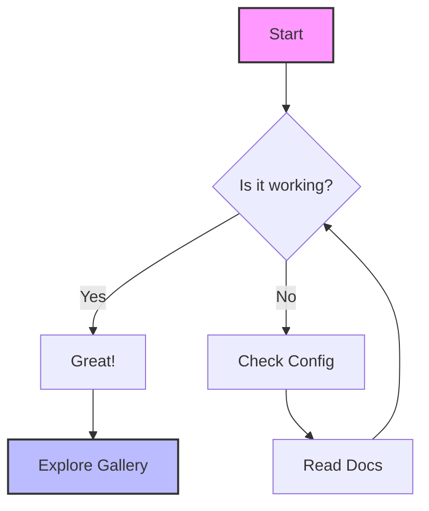

# Nuxt Content + Mermaid Playground

Welcome to the **Mermaid Playground**! This interactive demo showcases the power of the `nuxt-content-mermaid` module, seamlessly transforming Markdown code blocks into live, interactive diagrams.

## 🚀 Features

- **Automatic Conversion**: Simply write `mermaid` code blocks, and they automatically render as responsive diagrams.
- **Theme Aware**: Fully integrated with `@nuxtjs/color-mode`. Toggle between light and dark modes to see diagrams adapt instantly.
- **Performance First**: Assets are lazy-loaded only when a diagram is present, keeping your initial page load fast.
- **Highly Customizable**: Supports custom renderers, spinners, and error components to match your brand.

## 🧭 Quick Navigation

- **[Diagram Gallery](/mermaid)**: Explore a curated collection of Mermaid diagram types, from simple flowcharts to complex sequence diagrams.
- **Theme Toggle**: Use the button in the top-right corner to switch themes and observe how the UI and diagrams respond.

## ⚡️ Live Example

Edit the source of this page to see how easy it is!

## 📚 What You Can Learn Here

1.  **Rendering**: How standard Mermaid syntax in Markdown becomes a Vue component.
2.  **Theming**: How CSS variables control the look of diagrams in different modes.
3.  **Routing**: How Nuxt Content manages navigation between the index and detail pages.

Ready to dive in? Head over to the [Gallery](/mermaid) to see more!
