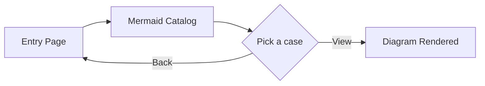

# Nuxt Content + Mermaid Playground

Welcome! This page is the entry point for experimenting with the `nuxt-content-mermaid` module in both light and dark modes. Use it as a quick tour of how Markdown code blocks become live Mermaid diagrams.

## Quick Navigation
- [Mermaid Diagram Gallery](/mermaid): Browse the curated cases and filter by diagram type.
- Theme toggle: use the `Switch to light/dark` button (top-right) to see how diagrams and UI react to color mode.

## What You Can Learn Here
- How Mermaid code blocks render inside Nuxt Content markdown without extra setup.
- How theme variables and borders/shadows behave across light/dark modes (matches the styles in `mermaid-page.css`).
- How per-page content links into the catalog (`/mermaid`) and detailed pages (`/mermaid/...`).

## Module Highlights (adapted from the README)
- Automatic conversion: `mermaid` code blocks become responsive chart components.
- Performance friendly: lazy loads Mermaid assets only when needed.
- Theme-aware: works with `@nuxtjs/color-mode` so Mermaid respects light/dark.
- Flexible UI: optional custom renderer/spinner/error components if you want your own chrome.
- Runtime-friendly: module defaults can be overridden via runtime config or per-page frontmatter.

## Try It Out
1) Toggle light/dark and note the accent colors, cards, and tags.  
2) Open the [Mermaid Diagram Gallery](/mermaid) and filter by type.  
3) Click any card to view the detailed page, read expected behavior/config, and see the rendered chart.  

## Quick Mermaid Example

