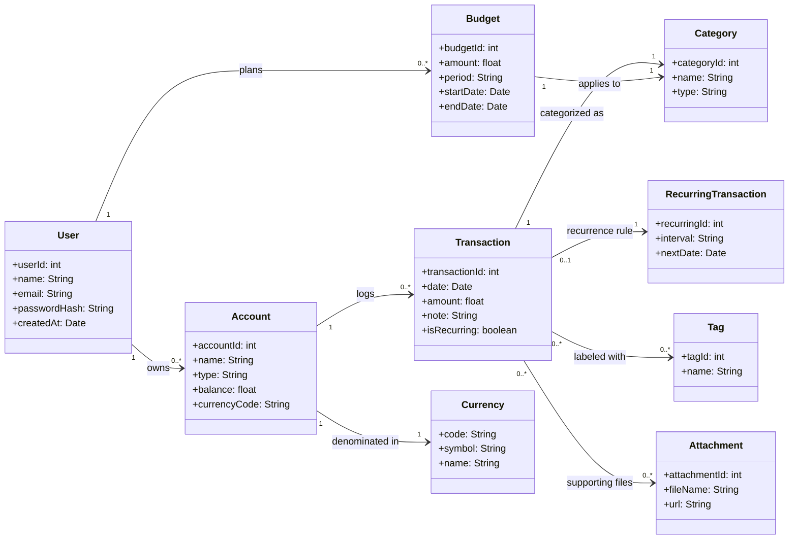

```mermaid
classDiagram
direction LR

%% Entities
class User {
+userId: int
+name: String
+email: String
+passwordHash: String
+createdAt: Date
}

class Account {
+accountId: int
+name: String
+type: String
+balance: float
+currencyCode: String
}

class Transaction {
+transactionId: int
+date: Date
+amount: float
+note: String
+isRecurring: boolean
}

class RecurringTransaction {
+recurringId: int
+interval: String
+nextDate: Date
}

class Category {
+categoryId: int
+name: String
+type: String
}

class Budget {
+budgetId: int
+amount: float
+period: String
+startDate: Date
+endDate: Date
}

class Currency {
+code: String
+symbol: String
+name: String
}

class Tag {
+tagId: int
+name: String
}

class Attachment {
+attachmentId: int
+fileName: String
+url: String
}

%% Relationships
User "1" --> "0..*" Account : owns
Account "1" --> "0..*" Transaction : logs
Transaction "1" --> "1" Category : categorized as
User "1" --> "0..*" Budget : plans
Budget "1" --> "1" Category : applies to
Transaction "0..1" --> "1" RecurringTransaction : recurrence rule
Account "1" --> "1" Currency : denominated in
Transaction "0..*" --> "0..*" Tag : labeled with
Transaction "0..*" --> "0..*" Attachment : supporting files
```
