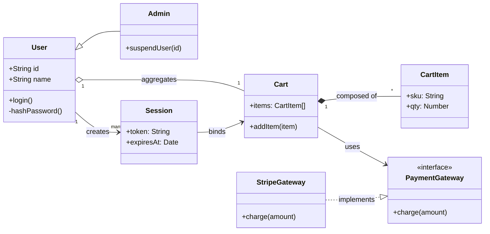

```mermaid
classDiagram
direction LR

class User {
  +String id
  +String name
  +login()
  -hashPassword()
}

class Admin {
  +suspendUser(id)
}

class Session {
  +token: String
  +expiresAt: Date
}

class Cart {
  +items: CartItem[]
  +addItem(item)
}

class CartItem {
  +sku: String
  +qty: Number
}

class PaymentGateway {
  <<interface>>
  +charge(amount)
}

class StripeGateway {
  +charge(amount)
}

User <|-- Admin
User "1" --> "many" Session : creates
User "1" o-- "1" Cart : aggregates
Cart "1" *-- "*" CartItem : composed of
Cart --> PaymentGateway : uses
StripeGateway ..|> PaymentGateway : implements
Session --> Cart : binds
```
