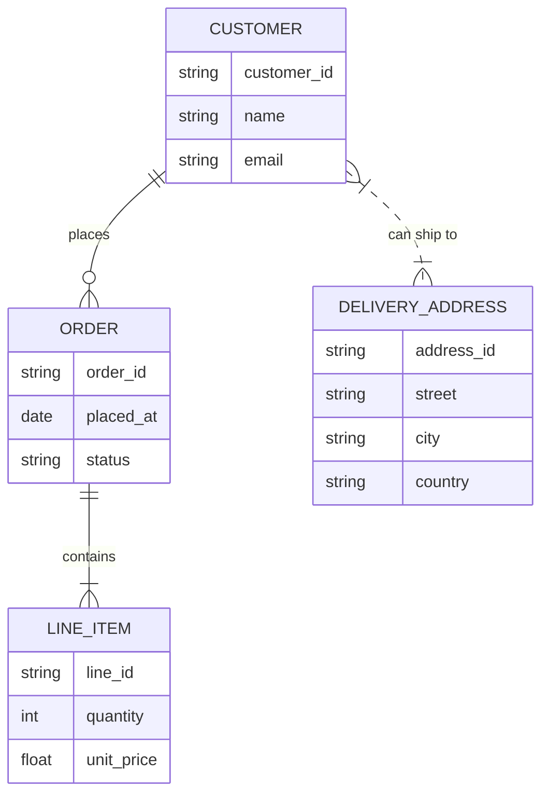

```mermaid
erDiagram
  CUSTOMER {
    string customer_id
    string name
    string email
  }

  ORDER {
    string order_id
    date placed_at
    string status
  }

  LINE_ITEM {
    string line_id
    int quantity
    float unit_price
  }

  DELIVERY_ADDRESS {
    string address_id
    string street
    string city
    string country
  }

  CUSTOMER ||--o{ ORDER : places
  ORDER   ||--|{ LINE_ITEM : contains
  CUSTOMER }|..|{ DELIVERY_ADDRESS : "can ship to"
```
