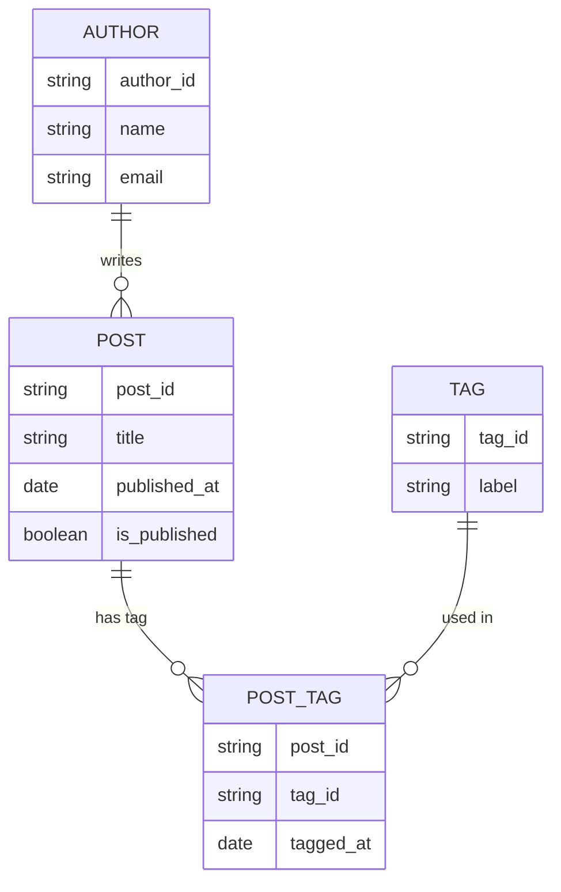

```mermaid
erDiagram
  AUTHOR {
    string author_id
    string name
    string email
  }

  POST {
    string post_id
    string title
    date published_at
    boolean is_published
  }

  TAG {
    string tag_id
    string label
  }

  POST_TAG {
    string post_id
    string tag_id
    date tagged_at
  }

  AUTHOR ||--o{ POST : writes
  POST   ||--o{ POST_TAG : "has tag"
  TAG    ||--o{ POST_TAG : "used in"
```
