### Frontmatter default (linear, TD)

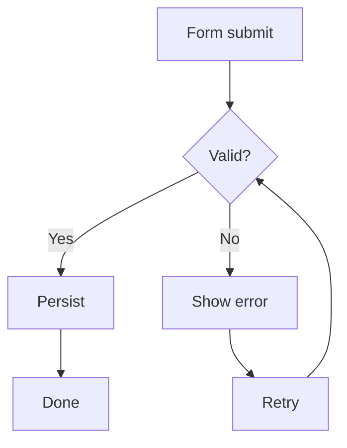

### Monotone family (monotoneX, LR)

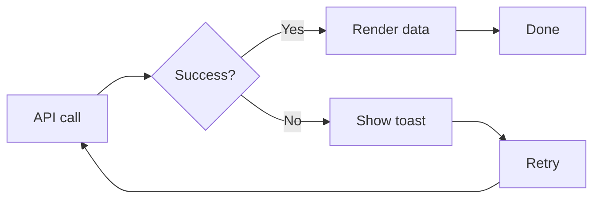

### Monotone family (monotoneY, BT)

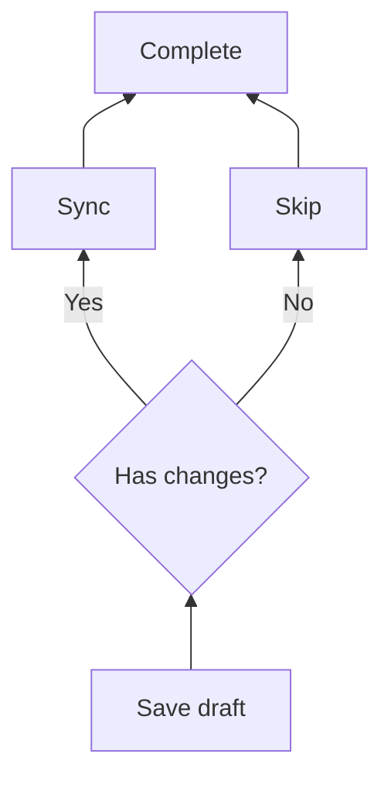

### Step family (step, LR)

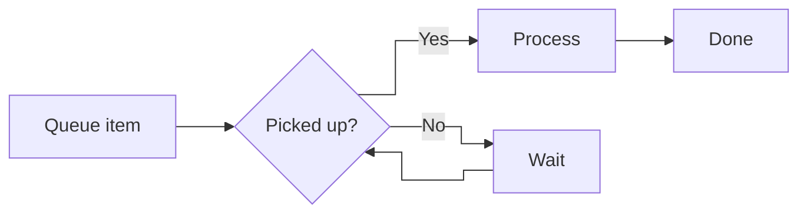

### Step family (stepBefore, LR)

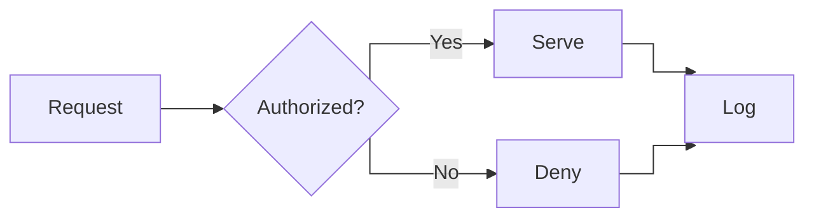

### Step family (stepAfter, LR)

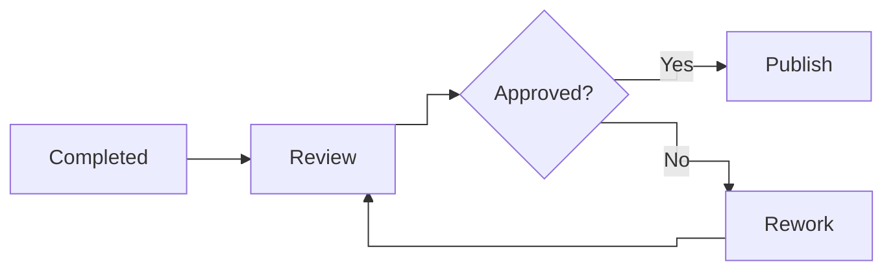

### Smooth family (basis, LR)

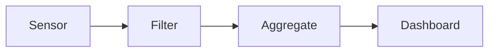

### Smooth family (cardinal, TD)

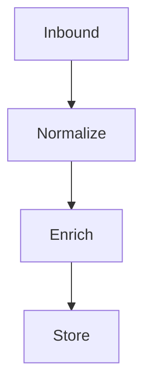

### Smooth family (catmullRom, BT)

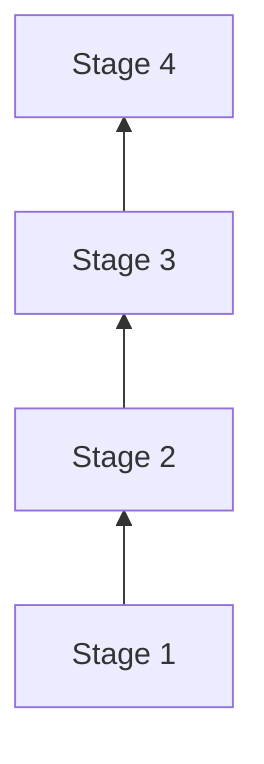

### Smooth family (natural, RL)

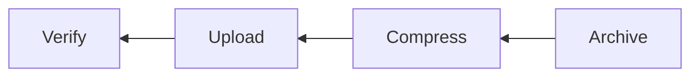

### Bump family (bumpX, LR)

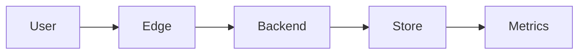

### Bump family (bumpY, TD)

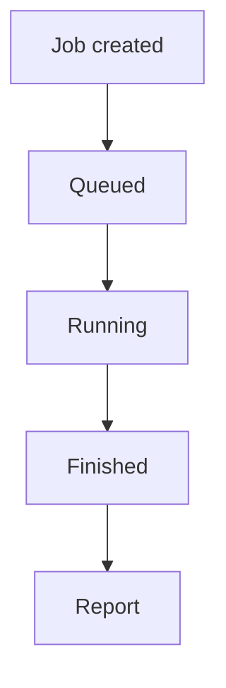
