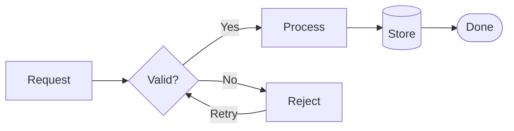

```mermaid
flowchart LR
  Request[Request] --> Validate{Valid?}
  Validate -->|Yes| Process[Process]
  Validate -->|No| Reject[Reject]
  Process --> Store[(Store)]
  Reject -->|Retry| Validate
  Store --> Done([Done])
```
