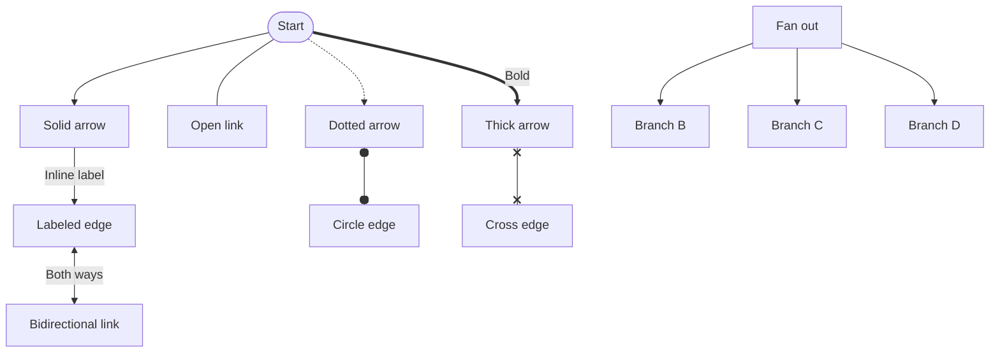

```mermaid
graph TD
  Start([Start]) --> Solid[Solid arrow]
  Start --- Open[Open link]
  Start -.-> Dotted[Dotted arrow]
  Start ==>|Bold| Thick[Thick arrow]
  Solid -- "Inline label" --> Labeled[Labeled edge]
  Dotted o--o Circle[Circle edge]
  Thick x--x Cross[Cross edge]
  Labeled <-->|Both ways| Bi[Bidirectional link]
  Fanout[Fan out] --> B[Branch B] & C[Branch C] & D[Branch D]
```
