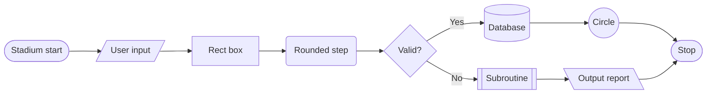

```mermaid
graph LR
  start([Stadium start]) --> input[/User input/]
  input --> rect[Rect box]
  rect --> rounded(Rounded step)
  rounded --> decision{Valid?}
  decision -->|Yes| db[(Database)]
  decision -->|No| subroutine[[Subroutine]]
  db --> circle((Circle))
  subroutine --> output[\Output report\]
  circle --> done([Stop])
  output --> done
```
