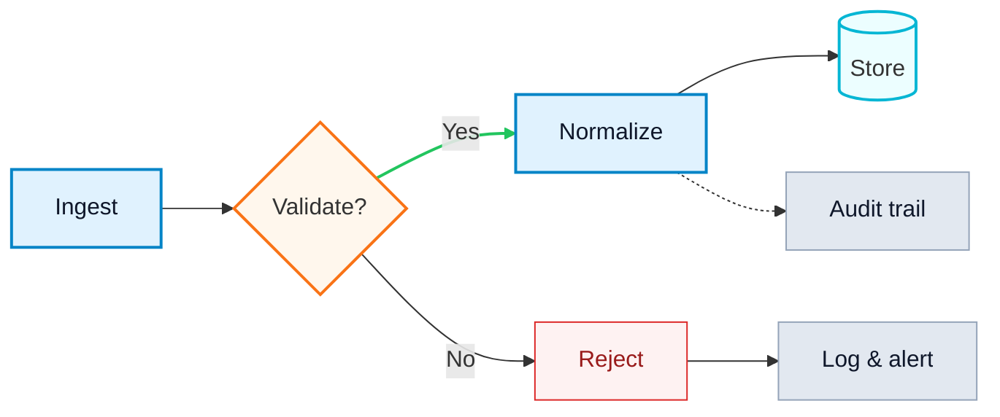

```mermaid
graph LR
  Ingest[Ingest]:::primary --> Validate{Validate?}:::decision
  Validate -->|Yes| Normalize[Normalize]:::primary
  Validate -->|No| Reject[Reject]:::danger
  Normalize --> Store[(Store)]:::accent
  Reject --> Log[Log & alert]:::muted
  Normalize -.-> Audit[Audit trail]:::muted
  linkStyle 1 stroke:#22c55e,stroke-width:2px;
  classDef primary fill:#e0f2fe,stroke:#0284c7,stroke-width:2px,color:#0f172a;
  classDef decision fill:#fff7ed,stroke:#f97316,stroke-width:2px,color:#333;
  classDef danger fill:#fef2f2,stroke:#dc2626,color:#991b1b;
  classDef accent fill:#ecfeff,stroke:#06b6d4,stroke-width:2px,color:#333;
  classDef muted fill:#e2e8f0,stroke:#94a3b8,color:#0f172a;
```
