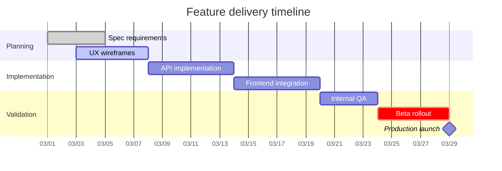

```mermaid
gantt
  title Feature delivery timeline
  dateFormat  YYYY-MM-DD
  axisFormat  %m/%d

  section Planning
  Spec requirements       :done,    spec, 2025-03-01, 4d
  UX wireframes           :active,  ux,   2025-03-03, 5d

  section Implementation
  API implementation      :api,     after ux, 6d
  Frontend integration    :fe,      after api, 6d

  section Validation
  Internal QA             :qa,      after fe, 4d
  Beta rollout            :crit,    beta, 2025-03-24, 5d
  Production launch       :milestone, launch, 2025-03-29, 0d
```

