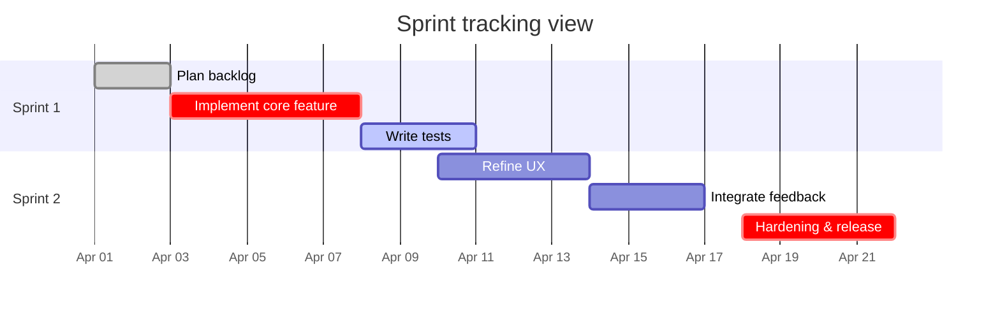

```mermaid
gantt
  title Sprint tracking view
  dateFormat  YYYY-MM-DD
  axisFormat  %b %d
  todayMarker stroke-width:4px,stroke:#f97316,opacity:0.6

  section Sprint 1
  Plan backlog           :done,    s1plan, 2025-04-01, 2d
  Implement core feature :crit,    s1core, 2025-04-03, 5d
  Write tests            :active,  s1test, after s1core, 3d

  section Sprint 2
  Refine UX              :s2ux,    2025-04-10, 4d
  Integrate feedback     :s2fb,    after s2ux, 3d
  Hardening & release    :crit,    s2rel,  2025-04-18, 4d
```

