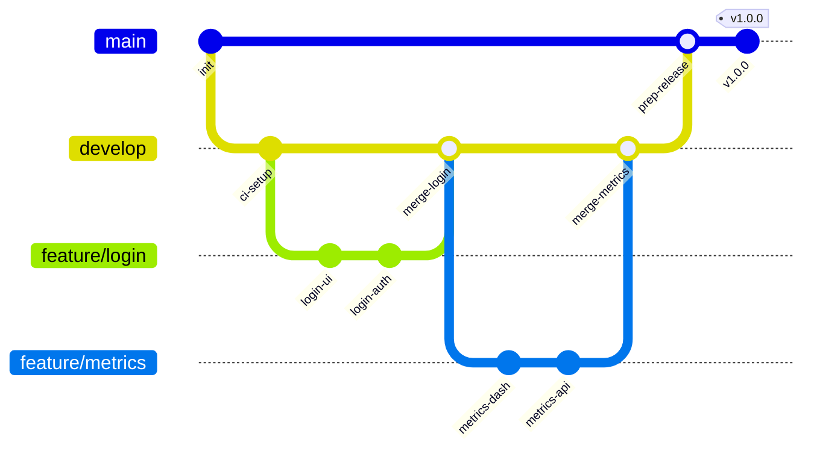

```mermaid
gitGraph
  commit id:"init"
  branch develop
  checkout develop
  commit id:"ci-setup"
  branch feature/login
  checkout feature/login
  commit id:"login-ui"
  commit id:"login-auth"
  checkout develop
  merge feature/login id:"merge-login"

  branch feature/metrics
  checkout feature/metrics
  commit id:"metrics-dash"
  commit id:"metrics-api"
  checkout develop
  merge feature/metrics id:"merge-metrics"

  checkout main
  merge develop id:"prep-release"
  commit id:"v1.0.0" tag:"v1.0.0"
```
