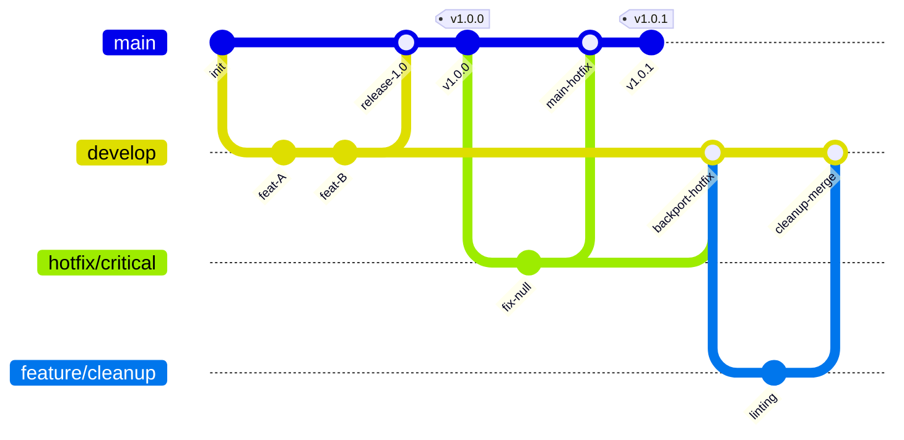

```mermaid
gitGraph
  commit id:"init"
  branch develop
  commit id:"feat-A"
  commit id:"feat-B"

  checkout main
  merge develop id:"release-1.0"
  commit id:"v1.0.0" tag:"v1.0.0"

  branch hotfix/critical
  commit id:"fix-null"

  checkout main
  merge hotfix/critical id:"main-hotfix"
  commit id:"v1.0.1" tag:"v1.0.1"

  checkout develop
  merge hotfix/critical id:"backport-hotfix"

  branch feature/cleanup
  checkout feature/cleanup
  commit id:"linting"
  checkout develop
  merge feature/cleanup id:"cleanup-merge"
```
