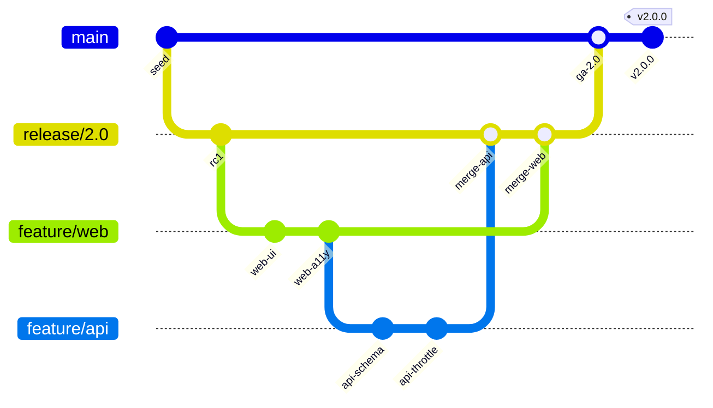

```mermaid
gitGraph
  commit id:"seed"
  branch release/2.0
  checkout release/2.0
  commit id:"rc1"

  branch feature/web
  checkout feature/web
  commit id:"web-ui"
  commit id:"web-a11y"

  branch feature/api
  checkout feature/api
  commit id:"api-schema"
  commit id:"api-throttle"

  checkout release/2.0
  merge feature/api id:"merge-api"
  merge feature/web id:"merge-web"

  checkout main
  merge release/2.0 id:"ga-2.0"
  commit id:"v2.0.0" tag:"v2.0.0"
```
