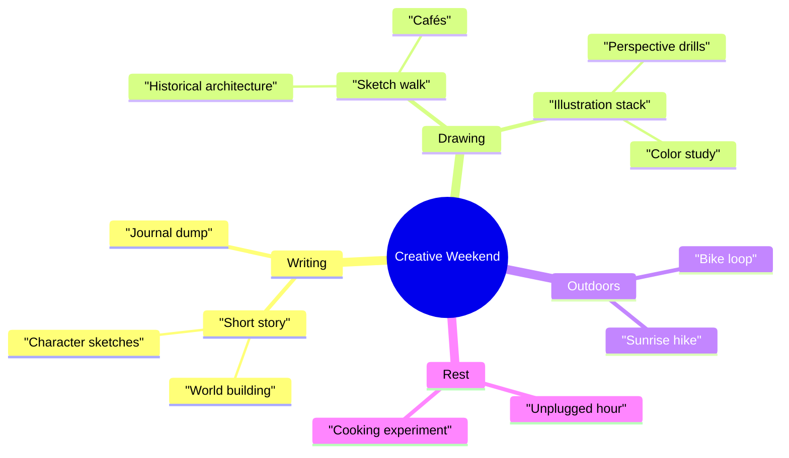

```mermaid
mindmap
  root((Creative Weekend))
    Writing
      "Short story"
        "World building"
        "Character sketches"
      "Journal dump"
    Drawing
      "Sketch walk"
        "Historical architecture"
        "Cafés"
      "Illustration stack"
        "Color study"
        "Perspective drills"
    Outdoors
      "Sunrise hike"
      "Bike loop"
    Rest
      "Unplugged hour"
      "Cooking experiment"
```
