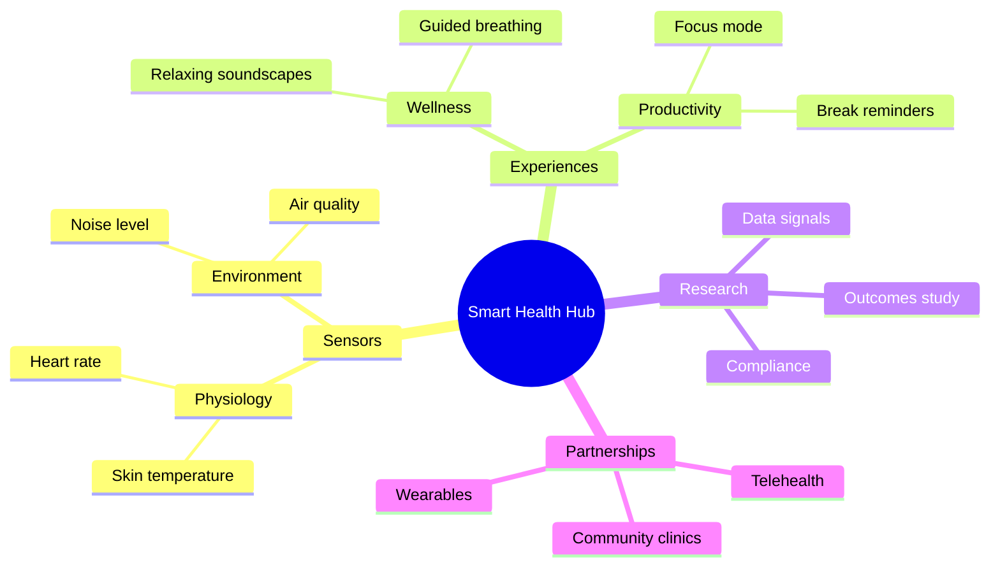

```mermaid
mindmap
  root((Smart Health Hub))
    Sensors
      Environment
        Air quality
        Noise level
      Physiology
        Heart rate
        Skin temperature
    Experiences
      Wellness
        Guided breathing
        Relaxing soundscapes
      Productivity
        Focus mode
        Break reminders
    Research
      Data signals
      Compliance
      Outcomes study
    Partnerships
      Telehealth
      Wearables
      Community clinics
```
