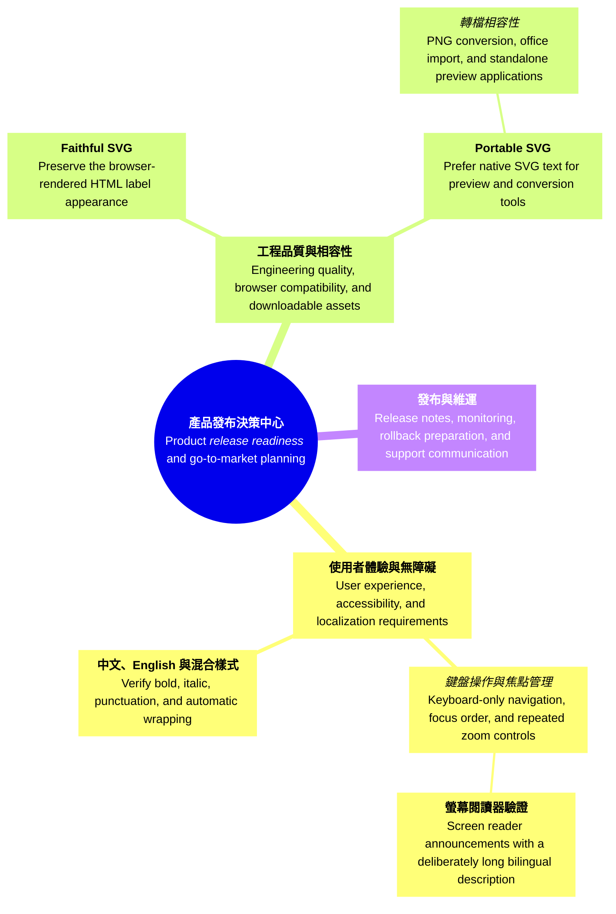

```mermaid
mindmap
  root(("`**產品發布決策中心**
  Product *release readiness* and go-to-market planning`"))
    experience["`**使用者體驗與無障礙**
    User experience, accessibility, and localization requirements`"]
      keyboard["`*鍵盤操作與焦點管理*
      Keyboard-only navigation, focus order, and repeated zoom controls`"]
        screenreader["`**螢幕閱讀器驗證**
        Screen reader announcements with a deliberately long bilingual description`"]
      localization["`**中文、English 與混合樣式**
      Verify bold, italic, punctuation, and automatic wrapping`"]
    engineering["`**工程品質與相容性**
    Engineering quality, browser compatibility, and downloadable assets`"]
      faithful["`**Faithful SVG**
      Preserve the browser-rendered HTML label appearance`"]
      portable["`**Portable SVG**
      Prefer native SVG text for preview and conversion tools`"]
        conversion["`*轉檔相容性*
        PNG conversion, office import, and standalone preview applications`"]
    operations["`**發布與維運**
    Release notes, monitoring, rollback preparation, and support communication`"]
```
