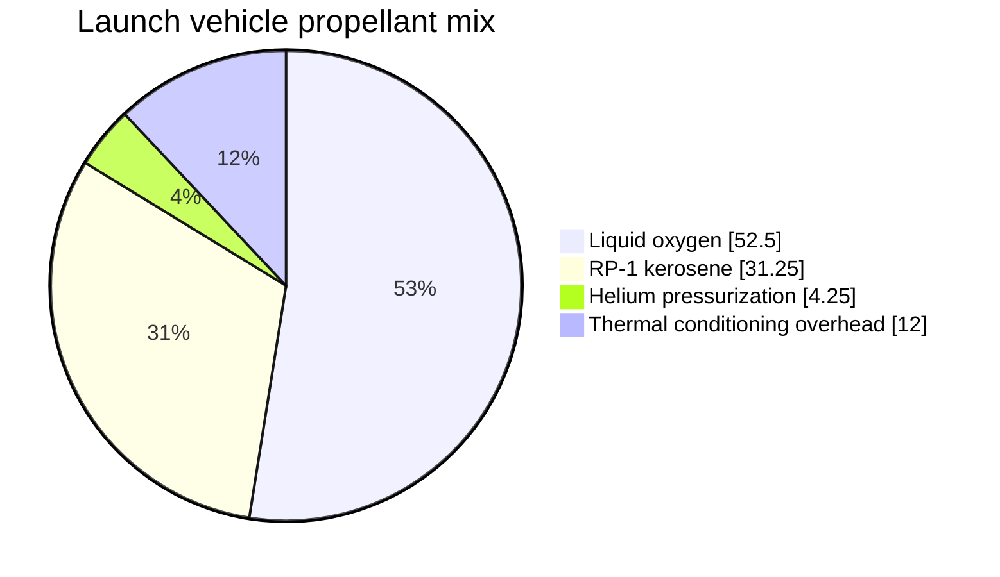

```mermaid
%%{init: {"pie": {"textPosition": 0.55}}}%%
pie showData title Launch vehicle propellant mix
  "Liquid oxygen" : 52.5
  "RP-1 kerosene" : 31.25
  "Helium pressurization" : 4.25
  "Thermal conditioning overhead" : 12
```
