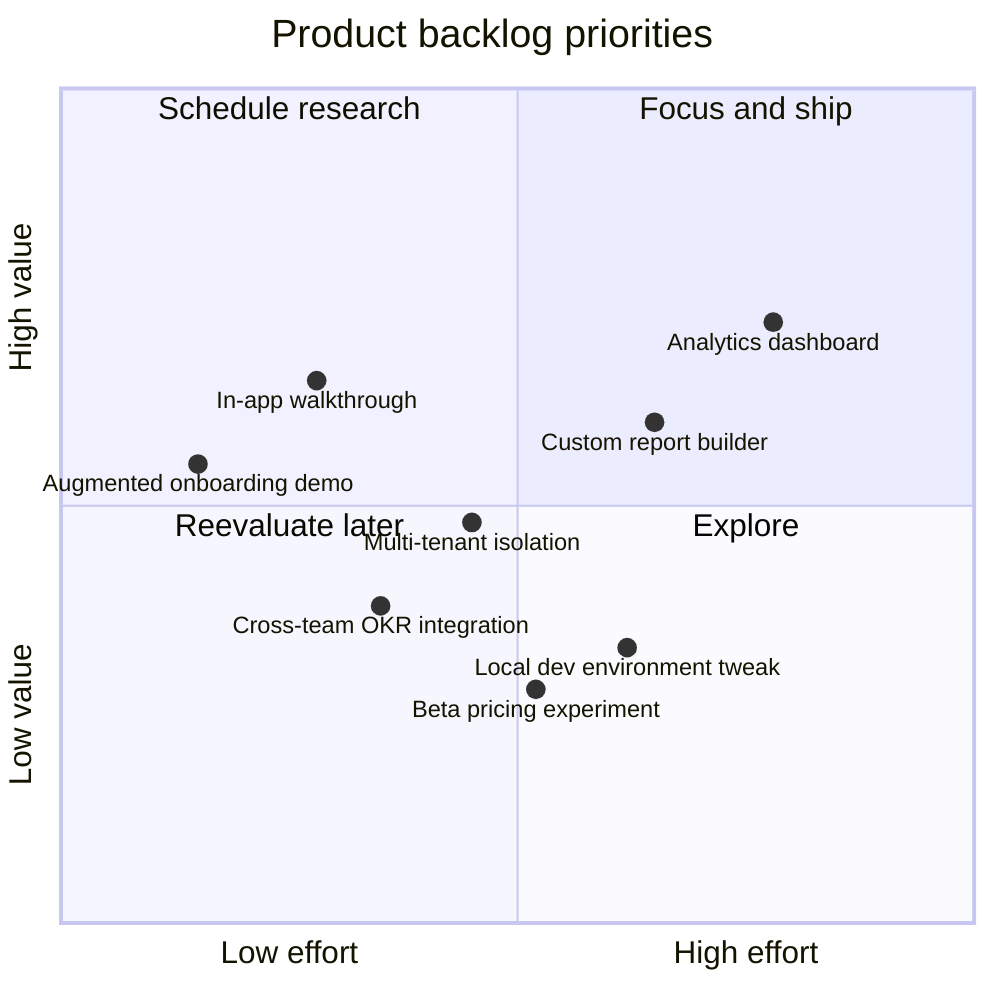

```mermaid
quadrantChart
  title Product backlog priorities
  x-axis Low effort --> High effort
  y-axis Low value --> High value
  quadrant-1 Focus and ship
  quadrant-2 Schedule research
  quadrant-3 Reevaluate later
  quadrant-4 Explore

  Analytics dashboard          : [0.78, 0.72]
  Multi-tenant isolation       : [0.45, 0.48]
  In-app walkthrough           : [0.28, 0.65]
  Local dev environment tweak  : [0.62, 0.33]
  Cross-team OKR integration   : [0.35, 0.38]
  Augmented onboarding demo    : [0.15, 0.55]
  Beta pricing experiment      : [0.52, 0.28]
  Custom report builder        : [0.65, 0.6]
```
