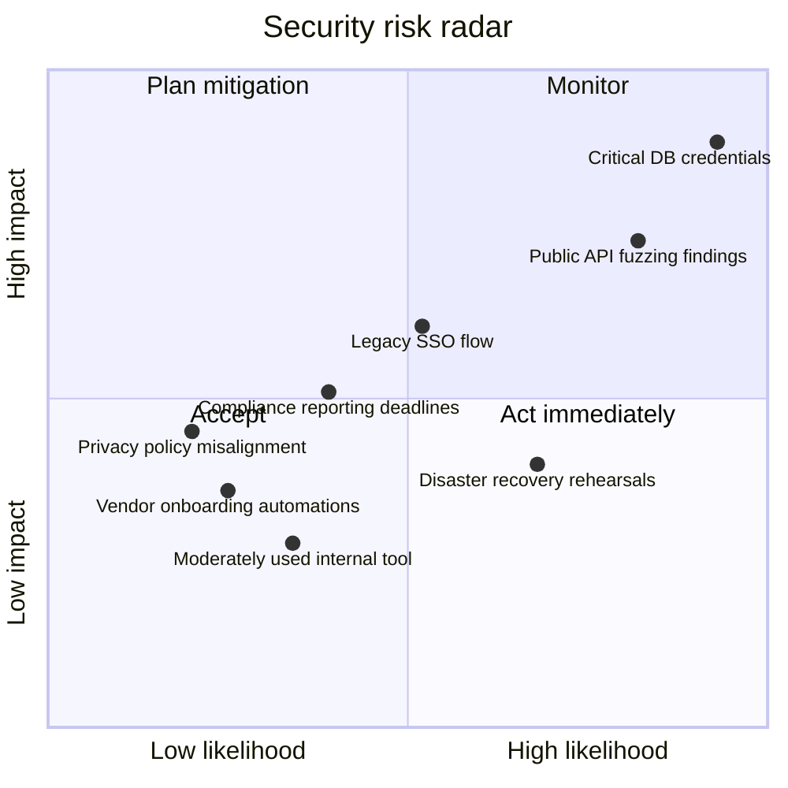

```mermaid
quadrantChart
  title Security risk radar
  x-axis Low likelihood --> High likelihood
  y-axis Low impact --> High impact
  quadrant-1 Monitor
  quadrant-2 Plan mitigation
  quadrant-3 Accept
  quadrant-4 Act immediately

  Public API fuzzing findings       : [0.82, 0.74]
  Moderately used internal tool     : [0.34, 0.28]
  Legacy SSO flow                   : [0.52, 0.61]
  Vendor onboarding automations     : [0.25, 0.36]
  Compliance reporting deadlines    : [0.39, 0.51]
  Disaster recovery rehearsals      : [0.68, 0.4]
  Critical DB credentials exposed   : [0.93, 0.89]
  Privacy policy misalignment       : [0.2, 0.45]
```
