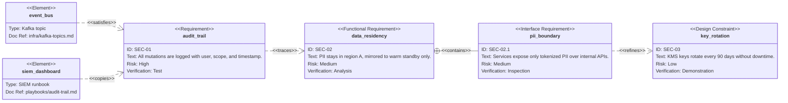

```mermaid
requirementDiagram

direction LR

requirement audit_trail {
  id: "SEC-01"
  text: "All mutations are logged with user, scope, and timestamp."
  risk: high
  verifymethod: test
}

functionalRequirement data_residency {
  id: "SEC-02"
  text: "PII stays in region A, mirrored to warm standby only."
  risk: medium
  verifymethod: analysis
}

interfaceRequirement pii_boundary {
  id: "SEC-02.1"
  text: "Services expose only tokenized PII over internal APIs."
  risk: medium
  verifymethod: inspection
}

designConstraint key_rotation {
  id: "SEC-03"
  text: "KMS keys rotate every 90 days without downtime."
  risk: low
  verifymethod: demonstration
}

element event_bus {
  type: "Kafka topic"
  docRef: "infra/kafka-topics.md"
}

element siem_dashboard {
  type: "SIEM runbook"
  docRef: "playbooks/audit-trail.md"
}

event_bus -satisfies-> audit_trail
audit_trail -traces-> data_residency
data_residency -contains-> pii_boundary
pii_boundary -refines-> key_rotation
siem_dashboard -verifies-> audit_trail
siem_dashboard -copies-> audit_trail
```
