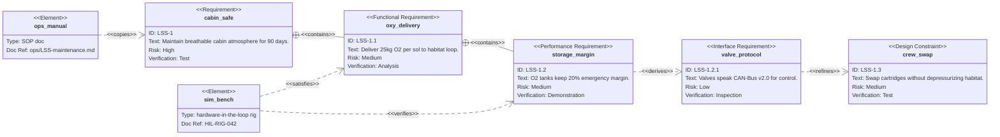

```mermaid
requirementDiagram

direction LR

requirement cabin_safe {
  id: "LSS-1"
  text: Maintain breathable cabin atmosphere for 90 days.
  risk: high
  verifymethod: test
}

functionalRequirement oxy_delivery {
  id: "LSS-1.1"
  text: Deliver 25kg O2 per sol to habitat loop.
  risk: medium
  verifymethod: analysis
}

performanceRequirement storage_margin {
  id: "LSS-1.2"
  text: O2 tanks keep 20% emergency margin.
  risk: medium
  verifymethod: demonstration
}

interfaceRequirement valve_protocol {
  id: "LSS-1.2.1"
  text: "Valves speak CAN-Bus v2.0 for control."
  risk: low
  verifymethod: inspection
}

designConstraint crew_swap {
  id: "LSS-1.3"
  text: Swap cartridges without depressurizing habitat.
  risk: medium
  verifymethod: test
}

element sim_bench {
  type: "hardware-in-the-loop rig"
  docRef: "HIL-RIG-042"
}

element ops_manual {
  type: "SOP doc"
  docRef: "ops/LSS-maintenance.md"
}

sim_bench - satisfies -> oxy_delivery
cabin_safe - contains -> oxy_delivery
oxy_delivery - contains -> storage_margin
storage_margin - derives -> valve_protocol
valve_protocol - refines -> crew_swap
sim_bench - verifies -> storage_margin
cabin_safe <- copies - ops_manual
```
