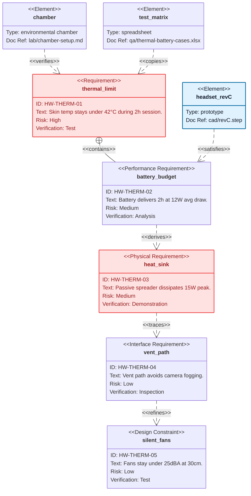

```mermaid
requirementDiagram

requirement thermal_limit {
  id: "HW-THERM-01"
  text: Skin temp stays under 42°C during 2h session.
  risk: high
  verifymethod: test
}

performanceRequirement battery_budget {
  id: "HW-THERM-02"
  text: Battery delivers 2h at 12W avg draw.
  risk: medium
  verifymethod: analysis
}

physicalRequirement heat_sink {
  id: "HW-THERM-03"
  text: Passive spreader dissipates 15W peak.
  risk: medium
  verifymethod: demonstration
}

interfaceRequirement vent_path {
  id: "HW-THERM-04"
  text: Vent path avoids camera fogging.
  risk: low
  verifymethod: inspection
}

designConstraint silent_fans {
  id: "HW-THERM-05"
  text: Fans stay under 25dBA at 30cm.
  risk: low
  verifymethod: test
}

element chamber {
  type: "environmental chamber"
  docRef: "lab/chamber-setup.md"
}

element headset_revC {
  type: "prototype"
  docRef: "cad/revC.step"
}

element test_matrix {
  type: "spreadsheet"
  docRef: "qa/thermal-battery-cases.xlsx"
}

classDef critical fill:#fee2e2,stroke:#ef4444,stroke-width:2px,color:#991b1b;
classDef prototype fill:#e0f2fe,stroke:#0369a1,stroke-width:2px,color:#0f172a;

class thermal_limit,heat_sink critical
class headset_revC prototype

thermal_limit - contains -> battery_budget
battery_budget - derives -> heat_sink
heat_sink - traces -> vent_path
vent_path - refines -> silent_fans
headset_revC - satisfies -> battery_budget
chamber - verifies -> thermal_limit
thermal_limit <- copies - test_matrix
```
