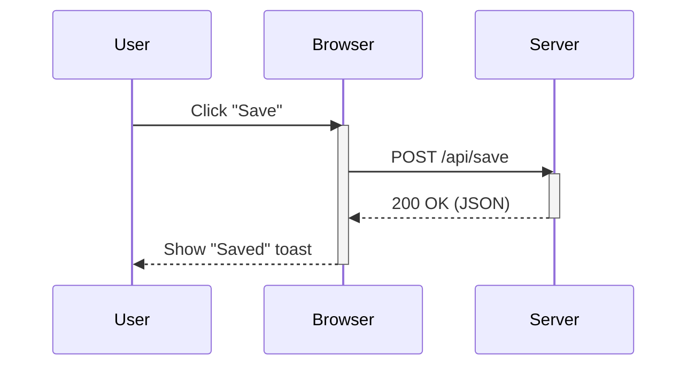
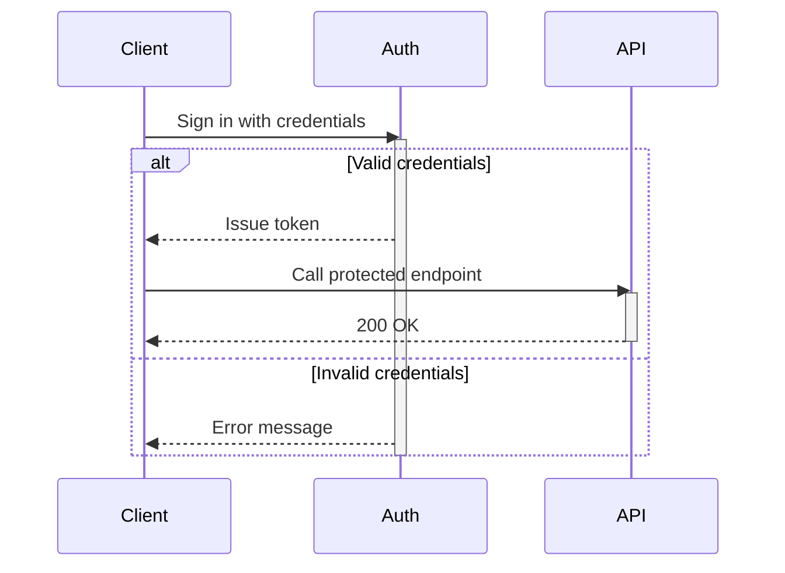
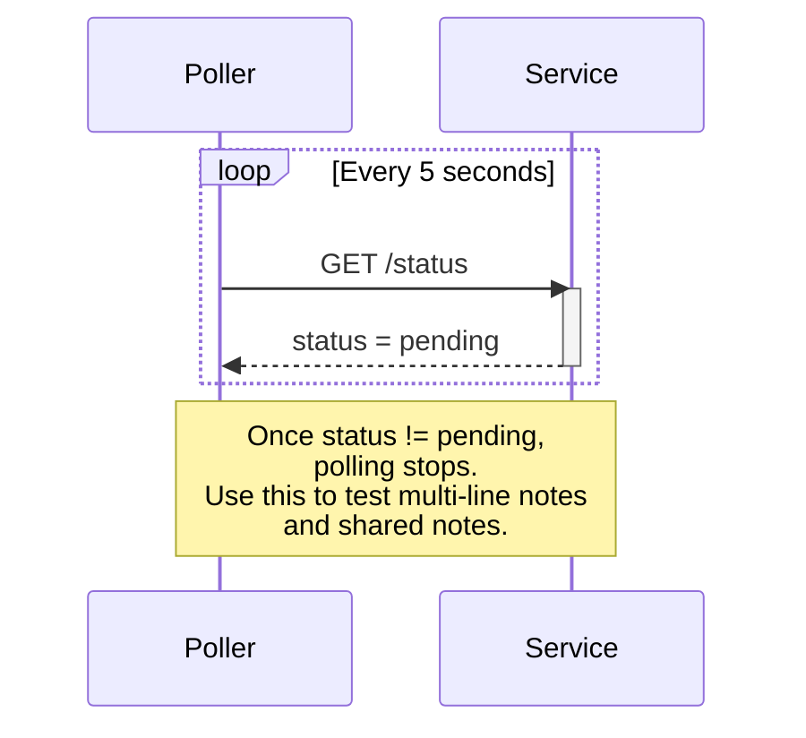

## Basic request / response

```mermaid
sequenceDiagram
  participant User
  participant Browser
  participant Server

  User->>Browser: Click "Save"
  activate Browser
  Browser->>Server: POST /api/save
  activate Server
  Server-->>Browser: 200 OK (JSON)
  deactivate Server
  Browser-->>User: Show "Saved" toast
  deactivate Browser
```

## Alternative paths (alt / else)

```mermaid
sequenceDiagram
  participant Client
  participant Auth
  participant API

  Client->>Auth: Sign in with credentials
  activate Auth
  alt Valid credentials
    Auth-->>Client: Issue token
    Client->>API: Call protected endpoint
    activate API
    API-->>Client: 200 OK
    deactivate API
  else Invalid credentials
    Auth-->>Client: Error message
  end
  deactivate Auth
```

## Loops and notes

```mermaid
sequenceDiagram
  participant Poller
  participant Service

  loop Every 5 seconds
    Poller->>Service: GET /status
    activate Service
    Service-->>Poller: status = pending
    deactivate Service
  end

  Note over Poller,Service: Once status != pending,<br/>polling stops.<br/>Use this to test multi-line notes<br/>and shared notes.
```
