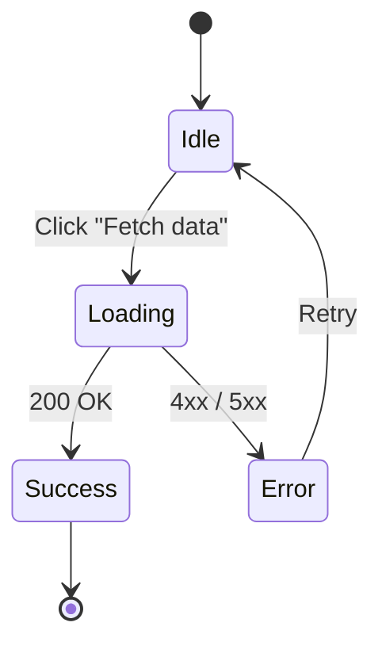
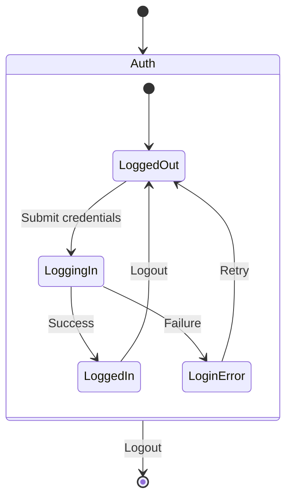

## Basic async request lifecycle

```mermaid
stateDiagram-v2
  [*] --> Idle
  Idle --> Loading: Click "Fetch data"
  Loading --> Success: 200 OK
  Loading --> Error: 4xx / 5xx
  Error --> Idle: Retry
  Success --> [*]
```

## Nested auth state machine

```mermaid
stateDiagram-v2
  [*] --> Auth
  Auth --> [*]: Logout

  state Auth {
    [*] --> LoggedOut
    LoggedOut --> LoggingIn: Submit credentials
    LoggingIn --> LoggedIn: Success
    LoggingIn --> LoginError: Failure
    LoginError --> LoggedOut: Retry
    LoggedIn --> LoggedOut: Logout
  }
```
