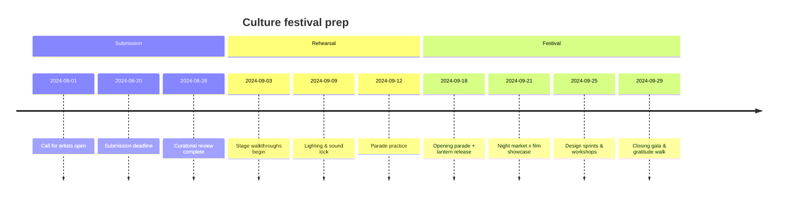

```mermaid
timeline
  title Culture festival prep

  section Submission
    2024-08-01 : Call for artists open
    2024-08-20 : Submission deadline
    2024-08-28 : Curatorial review complete

  section Rehearsal
    2024-09-03 : Stage walkthroughs begin
    2024-09-09 : Lighting & sound lock
    2024-09-12 : Parade practice

  section Festival
    2024-09-18 : Opening parade + lantern release
    2024-09-21 : Night market x film showcase
    2024-09-25 : Design sprints & workshops
    2024-09-29 : Closing gala & gratitude walk
```
