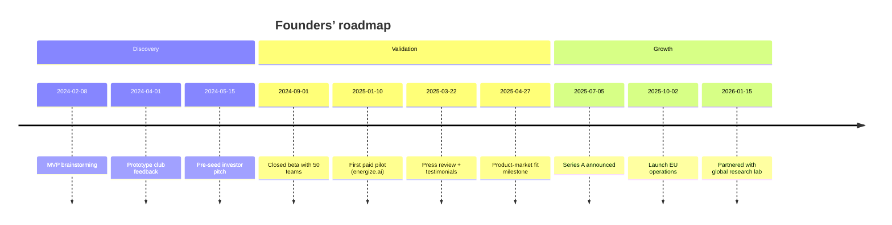

```mermaid
timeline
  title Founders’ roadmap

  section Discovery
    2024-02-08 : MVP brainstorming
    2024-04-01 : Prototype club feedback
    2024-05-15 : Pre-seed investor pitch

  section Validation
    2024-09-01 : Closed beta with 50 teams
    2025-01-10 : First paid pilot (energize.ai)
    2025-03-22 : Press review + testimonials
    2025-04-27 : Product-market fit milestone

  section Growth
    2025-07-05 : Series A announced
    2025-10-02 : Launch EU operations
    2026-01-15 : Partnered with global research lab
```
