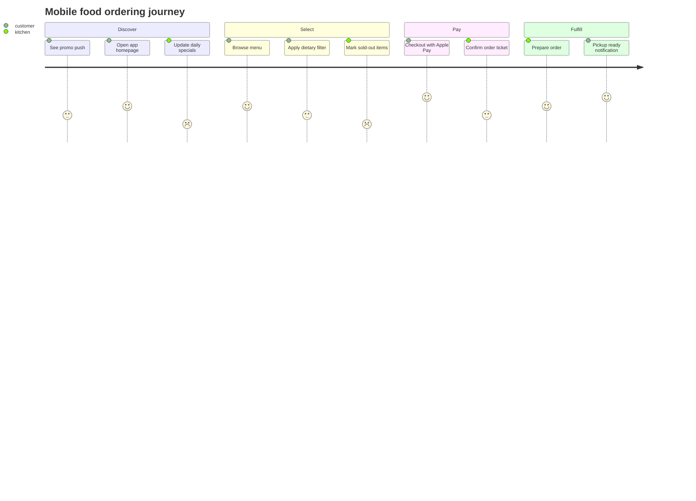

```mermaid
journey
  title Mobile food ordering journey
  section Discover
    See promo push            : 3: customer
    Open app homepage         : 4: customer
    Update daily specials     : 2: kitchen
  section Select
    Browse menu               : 4: customer
    Apply dietary filter      : 3: customer
    Mark sold-out items       : 2: kitchen
  section Pay
    Checkout with Apple Pay   : 5: customer
    Confirm order ticket      : 3: kitchen
  section Fulfill
    Prepare order             : 4: kitchen
    Pickup ready notification : 5: customer
```
