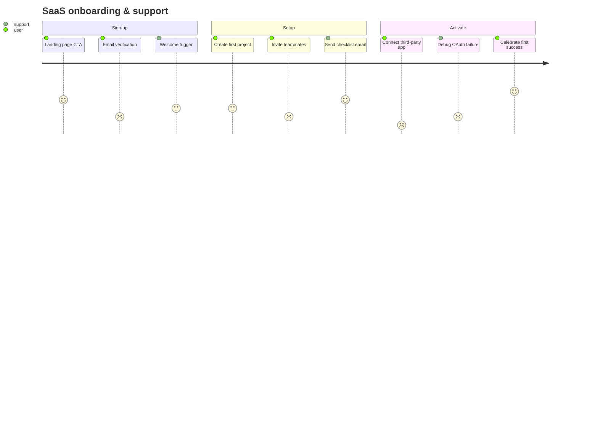

```mermaid
journey
  title SaaS onboarding & support
  section Sign-up
    Landing page CTA          : 4: user
    Email verification        : 2: user
    Welcome trigger           : 3: support
  section Setup
    Create first project      : 3: user
    Invite teammates          : 2: user
    Send checklist email      : 4: support
  section Activate
    Connect third-party app   : 1: user
    Debug OAuth failure       : 2: support
    Celebrate first success   : 5: user
```
