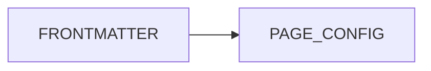

# Content-generated Page Mermaid Config

This diagram starts as Markdown with page frontmatter. Nuxt Content parses the page and the Markdown Diagram Protocol supplies its `config` value as Page Mermaid Config.

