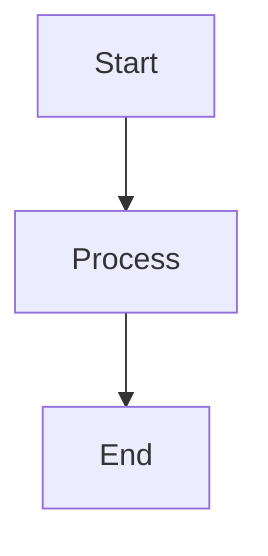
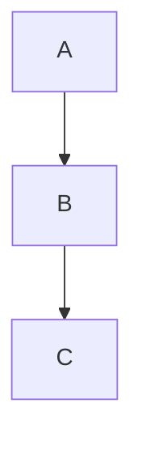
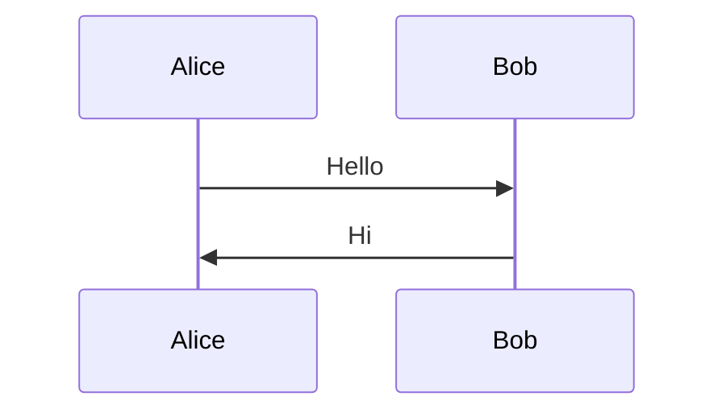

# Debug Mode Test

## Normal Chart (should log render time)

```mermaid
---
toolbar:
  buttons:
    copy: false
    fullscreen: true
---
graph TD
    A[Start] --> B[Process]
    B --> C[End]
```

## Syntax Error Chart (should display full error stack)

```mermaid
graph TD
    A --> 
    B --> C
```

## Another Normal Chart (Test Queue Mechanism)

```mermaid
sequenceDiagram
    Alice->>Bob: Hello
    Bob->>Alice: Hi
```
