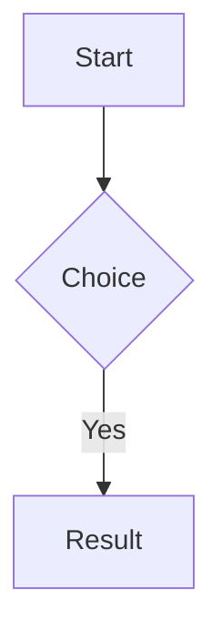
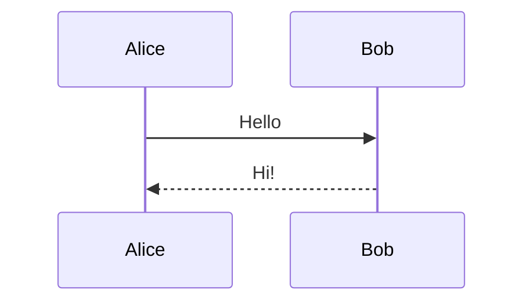

# Test Multiple Mermaid Block Transformations

Introductory text.

```mermaid
graph TD
  A[Start] --> B{Choice}
  B -->|Yes| C[Result]
```

Some explanation before the next diagram.

```mermaid
sequenceDiagram
  participant Alice
  participant Bob
  Alice->>Bob: Hello
  Bob-->>Alice: Hi!
```
