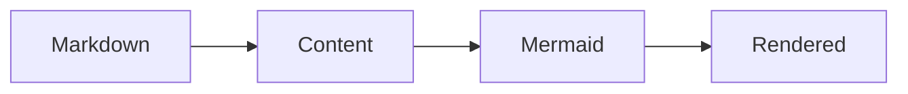

# Getting Started

## Prerequisites

Use the package in a Nuxt Content application with:

- Node.js `>=22.19.0`
- Nuxt `^4.1.0`
- Nuxt Content `>=3.5.0 <4.0.0`

## Install

Install the module and Nuxt Content:

```bash
pnpm add @barzhsieh/nuxt-content-mermaid @nuxt/content
```

Mermaid is included by the module, so you do not need to install it separately.

## Enable the module

Add the module to `nuxt.config.ts`:

```ts
export default defineNuxtConfig({
  modules: ['@barzhsieh/nuxt-content-mermaid'],
})
```

If your application already lists `@nuxt/content`, you can keep it in the module list.

## Add your first diagram

Add a `mermaid` code fence to a Markdown file in your Content source:

````md
# Hello diagram


````

The fence language must be `mermaid`. The module transforms the block during the Content build and renders the diagram in the browser.

## Run the application

Start Nuxt and open the route for that Markdown file:

```bash
pnpm dev
```

## Next steps

- Learn the supported authoring forms in [Writing Diagrams](/writing-diagrams).
- Set project defaults in [Configuration](/configuration).
- If the diagram does not render, follow [Troubleshooting](/troubleshooting).
