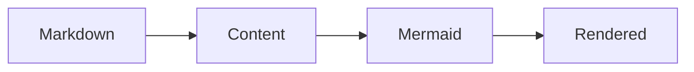

# Getting Started

Nuxt Content Mermaid is a Nuxt module that depends on Nuxt Content. Install Nuxt Content first; this module declares and starts it in the Nuxt application.

## Prerequisites

Confirm that your environment and packages meet these requirements:

- Node.js: `>=22.19.0`
- Nuxt: `^4.1.0`
- Nuxt Content: `>=3.5.0 <4.0.0`

## Install

Use your preferred package manager to install this module and its Nuxt Content peer dependency. Mermaid is a dependency of Nuxt Content Mermaid and is installed automatically, so do not add it separately.

```bash
# pnpm
pnpm add @barzhsieh/nuxt-content-mermaid @nuxt/content

# npm
npm install @barzhsieh/nuxt-content-mermaid @nuxt/content

# yarn
yarn add @barzhsieh/nuxt-content-mermaid @nuxt/content
```

::callout{variant="warning" title="Installation note"}
When you run your project in Node.js, Nuxt Content asks which database connector to use. You can install either `better-sqlite3` or `sqlite3`.
If you do not want to install another package, use the native SQLite included with Node.js v22.5.0 or newer. See the [Nuxt Content installation guide](https://content.nuxt.com/docs/getting-started/installation#automatic-setup) for details and supported connectors.

With pnpm v10 or later, native connector build scripts need explicit approval:

```bash
pnpm approve-builds
```

Or allow only the connector you selected in `package.json` (replace the example if needed):

```json
{
  "pnpm": {
    "onlyBuiltDependencies": ["better-sqlite3"]
  }
}
```

::

## Enable the module

Add Nuxt Content Mermaid to `nuxt.config.ts`:

```ts
export default defineNuxtConfig({
  modules: ['@barzhsieh/nuxt-content-mermaid'],
})
```

The module uses Nuxt `moduleDependencies` to declare its Nuxt Content relationship and start it in the required order. You must still install the `@nuxt/content` peer dependency, but you do not need to list it separately in `modules`; an existing entry can remain.

## Add your first Mermaid diagram

Create a Markdown page in your Content source and add a `mermaid` fence:

````md
# Hello diagram


````

During the Content build, the module transforms the fence into a diagram component. The original source remains available as its readable no-JavaScript fallback.

## Run the application

Start Nuxt and open the route for the Markdown page:

```bash
pnpm dev
```

## Next steps

- Author local metadata in [Writing Diagrams](/writing-diagrams).
- Set project defaults in [Configuration](/configuration).
- Adjust appearance in [Themes and Styling](/advanced/themes-and-styling).
- Diagnose a failure with [Troubleshooting](/troubleshooting).
